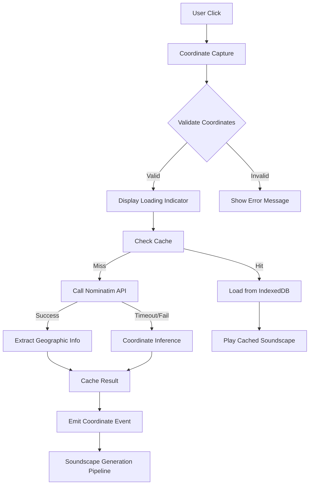

# Design Document: Map Interaction Module

## Overview

The Map Interaction Module is the foundational component of the PinDrop application, providing an interactive world map interface that enables users to explore global soundscapes through geographic coordinates. This module integrates Leaflet.js with OpenStreetMap to deliver a full-world clickable interface, captures geographic coordinates from user interactions, manages cached location markers with visual feedback, and implements hover preview functionality.

The module serves as the entry point for the soundscape generation pipeline and provides comprehensive visual feedback for user interactions and cached content. It operates entirely client-side with zero backend dependencies, storing all data in the browser's localStorage and IndexedDB.

### Key Responsibilities

- Render interactive world map using Leaflet.js and OpenStreetMap tiles
- Capture and validate geographic coordinates from user clicks
- Display pulsing markers at cached soundscape locations
- Provide hover preview functionality with throttling
- Integrate with Nominatim reverse geocoding API
- Manage coordinate precision and caching strategies
- Support theme switching (light/dark mode)
- Handle keyboard navigation and accessibility features
- Implement error handling and graceful degradation

## Architecture

### Component Structure

```
MapInteractionModule
├── MapView (React Component)
│   ├── LeafletMap (Leaflet.js instance)
│   ├── MapMarker[] (Cached location markers)
│   ├── LoadingIndicator (Click feedback)
│   └── HoverPreview (Preview overlay)
├── CoordinateCaptureSystem
│   ├── ClickHandler
│   ├── CoordinateValidator
│   └── EventEmitter
├── MarkerRenderer
│   ├── PulsingAnimation (CSS-based)
│   ├── TimeSlotColorMapper
│   └── MarkerManager
├── HoverPreviewSystem
│   ├── HoverDetector (500ms delay)
│   ├── ThrottleManager (5° radius)
│   └── PreviewAudioPlayer
├── GeocodingService
│   ├── NominatimClient (3s timeout)
│   ├── GeocodingCache (IndexedDB)
│   └── CoordinateInference (fallback)
└── CacheManager
    ├── IndexedDBWrapper
    ├── CacheKeyGenerator
    └── LRUEviction
```

### Data Flow



### State Management

The module maintains the following state:

```typescript
interface MapState {
  // Map configuration
  center: [number, number];
  zoom: number;
  theme: 'light' | 'dark';
  
  // Interaction state
  isLoading: boolean;
  selectedCoordinates: [number, number] | null;
  hoverCoordinates: [number, number] | null;
  
  // Cached locations
  cachedMarkers: CachedMarker[];
  
  // Error state
  error: string | null;
}

interface CachedMarker {
  id: string;
  coordinates: [number, number];
  timeSlot: TimeSlot;
  lastPlayed: number;
}
```

## Components and Interfaces

### MapView Component

**Purpose**: Main React component that renders the Leaflet map and manages user interactions.

**Props**:
```typescript
interface MapViewProps {
  onCoordinateSelect: (lat: number, lng: number) => void;
  cachedLocations: CachedLocation[];
  theme: 'light' | 'dark';
  isLoading: boolean;
}
```

**Key Methods**:
- `initializeMap()`: Initialize Leaflet instance with OpenStreetMap tiles
- `handleMapClick(event: LeafletMouseEvent)`: Process click events and extract coordinates
- `handleMapHover(event: LeafletMouseEvent)`: Trigger hover preview with delay
- `updateMarkers(locations: CachedLocation[])`: Render/update cached location markers
- `setTheme(theme: 'light' | 'dark')`: Switch map tile layer

### CoordinateCaptureSystem

**Purpose**: Capture, validate, and emit coordinate events from user interactions.

**Interface**:
```typescript
interface CoordinateCaptureSystem {
  captureCoordinates(event: LeafletMouseEvent): CoordinateResult;
  validateCoordinates(lat: number, lng: number): boolean;
  emitCoordinateEvent(lat: number, lng: number): void;
}

interface CoordinateResult {
  latitude: number;
  longitude: number;
  isValid: boolean;
  error?: string;
}
```

**Validation Rules**:
- Latitude: -90 ≤ lat ≤ 90
- Longitude: -180 ≤ lng ≤ 180
- Precision: Round to 0.01 degrees (±1.1km)

### MarkerRenderer

**Purpose**: Render and animate markers for cached soundscape locations.

**Interface**:
```typescript
interface MarkerRenderer {
  renderMarker(location: CachedLocation): L.Marker;
  updateMarkerColor(marker: L.Marker, timeSlot: TimeSlot): void;
  startPulsingAnimation(marker: L.Marker): void;
  stopPulsingAnimation(marker: L.Marker): void;
}

interface CachedLocation {
  id: string;
  coordinates: [number, number];
  timeSlot: TimeSlot;
  cityName: string;
}
```

**Animation Specification**:
```css
@keyframes pulse {
  0%, 100% {
    transform: scale(1);
    opacity: 0.8;
  }
  50% {
    transform: scale(1.3);
    opacity: 0.4;
  }
}

.marker {
  width: 24px;
  height: 24px;
  border-radius: 50%;
  animation: pulse 2s infinite;
  z-index: 1000;
}
```

**Color Mapping**:
- Dawn (05:00-08:59): `#FFA500` (orange)
- Day (09:00-16:59): `#22C55E` (green)
- Dusk (17:00-19:59): `#FBBF24` (yellow)
- Night (20:00-04:59): `#3B82F6` (blue)

### HoverPreviewSystem

**Purpose**: Trigger audio previews when user hovers over map locations.

**Interface**:
```typescript
interface HoverPreviewSystem {
  startHoverTimer(coordinates: [number, number]): void;
  cancelHoverTimer(): void;
  shouldTriggerPreview(coordinates: [number, number]): boolean;
  playPreview(coordinates: [number, number]): Promise<void>;
  stopPreview(): void;
}

interface HoverPreviewConfig {
  delayMs: 500;
  durationMs: 2000;
  fadeOutMs: 300;
  throttleRadiusDegrees: 5;
  volumeMultiplier: 0.3;
}
```

**Throttling Logic**:
- Maintain last preview coordinates
- Calculate distance using Haversine formula
- Block preview if distance < 5 degrees
- Reset throttle after 5 seconds

### GeocodingService

**Purpose**: Convert coordinates to geographic information using Nominatim API.

**Interface**:
```typescript
interface GeocodingService {
  reverseGeocode(lat: number, lng: number): Promise<GeocodingResult>;
  getCachedResult(lat: number, lng: number): GeocodingResult | null;
  cacheResult(lat: number, lng: number, result: GeocodingResult): Promise<void>;
  inferFromCoordinates(lat: number, lng: number): GeocodingResult;
}

interface GeocodingResult {
  cityName: string;
  countryName: string;
  administrativeRegion: string;
  timezone: string;
  language: string;
  isInferred: boolean;
}

interface NominatimResponse {
  display_name: string;
  address: {
    city?: string;
    town?: string;
    village?: string;
    country: string;
    state?: string;
  };
}
```

**API Configuration**:
- Endpoint: `https://nominatim.openstreetmap.org/reverse`
- Timeout: 3 seconds
- Required Headers: `User-Agent: PinDrop/1.0`
- Rate Limit: 1 request/second (client-side throttle)
- Cache Precision: 0.01 degrees

**Fallback Strategy**:
1. Check IndexedDB cache first
2. If cache miss, call Nominatim API
3. If timeout or no result, use coordinate inference:
   - Ocean detection: Check if coordinates are over water
   - Polar detection: Check if |latitude| > 66.5
   - Timezone inference: Calculate from longitude
   - Country inference: Use coordinate-to-country lookup table

### CacheManager

**Purpose**: Manage IndexedDB storage for geocoding results and soundscape cache keys.

**Interface**:
```typescript
interface CacheManager {
  generateCacheKey(lat: number, lng: number, timeSlot: TimeSlot): string;
  roundCoordinates(lat: number, lng: number): [number, number];
  checkCacheExists(cacheKey: string): Promise<boolean>;
  getCachedMarkers(): Promise<CachedMarker[]>;
  evictLRU(): Promise<void>;
}
```

**Cache Key Format**:
```
{lat},{lng}-{timeSlot}
Example: "48.86,2.36-dawn"
```

**Coordinate Rounding**:
```typescript
function roundCoordinates(lat: number, lng: number): [number, number] {
  const latRounded = Math.round(lat * 100) / 100;
  const lngRounded = Math.round(lng * 100) / 100;
  return [latRounded, lngRounded];
}
```

## Data Models

### Coordinate Types

```typescript
type Latitude = number;  // -90 to 90
type Longitude = number; // -180 to 180
type Coordinates = [Latitude, Longitude];

interface ValidatedCoordinates {
  lat: Latitude;
  lng: Longitude;
  rounded: Coordinates;
  precision: number; // 0.01
}
```

### Time Slot Types

```typescript
type TimeSlot = 'dawn' | 'day' | 'dusk' | 'night';

interface TimeSlotDefinition {
  slot: TimeSlot;
  startHour: number;
  endHour: number;
  color: string;
  emoji: string;
}

const TIME_SLOTS: TimeSlotDefinition[] = [
  { slot: 'dawn', startHour: 5, endHour: 8, color: '#FFA500', emoji: '🌅' },
  { slot: 'day', startHour: 9, endHour: 16, color: '#22C55E', emoji: '☀️' },
  { slot: 'dusk', startHour: 17, endHour: 19, color: '#FBBF24', emoji: '🌇' },
  { slot: 'night', startHour: 20, endHour: 4, color: '#3B82F6', emoji: '🌙' },
];
```

### Cache Structures

```typescript
interface GeocodeCacheEntry {
  key: string; // "lat,lng" with 0.01 precision
  result: GeocodingResult;
  cachedAt: number; // Unix timestamp
}

interface SoundscapeCacheMetadata {
  id: string; // Cache key
  coordinates: Coordinates;
  timeSlot: TimeSlot;
  generatedAt: number;
  playCount: number;
  lastPlayedAt: number;
  sizeBytes: number;
}
```

### IndexedDB Schema

```typescript
interface PinDropDatabase {
  name: 'pindrop';
  version: 1;
  stores: {
    geocode_cache: {
      key: string; // "lat,lng"
      value: GeocodeCacheEntry;
      indexes: {
        cachedAt: number;
      };
    };
    soundscape_cache: {
      key: string; // Cache ID
      value: SoundscapeCacheEntry;
      indexes: {
        lastPlayedAt: number;
        coordinates: string;
      };
    };
    location_history: {
      key: number; // Auto-increment
      value: LocationHistoryEntry;
      indexes: {
        visitedAt: number;
        soundscapeId: string;
      };
    };
  };
}

interface SoundscapeCacheEntry {
  id: string;
  location: LocationContext;
  recipe: SoundscapeRecipe;
  audioBlobs: {
    ambient: Blob;
    signature: Blob;
    dialogue: Blob;
    secondaryDialogue: Blob;
    atmosphere: Blob;
  };
  generatedAt: number;
  playCount: number;
  lastPlayedAt: number;
}

interface LocationHistoryEntry {
  id?: number;
  coordinates: Coordinates;
  visitedAt: number;
  soundscapeId: string;
}
```

## Error Handling

### Error Types

```typescript
enum MapErrorType {
  INVALID_COORDINATES = 'INVALID_COORDINATES',
  TILE_LOAD_FAILURE = 'TILE_LOAD_FAILURE',
  NOMINATIM_TIMEOUT = 'NOMINATIM_TIMEOUT',
  NOMINATIM_UNAVAILABLE = 'NOMINATIM_UNAVAILABLE',
  INDEXEDDB_UNAVAILABLE = 'INDEXEDDB_UNAVAILABLE',
  CACHE_WRITE_FAILURE = 'CACHE_WRITE_FAILURE',
  MARKER_RENDER_FAILURE = 'MARKER_RENDER_FAILURE',
}

interface MapError {
  type: MapErrorType;
  message: string;
  coordinates?: Coordinates;
  timestamp: number;
  recoverable: boolean;
}
```

### Error Handling Strategy

| Error Type | User Impact | Recovery Strategy |
|------------|-------------|-------------------|
| Invalid Coordinates | Click ignored | Display error message "Invalid location selected" |
| Tile Load Failure | Placeholder tiles | Display error indicator, retry on next pan/zoom |
| Nominatim Timeout | Delayed response | Use coordinate inference, continue without blocking |
| Nominatim Unavailable | No geocoding | Use coordinate inference for all requests |
| IndexedDB Unavailable | No caching | Disable marker display, continue with map interaction |
| Cache Write Failure | No persistence | Log error, continue without caching |
| Marker Render Failure | Missing markers | Log error, continue with other markers |

### Graceful Degradation

```typescript
class MapInteractionModule {
  private handleNominatimFailure(lat: number, lng: number): GeocodingResult {
    // Check if coordinates are in ocean
    if (this.isOcean(lat, lng)) {
      return {
        cityName: 'Ocean',
        countryName: 'International Waters',
        administrativeRegion: '',
        timezone: this.inferTimezone(lng),
        language: 'en',
        isInferred: true,
      };
    }
    
    // Check if coordinates are in polar region
    if (Math.abs(lat) > 66.5) {
      return {
        cityName: lat > 0 ? 'Arctic' : 'Antarctic',
        countryName: 'Polar Region',
        administrativeRegion: '',
        timezone: this.inferTimezone(lng),
        language: 'en',
        isInferred: true,
      };
    }
    
    // Use coordinate-based inference
    return this.inferFromCoordinates(lat, lng);
  }
}
```

## Testing Strategy

### Unit Testing

**Framework**: Vitest

**Coverage Target**: > 80% for utility functions and hooks

**Test Suites**:

1. **Coordinate Validation**
   - Valid latitude/longitude ranges
   - Boundary values (-90, 90, -180, 180)
   - Invalid inputs (NaN, undefined, out of range)
   - Coordinate rounding precision

2. **Cache Key Generation**
   - Format consistency
   - Coordinate rounding
   - Time slot inclusion
   - Collision avoidance

3. **Time Slot Calculation**
   - Hour to time slot mapping
   - Midnight rollover (23:00 → 01:00)
   - Timezone handling
   - Edge cases (exactly 05:00, 09:00, etc.)

4. **Geocoding Cache**
   - Cache hit/miss logic
   - Coordinate precision matching
   - LRU eviction
   - IndexedDB operations

5. **Hover Throttling**
   - Distance calculation (Haversine formula)
   - 5-degree radius enforcement
   - Timer management
   - Concurrent hover handling

### Integration Testing

**Framework**: Playwright

**Test Scenarios**:

1. **Map Click Flow**
   - Click map → coordinates captured → loading indicator shown
   - Nominatim called → result cached → event emitted
   - Marker rendered at correct position with correct color

2. **Hover Preview**
   - Hover 500ms → preview triggered
   - Move away → preview fades out
   - Hover within 5° → preview blocked

3. **Cache Hit**
   - Click cached location → marker already visible
   - No Nominatim call → immediate playback

4. **Theme Switching**
   - Switch to dark theme → tiles update within 500ms
   - Markers remain visible with correct colors

5. **Error Handling**
   - Click ocean → coordinate inference → ocean soundscape
   - Nominatim timeout → fallback to inference
   - IndexedDB unavailable → markers disabled, map functional

### Property-Based Testing

**Framework**: fast-check (JavaScript property-based testing library)

**Test Configuration**: Minimum 100 iterations per property

This module is well-suited for property-based testing as it involves:
- Pure functions for coordinate transformations
- Universal properties for caching and validation
- Input/output relationships that should hold across all valid coordinates

Before writing correctness properties, I'll analyze each acceptance criterion for testability.


## Correctness Properties

*A property is a characteristic or behavior that should hold true across all valid executions of a system—essentially, a formal statement about what the system should do. Properties serve as the bridge between human-readable specifications and machine-verifiable correctness guarantees.*

### Property Reflection

After analyzing all acceptance criteria, I identified the following properties suitable for property-based testing. I've reviewed them for redundancy:

**Identified Properties:**
1. Coordinate validation (lat/lng ranges) - 2 separate properties
2. Coordinate rounding precision - 2 separate properties (lat/lng)
3. Cache key format generation - 1 property
4. Time slot to color mapping - 1 property
5. Hover throttling distance calculation - 1 property
6. Geocoding cache precision matching - 1 property
7. Cache reuse within precision range - 1 property
8. Zoom level clamping - 1 property
9. Preview volume calculation - 1 property
10. Coordinate event emission - 1 property
11. Nominatim response extraction - 1 property
12. Cooldown enforcement - 1 property

**Redundancy Analysis:**
- Properties 1 (lat validation) and 1 (lng validation) can be combined into a single "coordinate validation" property
- Properties 2 (lat rounding) and 2 (lng rounding) can be combined into a single "coordinate rounding" property
- Property 6 (cache precision matching) and Property 7 (cache reuse) are related but test different aspects: one tests the matching logic, the other tests the reuse decision. They should remain separate.
- Property 5 (hover throttling) and Property 12 (cooldown enforcement) both involve distance/time-based throttling but apply to different systems. They should remain separate.

**Final Property Count**: 11 properties (after combining lat/lng validation and lat/lng rounding)

### Property 1: Coordinate Validation

*For any* pair of numeric values representing latitude and longitude, the coordinate validation function SHALL correctly identify whether both values are within their valid ranges (latitude ∈ [-90, 90], longitude ∈ [-180, 180]).

**Validates: Requirements 2.2, 2.3**

### Property 2: Coordinate Rounding Precision

*For any* valid latitude and longitude pair, the coordinate rounding function SHALL produce values with exactly 0.01 degree precision (2 decimal places), and rounding the result again SHALL produce the same value (idempotence).

**Validates: Requirements 8.1, 8.2**

### Property 3: Cache Key Format Consistency

*For any* valid coordinates and time slot, the cache key generation function SHALL produce a string in the format "{lat},{lng}-{timeSlot}" where lat and lng have exactly 2 decimal places, and generating a key for the same rounded coordinates and time slot SHALL always produce the same key.

**Validates: Requirements 8.3, 8.4**

### Property 4: Time Slot Color Mapping Completeness

*For any* time slot value from the set {dawn, day, dusk, night}, the color mapping function SHALL return a valid hex color code, and the mapping SHALL be bijective (each time slot maps to exactly one unique color).

**Validates: Requirements 3.6, 3.7, 3.8, 3.9**

### Property 5: Hover Throttling Distance Calculation

*For any* two coordinate pairs, the distance calculation function SHALL correctly determine whether they are within 5 degrees of each other, and the distance from point A to point B SHALL equal the distance from point B to point A (symmetry).

**Validates: Requirements 4.5, 12.3**

### Property 6: Geocoding Cache Precision Matching

*For any* coordinate pair and cached geocoding result, the cache lookup function SHALL find the cached result if and only if the query coordinates are within 0.01 degrees of the cached coordinates (after rounding both to 0.01 degree precision).

**Validates: Requirement 5.8**

### Property 7: Cache Reuse Decision Logic

*For any* user click coordinates, cached location coordinates, and time slot, the system SHALL decide to reuse the cached soundscape if and only if: (1) the rounded coordinates match within 0.01 degree precision AND (2) the time slots are identical.

**Validates: Requirements 8.5, 5.8**

### Property 8: Zoom Level Boundary Enforcement

*For any* zoom operation (in or out) from any current zoom level, the resulting zoom level SHALL always be clamped to the range [2, 18], and applying the clamp function twice SHALL produce the same result as applying it once (idempotence).

**Validates: Requirements 6.5, 6.6**

### Property 9: Preview Volume Calculation

*For any* configured ambient layer volume value in the range [0, 1], the preview volume SHALL be exactly 30% (0.3×) of the configured volume, and the result SHALL also be in the range [0, 1].

**Validates: Requirement 4.3**

### Property 10: Coordinate Event Emission Completeness

*For any* valid map click coordinates, the coordinate capture system SHALL emit an event containing the exact latitude and longitude values that were captured, and the emitted coordinates SHALL pass validation.

**Validates: Requirement 2.7**

### Property 11: Nominatim Response Field Extraction

*For any* valid Nominatim API response structure, the extraction function SHALL successfully extract city name (or town/village fallback), country name, and administrative region (if present), and SHALL never throw an exception for well-formed responses.

**Validates: Requirement 5.4**

### Property 12: Cooldown Period Enforcement

*For any* coordinate (rounded to 0.01 degree precision) and two timestamps, the cooldown enforcement function SHALL block the second request if and only if the time difference is less than 10 seconds and the rounded coordinates match exactly.

**Validates: Requirement 12.4**

## Testing Strategy

### Dual Testing Approach

The Map Interaction Module will employ both unit tests and property-based tests for comprehensive coverage:

**Unit Tests** (Vitest):
- Specific examples demonstrating correct behavior
- Edge cases (boundary coordinates, midnight rollover, empty responses)
- Error conditions (invalid inputs, API failures, timeout scenarios)
- Integration points (Leaflet initialization, IndexedDB operations)
- UI interactions (button clicks, theme switching, marker rendering)

**Property-Based Tests** (fast-check):
- Universal properties across all valid inputs
- Comprehensive input coverage through randomization
- Minimum 100 iterations per property test
- Each test tagged with feature name and property reference

### Property Test Configuration

All property-based tests SHALL:
- Run minimum 100 iterations per test
- Use fast-check library for JavaScript/TypeScript
- Include a comment tag referencing the design property
- Tag format: `// Feature: 01-map-interaction, Property {number}: {property_text}`

Example:
```typescript
import fc from 'fast-check';

// Feature: 01-map-interaction, Property 1: Coordinate Validation
test('coordinate validation correctly identifies valid/invalid coordinates', () => {
  fc.assert(
    fc.property(
      fc.float({ min: -180, max: 180 }),
      fc.float({ min: -180, max: 180 }),
      (lat, lng) => {
        const result = validateCoordinates(lat, lng);
        const latValid = lat >= -90 && lat <= 90;
        const lngValid = lng >= -180 && lng <= 180;
        expect(result.isValid).toBe(latValid && lngValid);
      }
    ),
    { numRuns: 100 }
  );
});
```

### Test Coverage Targets

| Module | Unit Test Coverage | Property Test Coverage | Priority |
|--------|-------------------|----------------------|----------|
| Coordinate validation | 100% | 100% | Critical |
| Coordinate rounding | 100% | 100% | Critical |
| Cache key generation | 100% | 100% | Critical |
| Time slot mapping | 100% | 100% | High |
| Distance calculation | 95% | 100% | High |
| Geocoding cache | 90% | 100% | High |
| Zoom clamping | 100% | 100% | High |
| Volume calculation | 100% | 100% | Medium |
| Event emission | 85% | 100% | Medium |
| Nominatim extraction | 90% | 100% | Medium |
| Cooldown enforcement | 90% | 100% | Medium |
| UI components | 60% | N/A | Medium |

### Integration Test Scenarios

Using Playwright for end-to-end testing:

1. **Complete Click Flow**
   - User clicks map → coordinates captured → loading indicator shown
   - Nominatim called (mocked) → result cached → marker rendered
   - Verify marker color matches time slot

2. **Cache Hit Flow**
   - Click location with existing cache → no API call
   - Marker already visible → immediate playback trigger

3. **Hover Preview Flow**
   - Hover 500ms → preview triggered
   - Move away → preview fades out in 300ms
   - Hover nearby (< 5°) → preview blocked

4. **Error Recovery Flow**
   - Nominatim timeout → coordinate inference used
   - Ocean coordinates → ocean template applied
   - IndexedDB unavailable → markers disabled, map functional

5. **Theme Switching Flow**
   - Switch theme → tiles update within 500ms
   - Markers remain visible → colors unchanged

### Manual Testing Checklist

- [ ] Click 10+ random locations, verify coordinates captured correctly
- [ ] Test all 4 time slots (dawn/day/dusk/night) with correct marker colors
- [ ] Test ocean click (no Nominatim result) → ocean inference
- [ ] Test polar click (extreme coordinates) → polar inference
- [ ] Test cache hit (click same location twice in same time slot)
- [ ] Test cache miss (click same location in different time slot)
- [ ] Test hover preview (500ms delay, 2s duration, 300ms fade-out)
- [ ] Test hover throttling (< 5° blocks preview)
- [ ] Test zoom controls (in/out buttons, min/max limits)
- [ ] Test keyboard navigation (arrow keys for panning)
- [ ] Test theme switch (light/dark tiles)
- [ ] Test invalid coordinates (show error message)
- [ ] Test Nominatim timeout (fallback to inference)
- [ ] Test IndexedDB unavailable (markers disabled)
- [ ] Test marker rendering with 100+ cached locations

## Performance Optimization Strategies

### Rendering Optimization

1. **Marker Clustering**
   - When zoom level < 5, cluster nearby markers
   - Show cluster count instead of individual markers
   - Expand clusters on zoom in

2. **Virtual Rendering**
   - Only render markers within viewport bounds
   - Add 20% buffer zone for smooth panning
   - Remove off-screen markers from DOM

3. **CSS Animation Performance**
   - Use `transform` and `opacity` for animations (GPU-accelerated)
   - Avoid `width`, `height`, `top`, `left` (trigger layout)
   - Use `will-change: transform, opacity` for pulsing markers

4. **Debouncing and Throttling**
   - Debounce map move events (100ms)
   - Throttle hover events (50ms)
   - Throttle marker updates (200ms)

### Caching Optimization

1. **IndexedDB Query Optimization**
   - Create indexes on `lastPlayedAt` for LRU eviction
   - Create indexes on `coordinates` for spatial queries
   - Batch read operations when loading markers

2. **Memory Caching**
   - Keep last 10 geocoding results in memory
   - Cache time slot calculations for current hour
   - Memoize distance calculations for hover throttling

3. **Lazy Loading**
   - Load marker data on-demand as user pans
   - Defer non-critical marker rendering
   - Progressive marker loading (closest first)

### Network Optimization

1. **Nominatim Request Optimization**
   - Check cache before every API call
   - Batch nearby requests (within 0.01° precision)
   - Use AbortController for request cancellation

2. **Tile Loading Optimization**
   - Preload tiles for adjacent zoom levels
   - Use tile caching (browser cache)
   - Lazy load tiles outside viewport

### Event Handling Optimization

1. **Event Delegation**
   - Use single click handler on map container
   - Delegate marker clicks to parent
   - Avoid individual marker event listeners

2. **Passive Event Listeners**
   - Mark scroll/touch events as passive
   - Improve scroll performance
   - Reduce input latency

## Animation Specifications

### Pulsing Marker Animation

```css
@keyframes pulse {
  0%, 100% {
    transform: scale(1);
    opacity: 0.8;
  }
  50% {
    transform: scale(1.3);
    opacity: 0.4;
  }
}

.cached-marker {
  width: 24px;
  height: 24px;
  border-radius: 50%;
  position: absolute;
  animation: pulse 2s ease-in-out infinite;
  z-index: 1000;
  will-change: transform, opacity;
}

.cached-marker.dawn {
  background-color: #FFA500;
  box-shadow: 0 0 10px rgba(255, 165, 0, 0.6);
}

.cached-marker.day {
  background-color: #22C55E;
  box-shadow: 0 0 10px rgba(34, 197, 94, 0.6);
}

.cached-marker.dusk {
  background-color: #FBBF24;
  box-shadow: 0 0 10px rgba(251, 191, 36, 0.6);
}

.cached-marker.night {
  background-color: #3B82F6;
  box-shadow: 0 0 10px rgba(59, 130, 246, 0.6);
}
```

### Loading Indicator Animation

```css
@keyframes ripple {
  0% {
    transform: scale(0);
    opacity: 1;
  }
  100% {
    transform: scale(2);
    opacity: 0;
  }
}

.loading-indicator {
  position: absolute;
  width: 40px;
  height: 40px;
  pointer-events: none;
}

.loading-indicator .circle {
  position: absolute;
  width: 100%;
  height: 100%;
  border: 2px solid #3B82F6;
  border-radius: 50%;
  animation: ripple 1.5s ease-out infinite;
}

.loading-indicator .circle:nth-child(2) {
  animation-delay: 0.5s;
}

.loading-indicator .circle:nth-child(3) {
  animation-delay: 1s;
}
```

### Hover Preview Fade Animation

```typescript
class HoverPreviewSystem {
  private fadeOut(audioNode: GainNode): void {
    const currentTime = this.audioContext.currentTime;
    audioNode.gain.setValueAtTime(audioNode.gain.value, currentTime);
    audioNode.gain.linearRampToValueAtTime(0, currentTime + 0.3);
  }
  
  private fadeIn(audioNode: GainNode, targetVolume: number): void {
    const currentTime = this.audioContext.currentTime;
    audioNode.gain.setValueAtTime(0, currentTime);
    audioNode.gain.linearRampToValueAtTime(targetVolume, currentTime + 0.1);
  }
}
```

## Event Handling Patterns

### Click Event Flow

```typescript
class MapView extends React.Component<MapViewProps> {
  private handleMapClick = (event: L.LeafletMouseEvent): void => {
    // 1. Extract coordinates
    const { lat, lng } = event.latlng;
    
    // 2. Validate coordinates
    const validation = this.coordinateCapture.validateCoordinates(lat, lng);
    if (!validation.isValid) {
      this.showError('Invalid location selected');
      return;
    }
    
    // 3. Show loading indicator
    this.setState({ isLoading: true, selectedCoordinates: [lat, lng] });
    this.showLoadingIndicator(lat, lng);
    
    // 4. Check cache
    const cacheKey = this.cacheManager.generateCacheKey(lat, lng, this.getCurrentTimeSlot());
    const cached = await this.cacheManager.checkCacheExists(cacheKey);
    
    if (cached) {
      // 5a. Load from cache
      this.props.onCoordinateSelect(lat, lng, { fromCache: true });
    } else {
      // 5b. Trigger geocoding and soundscape generation
      this.props.onCoordinateSelect(lat, lng, { fromCache: false });
    }
  };
}
```

### Hover Event Flow

```typescript
class HoverPreviewSystem {
  private hoverTimer: NodeJS.Timeout | null = null;
  private lastPreviewCoordinates: [number, number] | null = null;
  
  handleMouseMove = (event: L.LeafletMouseEvent): void => {
    const { lat, lng } = event.latlng;
    
    // Cancel existing timer
    if (this.hoverTimer) {
      clearTimeout(this.hoverTimer);
    }
    
    // Check if should trigger preview
    if (!this.shouldTriggerPreview([lat, lng])) {
      return;
    }
    
    // Start new timer
    this.hoverTimer = setTimeout(() => {
      this.triggerPreview(lat, lng);
    }, 500);
  };
  
  handleMouseOut = (): void => {
    // Cancel timer
    if (this.hoverTimer) {
      clearTimeout(this.hoverTimer);
      this.hoverTimer = null;
    }
    
    // Fade out preview
    this.stopPreview();
  };
  
  private shouldTriggerPreview(coordinates: [number, number]): boolean {
    // Don't trigger if soundscape is playing
    if (this.isSoundscapePlaying()) {
      return false;
    }
    
    // Don't trigger if within 5° of last preview
    if (this.lastPreviewCoordinates) {
      const distance = this.calculateDistance(
        this.lastPreviewCoordinates,
        coordinates
      );
      if (distance < 5) {
        return false;
      }
    }
    
    return true;
  }
  
  private calculateDistance(
    coord1: [number, number],
    coord2: [number, number]
  ): number {
    // Haversine formula for great-circle distance
    const [lat1, lng1] = coord1;
    const [lat2, lng2] = coord2;
    
    const toRad = (deg: number) => (deg * Math.PI) / 180;
    
    const dLat = toRad(lat2 - lat1);
    const dLng = toRad(lng2 - lng1);
    
    const a =
      Math.sin(dLat / 2) * Math.sin(dLat / 2) +
      Math.cos(toRad(lat1)) *
        Math.cos(toRad(lat2)) *
        Math.sin(dLng / 2) *
        Math.sin(dLng / 2);
    
    const c = 2 * Math.atan2(Math.sqrt(a), Math.sqrt(1 - a));
    const R = 6371; // Earth's radius in km
    const distance = R * c;
    
    // Convert to degrees (approximate)
    return distance / 111; // 1 degree ≈ 111 km
  }
}
```

### Keyboard Navigation

```typescript
class MapView extends React.Component<MapViewProps> {
  componentDidMount(): void {
    document.addEventListener('keydown', this.handleKeyDown);
  }
  
  componentWillUnmount(): void {
    document.removeEventListener('keydown', this.handleKeyDown);
  }
  
  private handleKeyDown = (event: KeyboardEvent): void => {
    if (!this.map) return;
    
    const panDistance = 50; // pixels
    
    switch (event.key) {
      case 'ArrowUp':
        event.preventDefault();
        this.map.panBy([0, -panDistance]);
        break;
      case 'ArrowDown':
        event.preventDefault();
        this.map.panBy([0, panDistance]);
        break;
      case 'ArrowLeft':
        event.preventDefault();
        this.map.panBy([-panDistance, 0]);
        break;
      case 'ArrowRight':
        event.preventDefault();
        this.map.panBy([panDistance, 0]);
        break;
      case '+':
      case '=':
        event.preventDefault();
        this.map.zoomIn();
        break;
      case '-':
      case '_':
        event.preventDefault();
        this.map.zoomOut();
        break;
      case 'Enter':
        if (this.state.selectedCoordinates) {
          event.preventDefault();
          this.handleMapClick({
            latlng: {
              lat: this.state.selectedCoordinates[0],
              lng: this.state.selectedCoordinates[1],
            },
          } as L.LeafletMouseEvent);
        }
        break;
    }
  };
}
```

## Theme Switching Implementation

### Theme Configuration

```typescript
interface ThemeConfig {
  name: 'light' | 'dark';
  tileUrl: string;
  attribution: string;
  markerStyles: {
    borderColor: string;
    shadowColor: string;
  };
  loadingIndicatorColor: string;
}

const THEMES: Record<'light' | 'dark', ThemeConfig> = {
  light: {
    name: 'light',
    tileUrl: 'https://{s}.tile.openstreetmap.org/{z}/{x}/{y}.png',
    attribution: '© OpenStreetMap contributors',
    markerStyles: {
      borderColor: '#FFFFFF',
      shadowColor: 'rgba(0, 0, 0, 0.3)',
    },
    loadingIndicatorColor: '#3B82F6',
  },
  dark: {
    name: 'dark',
    tileUrl: 'https://{s}.basemaps.cartocdn.com/dark_all/{z}/{x}/{y}{r}.png',
    attribution: '© OpenStreetMap contributors, © CARTO',
    markerStyles: {
      borderColor: '#1A1A1A',
      shadowColor: 'rgba(255, 255, 255, 0.2)',
    },
    loadingIndicatorColor: '#60A5FA',
  },
};
```

### Theme Switching Logic

```typescript
class MapView extends React.Component<MapViewProps> {
  private tileLayer: L.TileLayer | null = null;
  
  setTheme(theme: 'light' | 'dark'): void {
    const config = THEMES[theme];
    
    // Remove existing tile layer
    if (this.tileLayer && this.map) {
      this.map.removeLayer(this.tileLayer);
    }
    
    // Add new tile layer
    this.tileLayer = L.tileLayer(config.tileUrl, {
      attribution: config.attribution,
      maxZoom: 18,
      minZoom: 2,
    });
    
    if (this.map) {
      this.tileLayer.addTo(this.map);
    }
    
    // Update marker styles
    this.updateMarkerStyles(config.markerStyles);
    
    // Persist theme preference
    localStorage.setItem('pindrop_map_theme', theme);
    
    // Update state
    this.setState({ theme });
  }
  
  private updateMarkerStyles(styles: ThemeConfig['markerStyles']): void {
    const markers = document.querySelectorAll('.cached-marker');
    markers.forEach((marker) => {
      (marker as HTMLElement).style.border = `2px solid ${styles.borderColor}`;
      (marker as HTMLElement).style.boxShadow = `0 2px 8px ${styles.shadowColor}`;
    });
  }
  
  componentDidMount(): void {
    // Load theme preference
    const savedTheme = localStorage.getItem('pindrop_map_theme') as 'light' | 'dark' | null;
    const theme = savedTheme || 'light';
    this.setTheme(theme);
  }
}
```

## State Management Patterns

### React State Structure

```typescript
interface MapViewState {
  // Map configuration
  center: [number, number];
  zoom: number;
  theme: 'light' | 'dark';
  
  // Interaction state
  isLoading: boolean;
  selectedCoordinates: [number, number] | null;
  hoverCoordinates: [number, number] | null;
  isHoverPreviewPlaying: boolean;
  
  // Cached locations
  cachedMarkers: CachedMarker[];
  
  // Error state
  error: MapError | null;
  
  // UI state
  showControls: boolean;
  isFullscreen: boolean;
}
```

### State Update Patterns

```typescript
class MapView extends React.Component<MapViewProps, MapViewState> {
  // Coordinate selection
  private selectCoordinates(lat: number, lng: number): void {
    this.setState({
      selectedCoordinates: [lat, lng],
      isLoading: true,
      error: null,
    });
  }
  
  // Loading completion
  private completeLoading(): void {
    this.setState({
      isLoading: false,
    });
  }
  
  // Error handling
  private handleError(error: MapError): void {
    this.setState({
      error,
      isLoading: false,
    });
  }
  
  // Marker updates
  private updateCachedMarkers(markers: CachedMarker[]): void {
    this.setState({
      cachedMarkers: markers,
    });
  }
  
  // Hover state
  private setHoverState(coordinates: [number, number] | null, isPlaying: boolean): void {
    this.setState({
      hoverCoordinates: coordinates,
      isHoverPreviewPlaying: isPlaying,
    });
  }
}
```

## Accessibility Implementation

### ARIA Labels and Roles

```typescript
class MapView extends React.Component<MapViewProps> {
  render(): JSX.Element {
    return (
      <div
        ref={this.mapContainer}
        role="application"
        aria-label="Interactive world map for soundscape exploration"
        aria-describedby="map-instructions"
        tabIndex={0}
        onKeyDown={this.handleKeyDown}
      >
        <div id="map-instructions" className="sr-only">
          Click anywhere on the map to hear the soundscape of that location.
          Use arrow keys to pan, plus and minus to zoom, Enter to select.
        </div>
        
        {this.state.cachedMarkers.map((marker) => (
          <button
            key={marker.id}
            className="cached-marker"
            aria-label={`${marker.cityName}, ${marker.timeSlot} soundscape`}
            onClick={() => this.handleMarkerClick(marker)}
            style={{
              left: marker.position.x,
              top: marker.position.y,
            }}
          />
        ))}
        
        <div className="map-controls" role="toolbar" aria-label="Map controls">
          <button
            aria-label="Zoom in"
            onClick={this.handleZoomIn}
            disabled={this.state.zoom >= 18}
          >
            +
          </button>
          <button
            aria-label="Zoom out"
            onClick={this.handleZoomOut}
            disabled={this.state.zoom <= 2}
          >
            −
          </button>
          <span aria-live="polite" aria-atomic="true">
            Zoom level: {this.state.zoom}
          </span>
        </div>
        
        {this.state.isLoading && (
          <div
            className="loading-indicator"
            role="status"
            aria-live="polite"
            aria-label="Loading soundscape"
          >
            <span className="sr-only">Loading soundscape for selected location</span>
          </div>
        )}
        
        {this.state.error && (
          <div
            role="alert"
            aria-live="assertive"
            className="error-message"
          >
            {this.state.error.message}
          </div>
        )}
      </div>
    );
  }
}
```

### High Contrast Mode Support

```css
@media (prefers-contrast: high) {
  .cached-marker {
    border: 3px solid currentColor;
    box-shadow: 0 0 0 2px var(--bg-primary);
  }
  
  .cached-marker.dawn {
    background-color: #FF8C00;
  }
  
  .cached-marker.day {
    background-color: #00AA00;
  }
  
  .cached-marker.dusk {
    background-color: #FFD700;
  }
  
  .cached-marker.night {
    background-color: #0066FF;
  }
  
  .loading-indicator .circle {
    border-width: 3px;
  }
}
```

### Screen Reader Announcements

```typescript
class MapView extends React.Component<MapViewProps> {
  private announceToScreenReader(message: string): void {
    const announcement = document.createElement('div');
    announcement.setAttribute('role', 'status');
    announcement.setAttribute('aria-live', 'polite');
    announcement.className = 'sr-only';
    announcement.textContent = message;
    
    document.body.appendChild(announcement);
    
    setTimeout(() => {
      document.body.removeChild(announcement);
    }, 1000);
  }
  
  private handleMarkerFocus(marker: CachedMarker): void {
    this.announceToScreenReader(
      `${marker.cityName}, ${marker.timeSlot} soundscape. Press Enter to play.`
    );
  }
  
  private handleCoordinateSelect(lat: number, lng: number): void {
    this.announceToScreenReader(
      `Selected location at latitude ${lat.toFixed(2)}, longitude ${lng.toFixed(2)}. Loading soundscape.`
    );
  }
}
```

## Summary

The Map Interaction Module provides a robust, accessible, and performant foundation for the PinDrop application. Key design decisions include:

1. **Client-Side Architecture**: All data stored in browser (localStorage + IndexedDB), zero backend dependencies
2. **Coordinate Precision**: 0.01 degree rounding (±1.1km) for efficient caching
3. **Graceful Degradation**: Fallback to coordinate inference when Nominatim unavailable
4. **Performance Optimization**: Virtual rendering, marker clustering, CSS GPU acceleration
5. **Accessibility**: Full keyboard navigation, ARIA labels, screen reader support
6. **Property-Based Testing**: 11 universal properties with 100+ iterations each
7. **Theme Support**: Light/dark map tiles with persistent user preference
8. **Error Handling**: Comprehensive error types with recovery strategies

The module is designed to handle edge cases (ocean, polar regions, API timeouts) while maintaining a smooth user experience with sub-second response times for cached locations and sub-3-second response times for new locations.
