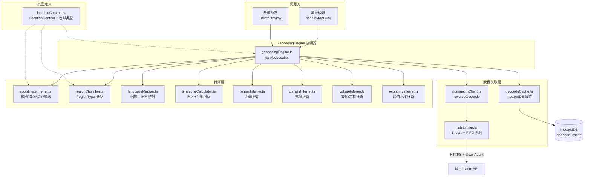
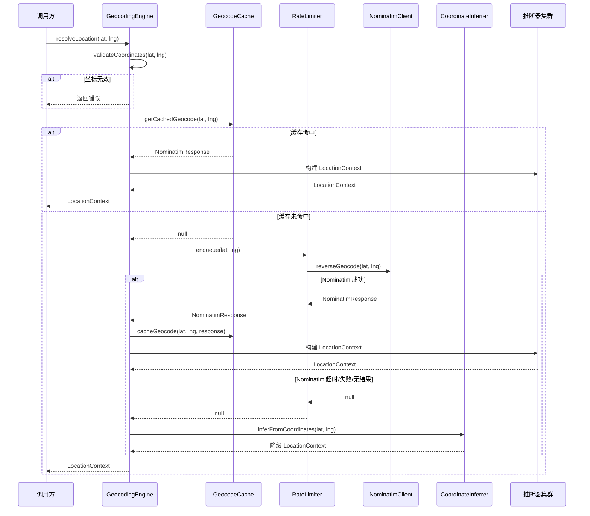
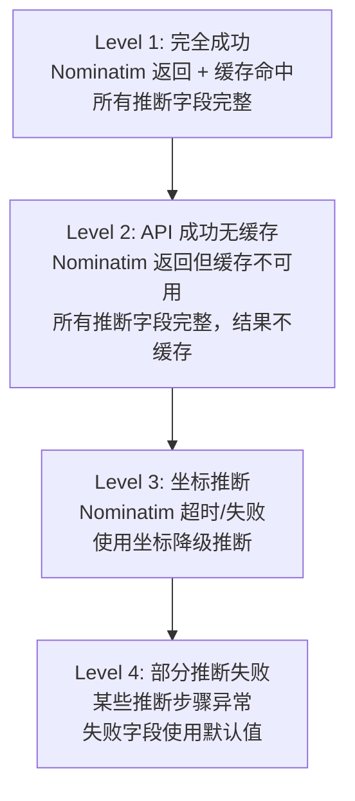

# 设计文档：Geocoding Engine（反向地理编码与语境推断引擎）

## 概述

Geocoding Engine 是 PinDrop 声景生成管道的第二阶段核心模块，负责将用户点击的地图坐标转换为结构化的 `LocationContext` 对象。该模块是连接"地图交互"与"声景配方生成"的桥梁——上游接收坐标输入，下游输出完整的位置语境供声景引擎消费。

系统由以下核心组件构成：

- **NominatimClient**：封装 Nominatim 反向地理编码 API，含 3s 超时、User-Agent Header、HTTPS 强制
- **RateLimiter**：1 req/s 速率限制 + FIFO 队列 + 10s 坐标冷却
- **CoordinateInferrer**：三级降级推断（极地 → 海洋 → 荒野），确保任意坐标都能产出有效 LocationContext
- **推断器集群**：LanguageMapper、RegionClassifier、TimezoneCalculator、TerrainInferrer、ClimateInferrer、CultureInferrer、EconomyInferrer
- **GeocodingEngine**：顶层协调器，编排 cache → Nominatim → infer → build 的完整流程

### 设计目标

1. **全覆盖**：地球上任意坐标（含海洋、极地、荒野）都能产出完整的 LocationContext
2. **合规性**：严格遵守 Nominatim 1 req/s 速率限制和 User-Agent 要求
3. **低延迟**：缓存命中时 < 1ms，API 调用时 ≤ 3s（超时即降级）
4. **容错性**：任何单个推断步骤失败不阻塞整体流程，使用默认值兜底

## 架构

### 整体架构图



### 数据流序列图

#### 完整 Geocoding 流程



## 组件与接口

### 模块结构

```
src/
├── types/
│   └── locationContext.ts         # LocationContext 接口 + 所有枚举类型
├── utils/
│   ├── nominatim.ts               # Nominatim API 客户端（已有，需扩展）
│   ├── throttle.ts                # 速率限制器（已有，需扩展）
│   ├── geocodeCache.ts            # 地理编码缓存（已有）
│   ├── coordinates.ts             # 坐标工具（已有）
│   ├── timeSlot.ts                # 时间档工具（已有）
│   ├── geocoding/
│   │   ├── geocodingEngine.ts     # 顶层协调器
│   │   ├── coordinateInferrer.ts  # 坐标降级推断
│   │   ├── regionClassifier.ts    # 区域类型分类
│   │   ├── languageMapper.ts      # 国家→语言映射
│   │   ├── timezoneCalculator.ts  # 时区计算
│   │   ├── terrainInferrer.ts     # 地形推断
│   │   ├── climateInferrer.ts     # 气候推断
│   │   ├── cultureInferrer.ts     # 文化/宗教推断
│   │   ├── economyInferrer.ts     # 经济水平推断
│   │   └── index.ts               # 模块导出
│   └── __tests__/
│       ├── geocodingEngine.test.ts
│       ├── geocodingEngine.property.test.ts
│       ├── coordinateInferrer.test.ts
│       ├── coordinateInferrer.property.test.ts
│       ├── regionClassifier.test.ts
│       ├── languageMapper.test.ts
│       ├── timezoneCalculator.test.ts
│       ├── timezoneCalculator.property.test.ts
│       ├── climateInferrer.property.test.ts
│       └── locationContext.property.test.ts
```


### 核心接口

#### locationContext.ts — 类型定义

```typescript
// === 枚举类型 ===

type RegionType =
  | "city_center"
  | "city_suburb"
  | "town"
  | "village"
  | "rural"
  | "wilderness"
  | "ocean"
  | "polar";

type TimeSlot = "dawn" | "day" | "dusk" | "night";

type TerrainType =
  | "mountain"
  | "plain"
  | "coast"
  | "desert"
  | "forest"
  | "tundra"
  | "jungle"
  | "river"
  | "lake";

type WaterType = "sea" | "river" | "lake" | "canal";

type ClimateType =
  | "tropical"
  | "temperate"
  | "subarctic"
  | "arid"
  | "mediterranean";

// === 主接口 ===

interface LocationContext {
  // 基础地理
  cityName: string;
  countryName: string;
  regionType: RegionType;
  coordinates: [number, number];

  // 语言
  primaryLanguage: string;      // ISO 639-1，如 "fr"
  languageVariant: string;      // BCP 47，如 "fr-FR"
  secondaryLanguages: string[]; // 其他可能听到的语言

  // 时间
  timezone: string;             // IANA 格式或 "UTC±N"
  currentLocalHour: number;     // 0-23
  timeSlot: TimeSlot;

  // 文化推断
  cultureRegion: string;        // 如 "western_europe"
  dominantReligion: string;     // 如 "christianity"
  urbanDensity: number;         // 0-1

  // 地理特征
  terrain: TerrainType;
  nearWater: WaterType | null;
  climate: ClimateType;

  // 经济水平
  economicLevel: number;        // 0-1
}

// === 辅助类型 ===

interface LanguageInfo {
  primaryLanguage: string;
  languageVariant: string;
  secondaryLanguages: string[];
}

interface CultureInfo {
  cultureRegion: string;
  dominantReligion: string;
}

interface TimezoneInfo {
  timezone: string;
  currentLocalHour: number;
  timeSlot: TimeSlot;
}

// === 序列化 ===

function serializeLocationContext(ctx: LocationContext): string;
function parseLocationContext(json: string): LocationContext | null;
```

#### nominatim.ts — Nominatim 客户端（扩展现有模块）

```typescript
// 已有接口保持不变
interface NominatimResponse {
  display_name: string;
  address: {
    city?: string;
    town?: string;
    village?: string;
    country?: string;
    state?: string;
    county?: string;
    suburb?: string;       // 新增：用于 city_suburb 判断
    hamlet?: string;       // 新增：用于 village 降级
    country_code?: string; // 新增：用于语言映射
  };
}

// 已有函数签名不变
function reverseGeocode(lat: number, lng: number): Promise<NominatimResponse | null>;
function extractGeocodingInfo(response: NominatimResponse, lat: number, lng: number): GeocodingResult;
function inferFromCoordinates(lat: number, lng: number): GeocodingResult;
function getGeocodingInfo(lat: number, lng: number): Promise<GeocodingResult>;
```

#### throttle.ts — 速率限制器（扩展现有模块）

```typescript
// 已有函数保持不变
function throttleNominatimRequest<T>(lat: number, lng: number, requestFn: () => Promise<T>): Promise<T>;
function shouldAllowRequest(lat: number, lng: number): boolean;
function recordRequest(lat: number, lng: number): void;

// 扩展：FIFO 队列管理器（增强 RequestThrottleManager）
class RequestThrottleManager {
  private queue: QueuedRequest[];
  private isProcessing: boolean;
  private lastRequestTime: number;
  private readonly minInterval: number; // 1000ms

  // 将请求加入队列，按 FIFO 顺序处理
  enqueue<T>(lat: number, lng: number, requestFn: () => Promise<T>): Promise<T>;

  // 内部：顺序处理队列
  private processQueue(): Promise<void>;
}
```

#### geocodingEngine.ts — 顶层协调器

```typescript
// 协调器入口：坐标 → 完整 LocationContext
async function resolveLocation(lat: number, lng: number): Promise<LocationContext>;

// 从 Nominatim 响应构建 LocationContext
function buildLocationContext(
  response: NominatimResponse,
  lat: number,
  lng: number
): LocationContext;

// 从坐标推断构建 LocationContext（降级路径）
function buildInferredLocationContext(lat: number, lng: number): LocationContext;
```

#### coordinateInferrer.ts — 坐标降级推断

```typescript
// 极地检测：|lat| > 66.5
function isPolar(lat: number): boolean;

// 海洋检测：无 Nominatim 结果且非极地
function isOcean(lat: number, lng: number): boolean;

// 三级降级入口
function inferFromCoordinates(lat: number, lng: number): LocationContext;

// 极地 LocationContext 构建
function buildPolarContext(lat: number, lng: number): LocationContext;

// 海洋 LocationContext 构建
function buildOceanContext(lat: number, lng: number): LocationContext;

// 荒野 LocationContext 构建
function buildWildernessContext(lat: number, lng: number): LocationContext;
```

#### regionClassifier.ts — 区域类型分类

```typescript
interface RegionClassification {
  regionType: RegionType;
  urbanDensity: number;
}

// 从 Nominatim address 推断区域类型
function classifyRegion(address: NominatimResponse['address']): RegionClassification;
```

**分类逻辑：**

| 优先级 | address 字段 | RegionType | urbanDensity |
|--------|-------------|------------|--------------|
| 1 | `city` + `suburb` | `city_suburb` | 0.6 |
| 2 | `city`（无 suburb） | `city_center` | 0.9 |
| 3 | `town` | `town` | 0.3 |
| 4 | `village` 或 `hamlet` | `village` | 0.15 |
| 5 | 仅 `county`/`state` | `rural` | 0.05 |

#### languageMapper.ts — 国家→语言映射

```typescript
// 查询国家的语言信息
function getLanguageInfo(countryName: string): LanguageInfo;

// 内部映射表（100+ 国家）
const COUNTRY_LANGUAGE_MAP: Record<string, {
  lang: string;        // ISO 639-1
  variant: string;     // BCP 47
  secondary: string[]; // 其他常见语言
}>;
```

**映射数据示例（部分）：**

```typescript
const COUNTRY_LANGUAGE_MAP = {
  "France":         { lang: "fr", variant: "fr-FR", secondary: ["en", "ar"] },
  "Japan":          { lang: "ja", variant: "ja-JP", secondary: ["en"] },
  "Brazil":         { lang: "pt", variant: "pt-BR", secondary: ["es", "en"] },
  "Egypt":          { lang: "ar", variant: "ar-EG", secondary: ["en", "fr"] },
  "India":          { lang: "hi", variant: "hi-IN", secondary: ["en", "bn", "te"] },
  "China":          { lang: "zh", variant: "zh-CN", secondary: ["en"] },
  "Switzerland":    { lang: "de", variant: "de-CH", secondary: ["fr", "it", "rm"] },
  "Belgium":        { lang: "nl", variant: "nl-BE", secondary: ["fr", "de"] },
  "Canada":         { lang: "en", variant: "en-CA", secondary: ["fr"] },
  // ... 100+ 国家
  // 兜底
  "_default":       { lang: "en", variant: "en-US", secondary: [] },
};
```

#### timezoneCalculator.ts — 时区计算

```typescript
// 计算时区信息
function calculateTimezone(countryName: string | null, lat: number, lng: number): TimezoneInfo;

// 从国家名获取 IANA 时区
function getTimezoneByCountry(countryName: string): string | null;

// 从经度估算时区偏移
function estimateTimezoneFromLongitude(lng: number): string;

// 获取指定时区的当前小时
function getCurrentHourInTimezone(timezone: string): number;
```

**时区计算策略：**

1. 优先使用 `Intl.DateTimeFormat` 解析国家对应的 IANA 时区
2. 若国家名不可用，使用经度估算：`offset = Math.round(lng / 15)`
3. `currentLocalHour` 通过 `new Date().toLocaleString('en-US', { timeZone, hour: 'numeric', hour12: false })` 获取
4. `timeSlot` 通过已有的 `getTimeSlot(hour)` 函数映射

#### terrainInferrer.ts — 地形推断

```typescript
interface TerrainResult {
  terrain: TerrainType;
  nearWater: WaterType | null;
}

// 推断地形类型
function inferTerrain(
  lat: number,
  lng: number,
  address: NominatimResponse['address'] | null
): TerrainResult;
```

**推断规则（按优先级）：**

| 优先级 | 条件 | terrain | nearWater |
|--------|------|---------|-----------|
| 1 | regionType === "ocean" | `"coast"` | `"sea"` |
| 2 | regionType === "polar" | `"tundra"` | `null` |
| 3 | 坐标在已知沙漠区域 | `"desert"` | `null` |
| 4 | \|lat\| < 15 且热带区域 | `"jungle"` | `null` |
| 5 | \|lat\| ≥ 60 且非海岸 | `"tundra"` | `null` |
| 6 | address 含海岸线指示 | `"coast"` | `"sea"` |
| 7 | 默认 | `"plain"` | `null` |

**已知沙漠区域坐标范围：**

```typescript
const DESERT_REGIONS = [
  { name: "Sahara",  latRange: [15, 35],  lngRange: [-17, 40] },
  { name: "Arabian", latRange: [12, 32],  lngRange: [35, 60] },
  { name: "Gobi",    latRange: [37, 50],  lngRange: [90, 115] },
  { name: "Kalahari",latRange: [-28, -18],lngRange: [17, 27] },
  { name: "Atacama", latRange: [-30, -18],lngRange: [-72, -68] },
  { name: "Sonoran", latRange: [25, 35],  lngRange: [-115, -108] },
];
```

#### climateInferrer.ts — 气候推断

```typescript
// 推断气候类型
function inferClimate(lat: number, lng: number): ClimateType;
```

**推断规则（按优先级）：**

| 优先级 | 条件 | ClimateType |
|--------|------|-------------|
| 1 | \|lat\| ≥ 55 | `"subarctic"` |
| 2 | 坐标在地中海气候区 | `"mediterranean"` |
| 3 | 坐标在已知干旱区域且 23.5 ≤ \|lat\| < 35 | `"arid"` |
| 4 | \|lat\| < 23.5 | `"tropical"` |
| 5 | 默认 | `"temperate"` |

**地中海气候区坐标范围：**

```typescript
const MEDITERRANEAN_REGIONS = [
  { name: "Mediterranean Basin", latRange: [30, 45], lngRange: [-10, 40] },
  { name: "California",          latRange: [32, 42], lngRange: [-125, -115] },
  { name: "Central Chile",       latRange: [-40, -30], lngRange: [-75, -70] },
  { name: "South Africa Cape",   latRange: [-35, -31], lngRange: [17, 26] },
  { name: "SW Australia",        latRange: [-37, -30], lngRange: [114, 120] },
];
```

#### cultureInferrer.ts — 文化/宗教推断

```typescript
// 推断文化信息
function inferCulture(countryName: string): CultureInfo;

// 内部映射表
const COUNTRY_CULTURE_MAP: Record<string, CultureInfo>;
```

**文化区域分类：**

| cultureRegion | 代表国家 |
|---------------|----------|
| `western_europe` | France, Germany, UK, Italy, Spain |
| `eastern_europe` | Russia, Poland, Ukraine, Romania |
| `east_asia` | China, Japan, South Korea |
| `south_asia` | India, Pakistan, Bangladesh |
| `southeast_asia` | Thailand, Vietnam, Indonesia |
| `middle_east` | Saudi Arabia, Iran, Egypt, Turkey |
| `sub_saharan_africa` | Nigeria, Kenya, Ethiopia |
| `north_africa` | Morocco, Algeria, Tunisia |
| `latin_america` | Brazil, Mexico, Argentina |
| `north_america` | USA, Canada |
| `central_asia` | Mongolia, Kazakhstan |
| `oceania` | Australia, New Zealand |
| `unknown` | 兜底值 |

**宗教映射：**

| dominantReligion | 代表国家 |
|------------------|----------|
| `christianity` | France, Brazil, USA, Russia |
| `islam` | Saudi Arabia, Egypt, Indonesia, Turkey |
| `buddhism` | Thailand, Myanmar, Cambodia, Mongolia |
| `hinduism` | India, Nepal |
| `shinto` | Japan |
| `judaism` | Israel |
| `folk_religion` | China, Vietnam |
| `none` | 兜底值 |

#### economyInferrer.ts — 经济水平推断

```typescript
// 推断经济水平
function inferEconomicLevel(countryName: string): number;

// 内部映射表（基于相对 GDP per capita 排名）
const COUNTRY_ECONOMY_MAP: Record<string, number>;
```

**经济水平分档：**

| economicLevel 范围 | 含义 | 代表国家 |
|---------------------|------|----------|
| 0.8 - 1.0 | 高收入 | USA, Japan, Germany, Switzerland |
| 0.6 - 0.79 | 中高收入 | China, Brazil, Mexico, Turkey |
| 0.4 - 0.59 | 中等收入 | India, Egypt, Vietnam, Indonesia |
| 0.2 - 0.39 | 中低收入 | Nigeria, Bangladesh, Cambodia |
| 0.0 - 0.19 | 低收入 | 部分非洲国家 |
| 0.5 | 兜底默认值 | 未知国家 |


## 数据模型

### LocationContext 完整字段说明

| 字段 | 类型 | 来源 | 默认值 |
|------|------|------|--------|
| `cityName` | `string` | Nominatim address / CoordinateInferrer | `"Unknown Location"` |
| `countryName` | `string` | Nominatim address / CoordinateInferrer | `"Unknown"` |
| `regionType` | `RegionType` | RegionClassifier / CoordinateInferrer | `"wilderness"` |
| `coordinates` | `[number, number]` | 输入参数 | — |
| `primaryLanguage` | `string` | LanguageMapper | `"en"` |
| `languageVariant` | `string` | LanguageMapper | `"en-US"` |
| `secondaryLanguages` | `string[]` | LanguageMapper | `[]` |
| `timezone` | `string` | TimezoneCalculator | `"UTC+0"` |
| `currentLocalHour` | `number` | TimezoneCalculator | 当前 UTC 小时 |
| `timeSlot` | `TimeSlot` | TimezoneCalculator + getTimeSlot | 基于 currentLocalHour |
| `cultureRegion` | `string` | CultureInferrer | `"unknown"` |
| `dominantReligion` | `string` | CultureInferrer | `"none"` |
| `urbanDensity` | `number` | RegionClassifier / CoordinateInferrer | `0` |
| `terrain` | `TerrainType` | TerrainInferrer | `"plain"` |
| `nearWater` | `WaterType \| null` | TerrainInferrer | `null` |
| `climate` | `ClimateType` | ClimateInferrer | `"temperate"` |
| `economicLevel` | `number` | EconomyInferrer | `0.5` |

### Nominatim 响应到 LocationContext 的映射

```
NominatimResponse.address
    ├── city ──────────→ cityName, regionType (city_center/city_suburb)
    ├── town ──────────→ cityName, regionType (town)
    ├── village ───────→ cityName, regionType (village)
    ├── hamlet ────────→ cityName, regionType (village)
    ├── suburb ────────→ regionType (city_suburb 判断依据)
    ├── country ───────→ countryName → LanguageMapper → CultureInferrer → EconomyInferrer
    ├── country_code ──→ 辅助语言映射
    ├── state ─────────→ 行政区划（辅助信息）
    └── county ────────→ regionType (rural 判断依据)
```

### 降级路径数据流

```
坐标输入 (lat, lng)
    │
    ├─ Nominatim 成功 ──→ 完整推断路径
    │   ├── RegionClassifier(address)
    │   ├── LanguageMapper(country)
    │   ├── TimezoneCalculator(country, lat, lng)
    │   ├── TerrainInferrer(lat, lng, address)
    │   ├── ClimateInferrer(lat, lng)
    │   ├── CultureInferrer(country)
    │   └── EconomyInferrer(country)
    │
    └─ Nominatim 失败 ──→ CoordinateInferrer
        ├── |lat| > 66.5? ──→ buildPolarContext
        │   ├── regionType: "polar"
        │   ├── cityName: "Arctic" / "Antarctic"
        │   ├── climate: "subarctic"
        │   ├── terrain: "tundra"
        │   └── urbanDensity: 0, economicLevel: 0
        │
        ├── 非极地? ──→ buildOceanContext
        │   ├── regionType: "ocean"
        │   ├── cityName: "Ocean"
        │   ├── climate: "temperate"
        │   ├── terrain: "coast", nearWater: "sea"
        │   └── urbanDensity: 0, economicLevel: 0
        │
        └── 其他 ──→ buildWildernessContext
            ├── regionType: "wilderness"
            ├── cityName: "Location at {lat}°, {lng}°"
            ├── climate: 基于纬度推断
            ├── terrain: "plain"（默认）
            └── urbanDensity: 0, economicLevel: 0
```

## 关键算法

### 1. 速率限制 FIFO 队列

```
状态：
  queue: QueuedRequest[]  // FIFO 队列
  lastRequestTime: number // 上次请求时间戳
  isProcessing: boolean   // 是否正在处理队列

enqueue(request):
  1. 将 request 加入 queue 尾部
  2. 若 !isProcessing，启动 processQueue()
  3. 返回 Promise（在 request 完成时 resolve）

processQueue():
  1. isProcessing = true
  2. while queue 非空:
     a. now = Date.now()
     b. elapsed = now - lastRequestTime
     c. if elapsed < 1000ms:
        await sleep(1000 - elapsed)
     d. request = queue.shift()
     e. lastRequestTime = Date.now()
     f. 执行 request.requestFn()
     g. resolve/reject request 的 Promise
  3. isProcessing = false
```

### 2. 极地检测算法

```
isPolar(lat):
  return |lat| > 66.5

// 66.5° 是北极圈/南极圈的近似纬度
// 极地检测优先于海洋检测，确保北冰洋区域归类为 polar 而非 ocean
```

### 3. 时区计算算法

```
calculateTimezone(countryName, lat, lng):
  1. if countryName 可用:
     a. 查询 COUNTRY_TIMEZONE_MAP[countryName]
     b. if 找到 IANA 时区:
        timezone = IANA 时区字符串
        hour = Intl.DateTimeFormat 解析当前小时
        return { timezone, currentLocalHour: hour, timeSlot: getTimeSlot(hour) }
  2. 经度估算降级:
     offset = Math.round(lng / 15)
     timezone = "UTC" + (offset >= 0 ? "+" : "") + offset
     hour = (UTC小时 + offset + 24) % 24
     return { timezone, currentLocalHour: hour, timeSlot: getTimeSlot(hour) }
```

### 4. 气候推断算法

```
inferClimate(lat, lng):
  absLat = |lat|

  1. if absLat >= 55 → return "subarctic"
  2. if 坐标在 MEDITERRANEAN_REGIONS 内 → return "mediterranean"
  3. if 坐标在 DESERT_REGIONS 内 且 23.5 <= absLat < 35 → return "arid"
  4. if absLat < 23.5 → return "tropical"
  5. return "temperate"  // 默认
```

### 5. LocationContext 序列化/反序列化

```typescript
// 序列化：直接 JSON.stringify
function serializeLocationContext(ctx: LocationContext): string {
  return JSON.stringify(ctx);
}

// 反序列化：JSON.parse + 类型验证
function parseLocationContext(json: string): LocationContext | null {
  try {
    const parsed = JSON.parse(json);
    // 验证必要字段存在且类型正确
    if (!parsed || typeof parsed !== 'object') return null;
    if (!Array.isArray(parsed.coordinates) || parsed.coordinates.length !== 2) return null;
    if (typeof parsed.cityName !== 'string') return null;
    if (typeof parsed.regionType !== 'string') return null;
    // ... 其他字段验证
    return parsed as LocationContext;
  } catch {
    return null;
  }
}
```

## 正确性属性

*属性（Property）是指在系统所有有效执行中都应成立的特征或行为——本质上是对系统应做什么的形式化陈述。*

### Property 1: 坐标验证完备性

*For any* 数值对 `(lat, lng)`，当 `lat ∉ [-90, 90]` 或 `lng ∉ [-180, 180]` 时，`resolveLocation(lat, lng)` SHALL 返回错误而不发起任何 API 调用。当 `lat ∈ [-90, 90]` 且 `lng ∈ [-180, 180]` 时，SHALL 返回有效的 LocationContext。

**Validates: Requirements 16.4, 16.5**

### Property 2: 极地检测阈值一致性

*For any* 纬度 `lat`，当 `|lat| > 66.5` 时 `isPolar(lat)` SHALL 返回 `true`；当 `|lat| ≤ 66.5` 时 SHALL 返回 `false`。此属性确保极地检测阈值在所有输入上行为一致。

**Validates: Requirements 5.1, 5.7**

### Property 3: 降级优先级正确性

*For any* 坐标 `(lat, lng)` 使得 Nominatim 返回 null，当 `|lat| > 66.5` 时 `inferFromCoordinates` SHALL 返回 `regionType: "polar"`（而非 "ocean"），确保极地检测优先于海洋检测。

**Validates: Requirements 5.7**

### Property 4: 时间档映射完备性

*For any* 整数 `hour ∈ [0, 23]`，`getTimeSlot(hour)` SHALL 返回恰好一个 TimeSlot 值。具体映射：5-8 → dawn，9-16 → day，17-19 → dusk，20-23 和 0-4 → night。

**Validates: Requirements 10.4, 10.6**

### Property 5: LocationContext 序列化往返一致性

*For any* 有效的 LocationContext 对象 `ctx`，`parseLocationContext(serializeLocationContext(ctx))` SHALL 产出与 `ctx` 在所有字段上等价的对象。特别地，`coordinates`、`urbanDensity`、`economicLevel` 的数值精度 SHALL 被完整保留。

**Validates: Requirements 17.3, 17.5**

### Property 6: 语言映射兜底保证

*For any* 字符串 `countryName`，`getLanguageInfo(countryName)` SHALL 返回有效的 LanguageInfo 对象，其中 `primaryLanguage` 为非空字符串，`languageVariant` 为非空字符串。当 `countryName` 不在映射表中时，SHALL 返回 `{ primaryLanguage: "en", languageVariant: "en-US", secondaryLanguages: [] }`。

**Validates: Requirements 8.3**

### Property 7: 气候推断纬度单调性

*For any* 纬度 `lat` 满足 `|lat| ≥ 55`，`inferClimate(lat, lng)` SHALL 返回 `"subarctic"`（对任意 `lng`）。*For any* 纬度 `lat` 满足 `|lat| < 23.5` 且坐标不在已知干旱/地中海区域内，`inferClimate(lat, lng)` SHALL 返回 `"tropical"`。

**Validates: Requirements 12.1, 12.4**

### Property 8: 区域类型与 urbanDensity 一致性

*For any* Nominatim address 输入，`classifyRegion(address)` 返回的 `regionType` 和 `urbanDensity` SHALL 满足以下映射关系：city_center → 0.9，city_suburb → 0.6，town → 0.3，village → 0.15，rural → 0.05。

**Validates: Requirements 9.5**

### Property 9: 经济水平范围约束

*For any* 字符串 `countryName`，`inferEconomicLevel(countryName)` SHALL 返回 `[0, 1]` 范围内的数值。

**Validates: Requirements 14.1**

### Property 10: resolveLocation 总是返回完整 LocationContext

*For any* 有效坐标 `(lat, lng)` 满足 `lat ∈ [-90, 90]` 且 `lng ∈ [-180, 180]`，`resolveLocation(lat, lng)` SHALL 返回一个 LocationContext 对象，其中所有字段均已填充（无 undefined），且 `regionType` 为 RegionType 枚举的有效值之一。

**Validates: Requirements 15.6, 15.7**


## 错误处理

### 错误分类与响应策略

| 错误类型 | 严重级别 | 响应策略 | 日志格式 |
|----------|----------|----------|----------|
| 坐标验证失败 | 高 | 返回错误，不发起 API 调用 | `[PinDrop Error] GeocodingEngine: Invalid coordinates lat={lat}, lng={lng}` |
| Nominatim 超时（>3s） | 低 | 静默降级到坐标推断 | `[PinDrop] Nominatim request timed out after 3s` |
| Nominatim HTTP 错误 | 低 | 静默降级到坐标推断 | `[PinDrop Error] Nominatim API error: {status}` |
| Nominatim 网络错误 | 低 | 静默降级到坐标推断 | `[PinDrop Error] Nominatim request failed: {error}` |
| Nominatim 无结果 | 低 | 静默降级到坐标推断 | 无日志（正常情况，如海洋坐标） |
| IndexedDB 缓存读取失败 | 低 | 跳过缓存，直接调 API | `[PinDrop Error] Failed to get cached geocode: {error}` |
| IndexedDB 缓存写入失败 | 低 | 继续执行，不缓存 | `[PinDrop Error] Failed to cache geocode: {error}` |
| IndexedDB 不可用 | 低 | 禁用缓存，直接调 API | `[PinDrop] IndexedDB unavailable, geocode caching disabled` |
| 单个推断步骤失败 | 低 | 使用该字段默认值，继续构建 | `[PinDrop Error] {InferrerName}: {error}` |
| 序列化失败 | 低 | 返回 null | 无日志 |
| 反序列化失败 | 低 | 返回 null | 无日志 |

### 降级策略



### 安全约束

1. **Nominatim 合规**：
   - 每个请求必须携带 `User-Agent: PinDrop/1.0 (https://github.com/pindrop/pindrop)`
   - 严格遵守 1 req/s 速率限制
   - 仅使用 HTTPS 协议

2. **日志安全**：
   - 日志中不包含原始 API 响应体
   - 日志中不包含用户坐标的完整精度（仅在错误场景记录）
   - 遵循 `[PinDrop Error] {component}: {message}` 格式

## 测试策略

### 测试框架与工具

- **单元测试框架**：Vitest
- **属性测试库**：fast-check
- **测试环境**：jsdom
- **Mock 工具**：Vitest 内置 `vi.mock` / `vi.fn` / `vi.spyOn`

### 双重测试方法

#### 属性测试（Property-Based Tests）

每个属性测试最少运行 **100 次迭代**。

| 属性 | 测试文件 | 标签 |
|------|----------|------|
| Property 1: 坐标验证完备性 | `geocodingEngine.property.test.ts` | Feature: 02-geocoding-engine, Property 1 |
| Property 2: 极地检测阈值 | `coordinateInferrer.property.test.ts` | Feature: 02-geocoding-engine, Property 2 |
| Property 3: 降级优先级 | `coordinateInferrer.property.test.ts` | Feature: 02-geocoding-engine, Property 3 |
| Property 4: 时间档映射完备性 | `timezoneCalculator.property.test.ts` | Feature: 02-geocoding-engine, Property 4 |
| Property 5: 序列化往返 | `locationContext.property.test.ts` | Feature: 02-geocoding-engine, Property 5 |
| Property 6: 语言映射兜底 | `languageMapper.property.test.ts` | Feature: 02-geocoding-engine, Property 6 |
| Property 7: 气候纬度单调性 | `climateInferrer.property.test.ts` | Feature: 02-geocoding-engine, Property 7 |
| Property 8: 区域-密度一致性 | `regionClassifier.property.test.ts` | Feature: 02-geocoding-engine, Property 8 |
| Property 9: 经济水平范围 | `economyInferrer.property.test.ts` | Feature: 02-geocoding-engine, Property 9 |
| Property 10: 总是返回完整 Context | `geocodingEngine.property.test.ts` | Feature: 02-geocoding-engine, Property 10 |

#### 单元测试（Example-Based Tests）

| 测试范围 | 测试文件 | 覆盖需求 |
|----------|----------|----------|
| Nominatim 请求参数 | `nominatim.test.ts` | Req 1 |
| 速率限制队列 | `throttle.test.ts` | Req 2 |
| 缓存命中/未命中 | `geocodeCache.test.ts` | Req 3 |
| 海洋检测具体坐标 | `coordinateInferrer.test.ts` | Req 4 |
| 极地检测边界值 | `coordinateInferrer.test.ts` | Req 5 |
| 荒野降级 | `coordinateInferrer.test.ts` | Req 6 |
| 区域分类具体示例 | `regionClassifier.test.ts` | Req 9 |
| 时区计算具体城市 | `timezoneCalculator.test.ts` | Req 10 |
| 地形推断具体区域 | `terrainInferrer.test.ts` | Req 11 |
| 气候推断边界纬度 | `climateInferrer.test.ts` | Req 12 |
| 文化推断具体国家 | `cultureInferrer.test.ts` | Req 13 |
| 经济水平具体国家 | `economyInferrer.test.ts` | Req 14 |
| 协调器完整流程 | `geocodingEngine.test.ts` | Req 15 |
| 错误处理与日志 | `geocodingEngine.test.ts` | Req 16 |
| 序列化边界情况 | `locationContext.test.ts` | Req 17 |

### Mock 策略

- **Nominatim API**：使用 `vi.fn()` mock `reverseGeocode`，返回预定义的 NominatimResponse 或 null
- **IndexedDB**：使用 `vi.mock('@/utils/db')` mock `getDB`
- **Intl.DateTimeFormat**：使用 `vi.spyOn` mock 时区解析
- **Date**：使用 `vi.useFakeTimers()` 控制当前时间
- **console**：使用 `vi.spyOn(console, 'error/log')` 验证日志输出

### Mock 测试数据

```typescript
// 巴黎 — 城市中心
const PARIS_RESPONSE: NominatimResponse = {
  display_name: "Paris, Île-de-France, France",
  address: { city: "Paris", state: "Île-de-France", country: "France", country_code: "fr" }
};

// 东京 — 城市中心
const TOKYO_RESPONSE: NominatimResponse = {
  display_name: "Tokyo, Japan",
  address: { city: "Tokyo", country: "Japan", country_code: "jp" }
};

// 小镇
const TOWN_RESPONSE: NominatimResponse = {
  display_name: "Grasse, Alpes-Maritimes, France",
  address: { town: "Grasse", county: "Alpes-Maritimes", country: "France", country_code: "fr" }
};

// 村庄
const VILLAGE_RESPONSE: NominatimResponse = {
  display_name: "Gordes, Vaucluse, France",
  address: { village: "Gordes", county: "Vaucluse", country: "France", country_code: "fr" }
};

// 海洋坐标 — null 响应
const OCEAN_COORDS = { lat: 0, lng: -30 };

// 极地坐标
const ARCTIC_COORDS = { lat: 85, lng: 0 };
const ANTARCTIC_COORDS = { lat: -85, lng: 0 };

// 荒野坐标（陆地但无 Nominatim 数据）
const WILDERNESS_COORDS = { lat: 45, lng: 90 };
```

### 覆盖率目标

| 模块 | 目标覆盖率 | 优先级 |
|------|-----------|--------|
| coordinateInferrer.ts | 95% | 关键 |
| timezoneCalculator.ts | 95% | 关键 |
| climateInferrer.ts | 90% | 高 |
| regionClassifier.ts | 90% | 高 |
| languageMapper.ts | 90% | 高 |
| geocodingEngine.ts | 90% | 高 |
| terrainInferrer.ts | 85% | 高 |
| cultureInferrer.ts | 85% | 高 |
| economyInferrer.ts | 85% | 高 |
| locationContext.ts (序列化) | 90% | 高 |