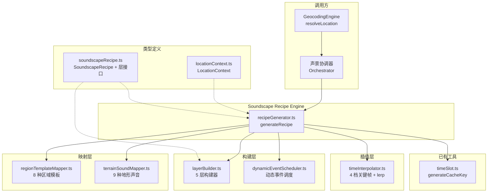
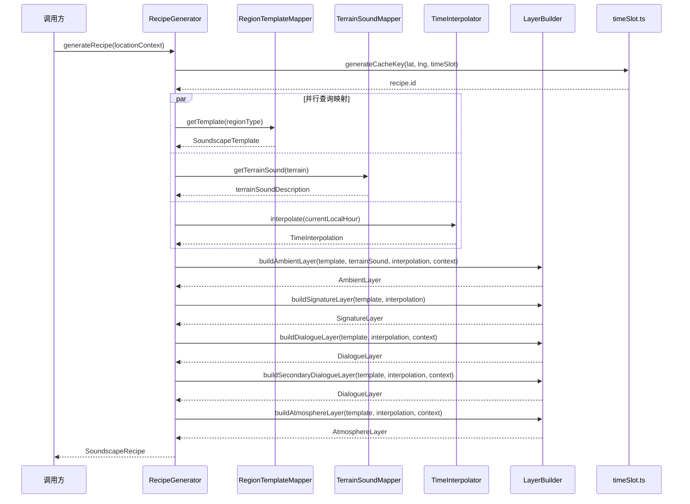
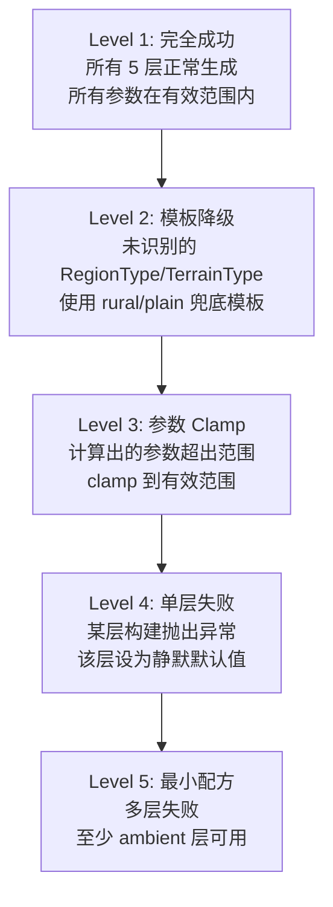

# 设计文档：Soundscape Recipe Engine（声景配方生成引擎）

## 概述

Soundscape Recipe Engine 是 PinDrop 声景生成管道的第三阶段核心模块，负责将上游 Geocoding Engine 输出的 `LocationContext` 对象转换为结构化的 `SoundscapeRecipe` JSON 配方。该模块是连接"位置语境"与"ElevenLabs 音频合成"的桥梁——上游接收完整的 LocationContext，下游输出包含 5 层声音参数的配方供音频合成器消费。

系统由以下核心组件构成：

- **RecipeGenerator**：顶层配方生成协调器，接收 LocationContext 并输出完整的 SoundscapeRecipe
- **RegionTemplateMapper**：8 种区域类型到声景模板的映射，提供 ambientPrompt、signaturePool、dialogueTopics、atmosphereStyle、dynamicEventPool
- **TerrainSoundMapper**：9 种地形类型到自然声音 prompt 的映射
- **TimeInterpolator**：4 档时间关键帧定义 + 连续参数插值算法，计算任意小时的声景参数
- **DynamicEventScheduler**：区域类型到动态事件池的映射 + 随机间隔调度逻辑
- **LayerBuilder**：5 层声音配方构建器，分别生成 ambient、signature、dialogue、secondaryDialogue、atmosphere 层参数

### 设计目标

1. **全覆盖**：任意有效的 LocationContext 都能产出完整的 SoundscapeRecipe
2. **时间连续性**：通过 4 档关键帧 + 线性插值实现声景参数的平滑过渡
3. **文化适配**：根据区域类型、地形、语言、文化等维度生成差异化的声景配方
4. **确定性**：相同的 LocationContext 输入产出结构一致的配方（随机元素仅限动态事件调度）
5. **可测试性**：纯函数设计，所有映射和插值逻辑可独立测试

## 架构

### 整体架构图



### 数据流序列图

#### 完整配方生成流程



## 组件与接口

### 模块结构

```
src/
├── types/
│   └── soundscapeRecipe.ts        # SoundscapeRecipe + 层接口 + TimeInterpolation
├── utils/
│   └── soundscape/
│       ├── recipeGenerator.ts     # 顶层协调器
│       ├── regionTemplateMapper.ts # 区域类型→声景模板
│       ├── terrainSoundMapper.ts  # 地形→自然音映射
│       ├── timeInterpolator.ts    # 时间插值
│       ├── dynamicEventScheduler.ts # 动态事件调度
│       ├── layerBuilder.ts        # 5 层构建器
│       └── index.ts               # 模块导出
│   └── __tests__/
│       ├── recipeGenerator.test.ts
│       ├── recipeGenerator.property.test.ts
│       ├── timeInterpolator.test.ts
│       ├── timeInterpolator.property.test.ts
│       ├── regionTemplateMapper.test.ts
│       ├── terrainSoundMapper.test.ts
│       ├── dynamicEventScheduler.test.ts
│       ├── layerBuilder.test.ts
│       └── soundscapeRecipe.property.test.ts
```

### 核心接口

#### soundscapeRecipe.ts — 类型定义

```typescript
import type { LocationContext } from '@/types/locationContext';
import type { TimeSlot } from '@/utils/timeSlot';

// === 层接口 ===

/** 环境音层 — SFX 类型，持续循环播放 */
interface AmbientLayer {
  type: 'sfx';
  prompt: string;
  volume: number;           // 0-1
  loop: true;               // 始终为 true
}

/** 标志性声音层 — SFX 类型，按间隔触发 */
interface SignatureLayer {
  type: 'sfx';
  prompt: string;
  volume: number;           // 0-1
  loop: false;              // 始终为 false
  intervalSeconds: number;  // 30-90
}

/** 对话层 — TTS 类型 */
interface DialogueLayer {
  type: 'tts';
  model: string;            // "eleven_v3" 或 "eleven_flash_v2_5"
  voiceId: string;
  language: string;         // BCP 47 标签，如 "fr-FR"
  text: string;
  emotionTags: string[];
  volume: number;           // 0-1
  pan: number;              // -1 到 1
  repeatIntervalSeconds: number; // 30-120
}

/** 氛围音乐层 — Music 类型，持续循环播放 */
interface AtmosphereLayer {
  type: 'music';
  prompt: string;
  volume: number;           // 0-1
  loop: true;               // 始终为 true
}

// === 时间插值 ===

/** 时间参数 — 5 个 0-1 范围的声景参数 */
interface TimeParams {
  activity: number;         // 环境活动度
  traffic: number;          // 交通密度
  nature: number;           // 自然声强度
  humanVoice: number;       // 人声密度
  music: number;            // 音乐强度
}

/** 时间插值结果 */
interface TimeInterpolation {
  sourceSlot: TimeSlot;
  targetSlot: TimeSlot;
  progress: number;         // 0-1
  appliedParams: TimeParams;
}

// === 5 层容器 ===

/** 声景层集合 */
interface SoundscapeLayers {
  ambient: AmbientLayer;
  signature: SignatureLayer;
  dialogue: DialogueLayer;
  secondaryDialogue: DialogueLayer;
  atmosphere: AtmosphereLayer;
}

// === 主接口 ===

/** 声景配方 — 完整的声景生成规格 */
interface SoundscapeRecipe {
  id: string;                       // "{lat},{lng}-{timeSlot}"
  location: LocationContext;
  generatedAt: number;              // Unix timestamp
  localTimeAtGeneration: string;    // "HH:MM" 格式
  layers: SoundscapeLayers;
  timeInterpolation: TimeInterpolation;
}

// === 声景模板 ===

/** 区域声景模板 — RegionTemplateMapper 的输出 */
interface SoundscapeTemplate {
  ambientPrompt: string;            // 含 {weather} 占位符
  signaturePool: string[];          // ≥ 3 个条目
  dialogueTopics: string[];         // rural/wilderness/polar 为空数组
  atmosphereStyle: string;          // 含 {culture} 占位符
  dynamicEventPool: string[];
}

// === 动态事件 ===

/** 动态事件定义 */
interface DynamicEvent {
  id: string;
  prompt: string;
  volumeRange: [number, number];    // 各 0-1，[0] ≤ [1]
  panFromTo: [number, number];      // 各 -1 到 1
  durationMs: number;
  minIntervalMs: number;            // 30000
  maxIntervalMs: number;            // 90000
}

// === 序列化 ===

function serializeSoundscapeRecipe(recipe: SoundscapeRecipe): string;
function parseSoundscapeRecipe(json: string): SoundscapeRecipe | null;
```

#### recipeGenerator.ts — 顶层协调器

```typescript
import type { LocationContext } from '@/types/locationContext';
import type { SoundscapeRecipe } from '@/types/soundscapeRecipe';

/**
 * 从 LocationContext 生成完整的 SoundscapeRecipe
 *
 * 协调流程：
 * 1. 使用 generateCacheKey 生成 recipe.id
 * 2. 查询 RegionTemplateMapper 获取区域模板
 * 3. 查询 TerrainSoundMapper 获取地形声音
 * 4. 查询 TimeInterpolator 获取时间插值参数
 * 5. 使用 LayerBuilder 构建 5 层声音参数
 * 6. 组装完整 SoundscapeRecipe
 *
 * @param context - 上游 GeocodingEngine 输出的 LocationContext
 * @returns 完整的 SoundscapeRecipe
 */
function generateRecipe(context: LocationContext): SoundscapeRecipe;
```

#### regionTemplateMapper.ts — 区域模板映射

```typescript
import type { RegionType } from '@/types/locationContext';
import type { SoundscapeTemplate } from '@/types/soundscapeRecipe';

/**
 * 获取区域类型对应的声景模板
 *
 * 为 8 种 RegionType 提供完整的声景模板。
 * 未识别的 RegionType 降级到 "rural" 模板。
 *
 * @param regionType - 区域类型
 * @returns 声景模板
 */
function getTemplate(regionType: RegionType): SoundscapeTemplate;
```

**映射数据：**

| RegionType | ambientPrompt | signaturePool (≥3) | dialogueTopics | atmosphereStyle |
|------------|---------------|-------------------|----------------|-----------------|
| city_center | "Urban ambient: steady traffic hum, distant siren, pedestrian noise, {weather} sound" | street_musician, market_vendor, construction, tram_bell, cafe_chatter | greeting, ordering_food, asking_directions, small_talk, phone_call | "lo-fi urban ambient, minimal, {culture} influence" |
| city_suburb | "Quiet residential street ambient, occasional car, dog barking, {weather} sound" | lawn_mower, ice_cream_truck, school_bell, neighbor_greeting | neighbor_chat, dog_walking, coming_home | "gentle ambient, suburban peaceful, {culture} influence" |
| town | "Small town ambient, sparse traffic, birds, wind, {weather} sound" | church_bell, market_bell, local_announcement, train_whistle | greeting, local_news, weather_comment | "minimal ambient, small town feel, {culture} influence" |
| village | "Rural village ambient, very sparse human activity, nature dominant, {weather} sound" | rooster, temple_bell, well_bucket, children_playing | greeting, farming_talk, seasonal_comment | "very sparse ambient, rural, {culture} influence" |
| rural | "Open rural landscape, wind, insects, distant animals, {weather} sound" | tractor_distant, cow_bell, sheep_bleating, river_trickle | [] (空) | "nature soundscape, very minimal, spacious" |
| wilderness | "Remote wilderness, wind, birds, natural silence, {weather} sound" | eagle_cry, wolf_howl, stream, crackling_twigs | [] (空) | "wilderness soundscape, very sparse, ancient feel" |
| ocean | "Ocean waves rolling steadily, wind over water, distant ship engine" | ship_horn, buoy_bell, fishing_boat, ferry_arrival | fisherman_chat, harbor_master | "ocean soundscape, peaceful, vast" |
| polar | "Arctic wind, ice cracking, absolute quiet between gusts" | ice_crack, aurora_hum, polar_bird, whale_blow | [] (空) | "polar soundscape, extreme minimal, crystalline" |

#### terrainSoundMapper.ts — 地形声音映射

```typescript
import type { TerrainType } from '@/types/locationContext';

/**
 * 获取地形类型对应的自然声音描述
 *
 * 为 9 种 TerrainType 提供特征性自然声音 prompt。
 * 未识别的 TerrainType 降级到 "plain" 声音。
 *
 * @param terrain - 地形类型
 * @returns 自然声音描述字符串（≥ 20 字符）
 */
function getTerrainSound(terrain: TerrainType): string;
```

**映射数据：**

| TerrainType | 自然声音描述 |
|-------------|-------------|
| mountain | "wind through mountain pass, distant eagle cry, rock crunching, echo" |
| plain | "grasshoppers, gentle wind through grass, distant cowbell, open sky silence" |
| coast | "waves, seabirds, wind, shell crunching underfoot, salt air hiss" |
| desert | "wind over sand, absolute silence with occasional sand rustle, heat shimmer hum" |
| forest | "birdsong variety, leaves rustling, woodpecker, stream trickle, twig snap" |
| tundra | "arctic wind, ice cracking, absolute quiet, wolf howl distant, snow crunch" |
| jungle | "dense insect hum, monkey calls, rain on canopy, frog chorus, bird screech" |
| river | "flowing water, riverside birds, reed rustling, fish splash, dragonfly buzz" |
| lake | "loons, gentle lapping, dragonfly buzz, stillness, occasional splash" |

#### timeInterpolator.ts — 时间插值

```typescript
import type { TimeSlot } from '@/utils/timeSlot';
import type { TimeInterpolation, TimeParams } from '@/types/soundscapeRecipe';

/** 4 档时间关键帧 */
const TIME_KEYFRAMES: Record<TimeSlot, TimeParams> = {
  dawn:  { activity: 0.3,  traffic: 0.4,  nature: 0.7,  humanVoice: 0.3,  music: 0.15 },
  day:   { activity: 0.9,  traffic: 0.8,  nature: 0.2,  humanVoice: 0.8,  music: 0.25 },
  dusk:  { activity: 0.5,  traffic: 0.5,  nature: 0.4,  humanVoice: 0.4,  music: 0.3  },
  night: { activity: 0.1,  traffic: 0.15, nature: 0.6,  humanVoice: 0.1,  music: 0.2  },
};

/** 关键帧起始小时 */
const KEYFRAME_HOURS: Array<{ start: number; slot: TimeSlot }> = [
  { start: 5,  slot: 'dawn'  },
  { start: 9,  slot: 'day'   },
  { start: 17, slot: 'dusk'  },
  { start: 20, slot: 'night' },
];

/**
 * 根据当前小时计算时间插值参数
 *
 * 在两个相邻关键帧之间进行线性插值（lerp），
 * 正确处理午夜跨越（night 20:00 → dawn 5:00）。
 *
 * @param currentLocalHour - 当地当前小时 (0-23)
 * @returns 时间插值结果
 */
function interpolate(currentLocalHour: number): TimeInterpolation;

/**
 * 线性插值辅助函数
 *
 * @param a - 起始值
 * @param b - 目标值
 * @param t - 插值进度 (0-1)
 * @returns 插值结果
 */
function lerp(a: number, b: number, t: number): number;
```

#### dynamicEventScheduler.ts — 动态事件调度

```typescript
import type { RegionType } from '@/types/locationContext';
import type { DynamicEvent } from '@/types/soundscapeRecipe';

/** 动态事件调度结果 */
interface ScheduledEvent {
  event: DynamicEvent;
  volume: number;           // 在 volumeRange 内随机
  nextIntervalMs: number;   // 在 [30000, 90000] 内随机
}

/**
 * 获取区域类型对应的动态事件池
 *
 * @param regionType - 区域类型
 * @returns 动态事件数组
 */
function getEventPool(regionType: RegionType): DynamicEvent[];

/**
 * 计算下一个动态事件的参数（纯函数）
 *
 * 从事件池中随机选取事件，分配随机音量和触发间隔。
 * 接受随机数生成器参数以支持确定性测试。
 *
 * @param eventPool - 动态事件池
 * @param random - 随机数生成器函数，默认 Math.random
 * @returns 调度结果
 */
function scheduleNextEvent(
  eventPool: DynamicEvent[],
  random?: () => number
): ScheduledEvent;
```

#### layerBuilder.ts — 5 层构建器

```typescript
import type { LocationContext } from '@/types/locationContext';
import type {
  AmbientLayer,
  SignatureLayer,
  DialogueLayer,
  AtmosphereLayer,
  SoundscapeTemplate,
  TimeInterpolation,
} from '@/types/soundscapeRecipe';

/**
 * 构建 Ambient 层
 *
 * 组合区域模板 ambientPrompt + 地形声音 + 气候天气描述。
 * 音量 = baseVolume * activity 参数，clamp 到 [0, 1]。
 * 若 nearWater 非 null，追加水体声音描述。
 */
function buildAmbientLayer(
  template: SoundscapeTemplate,
  terrainSound: string,
  interpolation: TimeInterpolation,
  context: LocationContext
): AmbientLayer;

/**
 * 构建 Signature 层
 *
 * 从 signaturePool 选取声音 prompt。
 * intervalSeconds = 90 - (60 * activity)，clamp 到 [30, 90]。
 * 音量由 activity 参数调节。
 */
function buildSignatureLayer(
  template: SoundscapeTemplate,
  interpolation: TimeInterpolation
): SignatureLayer;

/**
 * 构建 Dialogue 层（主对话）
 *
 * model = "eleven_v3"，language = context.languageVariant。
 * dialogueTopics 为空时，volume = 0，text = ""。
 * repeatIntervalSeconds = 120 - (90 * humanVoice)，clamp 到 [30, 120]。
 */
function buildDialogueLayer(
  template: SoundscapeTemplate,
  interpolation: TimeInterpolation,
  context: LocationContext
): DialogueLayer;

/**
 * 构建 SecondaryDialogue 层
 *
 * model = "eleven_flash_v2_5"。
 * 音量低于主对话层，pan 与主对话层空间分离。
 * repeatIntervalSeconds 大于主对话层。
 */
function buildSecondaryDialogueLayer(
  template: SoundscapeTemplate,
  interpolation: TimeInterpolation,
  context: LocationContext,
  primaryDialogue: DialogueLayer
): DialogueLayer;

/**
 * 构建 Atmosphere 层
 *
 * 使用 atmosphereStyle 模板，替换 {culture} 占位符。
 * prompt 反映时间段特征（如 "morning feeling"、"night mood"）。
 * 音量由 music 参数调节。
 */
function buildAtmosphereLayer(
  template: SoundscapeTemplate,
  interpolation: TimeInterpolation,
  context: LocationContext
): AtmosphereLayer;

// === 辅助函数 ===

/**
 * 根据气候类型生成天气描述
 *
 * @param climate - 气候类型
 * @returns 天气描述字符串
 */
function getWeatherDescription(climate: ClimateType): string;

/**
 * 根据水体类型生成水声描述
 *
 * @param waterType - 水体类型
 * @returns 水声描述字符串
 */
function getWaterSoundDescription(waterType: WaterType): string;

/**
 * 根据时间段生成时间氛围描述
 *
 * @param timeSlot - 时间档
 * @returns 时间氛围描述字符串
 */
function getTimeMoodDescription(timeSlot: TimeSlot): string;

/**
 * 将数值 clamp 到指定范围
 *
 * @param value - 输入值
 * @param min - 最小值
 * @param max - 最大值
 * @returns clamp 后的值
 */
function clamp(value: number, min: number, max: number): number;
```

## 数据模型

### SoundscapeRecipe 完整字段说明

| 字段 | 类型 | 来源 | 说明 |
|------|------|------|------|
| `id` | `string` | `generateCacheKey(lat, lng, timeSlot)` | 格式 `{lat},{lng}-{timeSlot}`，坐标精度 0.01° |
| `location` | `LocationContext` | 输入参数 | 完整的位置语境对象 |
| `generatedAt` | `number` | `Date.now()` | 生成时的 Unix 时间戳 |
| `localTimeAtGeneration` | `string` | `context.currentLocalHour` | "HH:MM" 格式 |
| `layers.ambient` | `AmbientLayer` | LayerBuilder | type="sfx", loop=true |
| `layers.signature` | `SignatureLayer` | LayerBuilder | type="sfx", loop=false |
| `layers.dialogue` | `DialogueLayer` | LayerBuilder | type="tts", model="eleven_v3" |
| `layers.secondaryDialogue` | `DialogueLayer` | LayerBuilder | type="tts", model="eleven_flash_v2_5" |
| `layers.atmosphere` | `AtmosphereLayer` | LayerBuilder | type="music", loop=true |
| `timeInterpolation` | `TimeInterpolation` | TimeInterpolator | 包含 sourceSlot、targetSlot、progress、appliedParams |

### ElevenLabs API 端点映射

| 层 | API 端点 | 模型 | 说明 |
|----|----------|------|------|
| ambient | `POST /v1/sound-generation` | — | SFX 生成，30 秒循环 |
| signature | `POST /v1/sound-generation` | — | SFX 生成，5 秒单次 |
| dialogue | `POST /v1/text-to-speech` | eleven_v3 | 主对话 TTS |
| secondaryDialogue | `POST /v1/text-to-speech` | eleven_flash_v2_5 | 背景对话 TTS（更快更便宜） |
| atmosphere | `POST /v1/music-generation` | — | 氛围音乐，60 秒循环 |

### 层参数范围约束

| 参数 | 范围 | 适用层 |
|------|------|--------|
| `volume` | [0, 1] | 所有层 |
| `pan` | [-1, 1] | DialogueLayer |
| `intervalSeconds` | [30, 90] | SignatureLayer |
| `repeatIntervalSeconds` | [30, 120] | DialogueLayer |
| `loop` | `true` | AmbientLayer, AtmosphereLayer |
| `loop` | `false` | SignatureLayer |
| `model` | `"eleven_v3"` | 主 DialogueLayer |
| `model` | `"eleven_flash_v2_5"` | 次 DialogueLayer |

### 时间关键帧数据

| TimeSlot | startHour | activity | traffic | nature | humanVoice | music |
|----------|-----------|----------|---------|--------|------------|-------|
| dawn | 5 | 0.3 | 0.4 | 0.7 | 0.3 | 0.15 |
| day | 9 | 0.9 | 0.8 | 0.2 | 0.8 | 0.25 |
| dusk | 17 | 0.5 | 0.5 | 0.4 | 0.4 | 0.3 |
| night | 20 | 0.1 | 0.15 | 0.6 | 0.1 | 0.2 |

## 关键算法

### 1. 时间插值算法

```
interpolate(currentLocalHour):
  // 步骤 1: 规范化小时到 [0, 23]
  hour = ((currentLocalHour % 24) + 24) % 24

  // 步骤 2: 确定相邻关键帧
  keyframes = [
    { start: 5,  slot: "dawn"  },
    { start: 9,  slot: "day"   },
    { start: 17, slot: "dusk"  },
    { start: 20, slot: "night" },
  ]

  // 步骤 3: 找到当前小时所在的区间
  // 特殊处理午夜跨越：night(20) → dawn(5) 跨越 0 点
  if hour >= 20 || hour < 5:
    sourceSlot = "night", sourceStart = 20
    targetSlot = "dawn",  targetStart = 5
    // 区间长度 = 24 - 20 + 5 = 9 小时
    if hour >= 20:
      elapsed = hour - 20
    else:
      elapsed = hour + 4  // (24 - 20) + hour
    progress = elapsed / 9
  else if hour >= 5 && hour < 9:
    sourceSlot = "dawn", targetSlot = "day"
    progress = (hour - 5) / 4
  else if hour >= 9 && hour < 17:
    sourceSlot = "day", targetSlot = "dusk"
    progress = (hour - 9) / 8
  else: // hour >= 17 && hour < 20
    sourceSlot = "dusk", targetSlot = "night"
    progress = (hour - 17) / 3

  // 步骤 4: 对 5 个参数执行线性插值
  sourceParams = TIME_KEYFRAMES[sourceSlot]
  targetParams = TIME_KEYFRAMES[targetSlot]
  appliedParams = {
    activity:   lerp(sourceParams.activity,   targetParams.activity,   progress),
    traffic:    lerp(sourceParams.traffic,    targetParams.traffic,    progress),
    nature:     lerp(sourceParams.nature,     targetParams.nature,     progress),
    humanVoice: lerp(sourceParams.humanVoice, targetParams.humanVoice, progress),
    music:      lerp(sourceParams.music,      targetParams.music,      progress),
  }

  return { sourceSlot, targetSlot, progress, appliedParams }

lerp(a, b, t):
  return a + (b - a) * t
```

**插值示例：**

| 小时 | sourceSlot | targetSlot | progress | activity | traffic |
|------|-----------|-----------|----------|----------|---------|
| 5 | dawn | day | 0.0 | 0.30 | 0.40 |
| 7 | dawn | day | 0.5 | 0.60 | 0.60 |
| 9 | day | dusk | 0.0 | 0.90 | 0.80 |
| 13 | day | dusk | 0.5 | 0.70 | 0.65 |
| 17 | dusk | night | 0.0 | 0.50 | 0.50 |
| 18.5 | dusk | night | 0.5 | 0.30 | 0.325 |
| 20 | night | dawn | 0.0 | 0.10 | 0.15 |
| 0 | night | dawn | 0.44 | 0.19 | 0.26 |
| 3 | night | dawn | 0.78 | 0.26 | 0.35 |

### 2. Ambient 层 Prompt 组合算法

```
buildAmbientPrompt(template, terrainSound, climate, nearWater):
  // 步骤 1: 替换天气占位符
  weatherDesc = getWeatherDescription(climate)
  prompt = template.ambientPrompt.replace("{weather}", weatherDesc)

  // 步骤 2: 追加地形声音
  prompt = prompt + ", " + terrainSound

  // 步骤 3: 追加水体声音（如有）
  if nearWater !== null:
    waterDesc = getWaterSoundDescription(nearWater)
    prompt = prompt + ", " + waterDesc

  return prompt
```

**天气描述映射：**

| ClimateType | 天气描述 |
|-------------|---------|
| tropical | "warm humid air, occasional tropical rain" |
| temperate | "mild breeze, partly cloudy" |
| subarctic | "cold biting wind, frost" |
| arid | "dry hot air, dust" |
| mediterranean | "warm dry breeze, clear sky" |

**水体声音映射：**

| WaterType | 水声描述 |
|-----------|---------|
| sea | "ocean waves in the background, salt spray" |
| river | "flowing river nearby, water over rocks" |
| lake | "gentle lake lapping, still water" |
| canal | "canal water flowing gently, boat wake" |

### 3. Signature 层间隔计算

```
calculateSignatureInterval(activity):
  // 高活动度 → 短间隔（更频繁的标志性声音）
  // 低活动度 → 长间隔（更稀疏的标志性声音）
  interval = 90 - (60 * activity)
  return clamp(interval, 30, 90)
```

| activity | intervalSeconds |
|----------|----------------|
| 0.0 | 90 |
| 0.3 | 72 |
| 0.5 | 60 |
| 0.8 | 42 |
| 1.0 | 30 |

### 4. Dialogue 层间隔计算

```
calculateDialogueInterval(humanVoice):
  // 高人声密度 → 短间隔（更频繁的对话）
  // 低人声密度 → 长间隔（更稀疏的对话）
  interval = 120 - (90 * humanVoice)
  return clamp(interval, 30, 120)
```

### 5. 动态事件调度算法

```
scheduleNextEvent(eventPool, random = Math.random):
  // 步骤 1: 随机选取事件
  index = Math.floor(random() * eventPool.length)
  event = eventPool[index]

  // 步骤 2: 在 volumeRange 内随机分配音量
  [minVol, maxVol] = event.volumeRange
  volume = minVol + random() * (maxVol - minVol)

  // 步骤 3: 在 [minIntervalMs, maxIntervalMs] 内随机分配间隔
  nextIntervalMs = event.minIntervalMs + random() * (event.maxIntervalMs - event.minIntervalMs)

  return { event, volume, nextIntervalMs }
```

### 6. 配方 ID 生成

```
generateRecipeId(context):
  // 复用已有的 generateCacheKey 函数
  return generateCacheKey(
    context.coordinates[0],
    context.coordinates[1],
    context.timeSlot
  )
  // 输出格式: "48.86,2.36-dawn"
```

## 正确性属性

*属性（Property）是指在系统所有有效执行中都应成立的特征或行为——本质上是对系统应做什么的形式化陈述。属性是连接人类可读规格与机器可验证正确性保证的桥梁。*

### Property 1: 配方结构完整性

*For any* 有效的 LocationContext 对象，`generateRecipe(context)` SHALL 返回一个 SoundscapeRecipe 对象，其中：
- `id` 为非空字符串
- `location` 等于输入的 LocationContext
- `generatedAt` 为正整数
- `localTimeAtGeneration` 匹配 `/^\d{2}:\d{2}$/` 格式
- `layers` 包含恰好 5 个键：`ambient`、`signature`、`dialogue`、`secondaryDialogue`、`atmosphere`
- `layers.ambient.type` === `"sfx"` 且 `layers.ambient.loop` === `true`
- `layers.signature.type` === `"sfx"` 且 `layers.signature.loop` === `false`
- `layers.dialogue.type` === `"tts"`
- `layers.atmosphere.type` === `"music"` 且 `layers.atmosphere.loop` === `true`
- `timeInterpolation` 包含有效的 `sourceSlot`、`targetSlot`、`progress`、`appliedParams`

**Validates: Requirements 1.1, 1.3, 1.4, 1.5, 1.6, 1.7, 1.8, 6.1, 6.4**

### Property 2: 层参数范围约束

*For any* 有效的 LocationContext 对象，`generateRecipe(context)` 返回的 SoundscapeRecipe SHALL 满足：
- 所有层的 `volume` ∈ [0, 1]
- 所有 DialogueLayer 的 `pan` ∈ [-1, 1]
- `signature.intervalSeconds` ∈ [30, 90]
- 所有 DialogueLayer 的 `repeatIntervalSeconds` ∈ [30, 120]
- `dialogue.model` === `"eleven_v3"`
- `secondaryDialogue.model` === `"eleven_flash_v2_5"`
- `timeInterpolation.progress` ∈ [0, 1]
- `timeInterpolation.appliedParams` 的 5 个参数均 ∈ [0, 1]

**Validates: Requirements 14.1, 14.2, 14.3, 14.4, 14.5, 14.6, 14.7, 14.8, 14.9, 5.7**

### Property 3: 配方 ID 与缓存键一致性

*For any* 有效的 LocationContext 对象，`generateRecipe(context).id` SHALL 等于 `generateCacheKey(context.coordinates[0], context.coordinates[1], context.timeSlot)` 的返回值。此外，*for any* 两个 LocationContext 对象，若其坐标四舍五入到 0.01° 精度后相同且 `timeSlot` 相同，则生成的配方 `id` SHALL 相同。

**Validates: Requirements 1.2, 18.1, 18.2, 18.3, 18.4**

### Property 4: 时间插值正确性

*For any* 整数 `hour ∈ [0, 23]`，`interpolate(hour)` SHALL 返回一个 TimeInterpolation 对象，其中：
- `sourceSlot` 和 `targetSlot` 为有效的 TimeSlot 值且互不相同
- `progress` ∈ [0, 1]
- `appliedParams` 的 5 个参数均 ∈ [0, 1]
- 每个参数值位于 `sourceSlot` 和 `targetSlot` 对应关键帧参数值之间（含端点）
- 当 `hour` 恰好等于关键帧起始小时（5, 9, 17, 20）时，`progress` === 0
- 当 `hour ∈ [0, 4]` 时，`sourceSlot` === `"night"` 且 `targetSlot` === `"dawn"`（午夜跨越）

**Validates: Requirements 5.1, 5.2, 5.3, 5.4, 5.5, 5.6, 5.7**

### Property 5: 区域模板完备性

*For any* RegionType 值（8 种枚举值中的任意一种），`getTemplate(regionType)` SHALL 返回一个 SoundscapeTemplate 对象，其中：
- `ambientPrompt` 为非空字符串且包含 `"{weather}"` 占位符
- `signaturePool` 为长度 ≥ 3 的非空数组
- `atmosphereStyle` 为非空字符串且包含 `"{culture}"` 占位符
- `dynamicEventPool` 为非空数组

**Validates: Requirements 2.1, 2.2, 2.3, 2.4, 2.5**

### Property 6: 地形声音完备性

*For any* TerrainType 值（9 种枚举值中的任意一种），`getTerrainSound(terrain)` SHALL 返回一个长度 ≥ 20 的非空字符串。此外，*for any* 非法字符串输入，`getTerrainSound` SHALL 降级返回 "plain" 对应的声音描述。

**Validates: Requirements 3.1, 3.2, 3.7, 16.2**

### Property 7: 占位符替换完整性

*For any* 有效的 LocationContext 对象，`generateRecipe(context)` 返回的 SoundscapeRecipe SHALL 满足：
- `layers.ambient.prompt` 不包含字面量 `"{weather}"`
- `layers.atmosphere.prompt` 不包含字面量 `"{culture}"`

即所有模板占位符在配方生成过程中均已被替换为实际内容。

**Validates: Requirements 7.2, 11.1**

### Property 8: 无对话区域静默规则

*For any* 有效的 LocationContext 对象，当 `regionType` 为 `"rural"`、`"wilderness"` 或 `"polar"` 时，`generateRecipe(context)` 返回的 SoundscapeRecipe SHALL 满足：
- `layers.dialogue.volume` === 0 且 `layers.dialogue.text` === `""`
- `layers.secondaryDialogue.volume` === 0 且 `layers.secondaryDialogue.text` === `""`

**Validates: Requirements 9.8, 10.6**

### Property 9: 次要对话层约束

*For any* 有效的 LocationContext 对象，`generateRecipe(context)` 返回的 SoundscapeRecipe SHALL 满足：
- `layers.secondaryDialogue.volume` ≤ `layers.dialogue.volume`
- `layers.secondaryDialogue.repeatIntervalSeconds` ≥ `layers.dialogue.repeatIntervalSeconds`

**Validates: Requirements 10.3, 10.5**

### Property 10: 动态事件池完备性

*For any* RegionType 值，`getEventPool(regionType)` SHALL 返回一个非空的 DynamicEvent 数组，其中每个事件满足：
- `minIntervalMs` === 30000
- `maxIntervalMs` === 90000
- `volumeRange[0]` ≤ `volumeRange[1]`
- `volumeRange[0]` ∈ [0, 1] 且 `volumeRange[1]` ∈ [0, 1]
- `panFromTo[0]` ∈ [-1, 1] 且 `panFromTo[1]` ∈ [-1, 1]
- `id`、`prompt` 为非空字符串
- `durationMs` > 0

**Validates: Requirements 12.1, 12.2, 12.3, 12.4, 12.8**

### Property 11: 动态事件调度输出有效性

*For any* 非空的 DynamicEvent 数组和任意随机数生成器函数（返回 [0, 1) 范围的值），`scheduleNextEvent(eventPool, random)` SHALL 返回一个 ScheduledEvent 对象，其中：
- `event` 是 `eventPool` 中的某个元素
- `volume` ∈ [`event.volumeRange[0]`, `event.volumeRange[1]`]
- `nextIntervalMs` ∈ [30000, 90000]

**Validates: Requirements 13.1, 13.2, 13.3**

### Property 12: SoundscapeRecipe 序列化往返一致性

*For any* 有效的 SoundscapeRecipe 对象 `recipe`，`parseSoundscapeRecipe(serializeSoundscapeRecipe(recipe))` SHALL 产出与 `recipe` 在所有字段上等价的对象。特别地，所有数值字段（volume、pan、intervalSeconds、progress、appliedParams）的精度 SHALL 被完整保留。

**Validates: Requirements 17.3, 17.5**

### Property 13: 反序列化鲁棒性

*For any* 随机字符串 `s`，`parseSoundscapeRecipe(s)` SHALL 返回 `null` 或一个有效的 SoundscapeRecipe 对象，且永远不抛出未处理的异常。

**Validates: Requirements 17.4, 17.6**

### Property 14: 对话层语言匹配

*For any* 有效的 LocationContext 对象，`generateRecipe(context)` 返回的 SoundscapeRecipe SHALL 满足：
- `layers.dialogue.language` === `context.languageVariant`
- `layers.secondaryDialogue.language` 为 `context.languageVariant` 或 `context.secondaryLanguages` 中的某个值

**Validates: Requirements 9.2, 10.2**

## 错误处理

### 错误分类与响应策略

| 错误类型 | 严重级别 | 响应策略 | 日志格式 |
|----------|----------|----------|----------|
| 未识别的 RegionType | 低 | 降级到 "rural" 模板 | `[PinDrop Error] RecipeGenerator: Unknown regionType {value}, falling back to rural` |
| 未识别的 TerrainType | 低 | 降级到 "plain" 声音 | `[PinDrop Error] RecipeGenerator: Unknown terrainType {value}, falling back to plain` |
| 小时值超出 [0, 23] | 低 | 模运算规范化 | 无日志（静默处理） |
| 单层构建失败 | 低 | 该层设为静默默认值，继续构建其余层 | `[PinDrop Error] LayerBuilder: Failed to build {layerName}: {error}` |
| 序列化失败 | 低 | 返回空字符串 | `[PinDrop Error] RecipeGenerator: Serialization failed: {error}` |
| 反序列化失败 | 低 | 返回 null | 无日志（正常情况，如无效 JSON） |
| 音量/pan 值超出范围 | 低 | clamp 到有效范围 | 无日志（静默 clamp） |

### 5 级降级策略



### 静默默认层定义

当某层构建失败时，使用以下默认值：

```typescript
// 静默 AmbientLayer
const SILENT_AMBIENT: AmbientLayer = {
  type: 'sfx',
  prompt: '',
  volume: 0,
  loop: true,
};

// 静默 SignatureLayer
const SILENT_SIGNATURE: SignatureLayer = {
  type: 'sfx',
  prompt: '',
  volume: 0,
  loop: false,
  intervalSeconds: 60,
};

// 静默 DialogueLayer
const SILENT_DIALOGUE: DialogueLayer = {
  type: 'tts',
  model: 'eleven_v3',
  voiceId: '',
  language: 'en-US',
  text: '',
  emotionTags: [],
  volume: 0,
  pan: 0,
  repeatIntervalSeconds: 60,
};

// 静默 AtmosphereLayer
const SILENT_ATMOSPHERE: AtmosphereLayer = {
  type: 'music',
  prompt: '',
  volume: 0,
  loop: true,
};
```

## 测试策略

### 测试框架与工具

- **单元测试框架**：Vitest
- **属性测试库**：fast-check
- **测试环境**：jsdom
- **Mock 工具**：Vitest 内置 `vi.mock` / `vi.fn` / `vi.spyOn`

### 双重测试方法

#### 属性测试（Property-Based Tests）

每个属性测试最少运行 **100 次迭代**。

| 属性 | 测试文件 | 标签 |
|------|----------|------|
| Property 1: 配方结构完整性 | `recipeGenerator.property.test.ts` | Feature: 03-soundscape-engine, Property 1: 配方结构完整性 |
| Property 2: 层参数范围约束 | `recipeGenerator.property.test.ts` | Feature: 03-soundscape-engine, Property 2: 层参数范围约束 |
| Property 3: 配方 ID 与缓存键一致性 | `recipeGenerator.property.test.ts` | Feature: 03-soundscape-engine, Property 3: 配方 ID 与缓存键一致性 |
| Property 4: 时间插值正确性 | `timeInterpolator.property.test.ts` | Feature: 03-soundscape-engine, Property 4: 时间插值正确性 |
| Property 5: 区域模板完备性 | `regionTemplateMapper.test.ts` | Feature: 03-soundscape-engine, Property 5: 区域模板完备性 |
| Property 6: 地形声音完备性 | `terrainSoundMapper.test.ts` | Feature: 03-soundscape-engine, Property 6: 地形声音完备性 |
| Property 7: 占位符替换完整性 | `recipeGenerator.property.test.ts` | Feature: 03-soundscape-engine, Property 7: 占位符替换完整性 |
| Property 8: 无对话区域静默规则 | `recipeGenerator.property.test.ts` | Feature: 03-soundscape-engine, Property 8: 无对话区域静默规则 |
| Property 9: 次要对话层约束 | `recipeGenerator.property.test.ts` | Feature: 03-soundscape-engine, Property 9: 次要对话层约束 |
| Property 10: 动态事件池完备性 | `dynamicEventScheduler.test.ts` | Feature: 03-soundscape-engine, Property 10: 动态事件池完备性 |
| Property 11: 动态事件调度输出有效性 | `dynamicEventScheduler.test.ts` | Feature: 03-soundscape-engine, Property 11: 动态事件调度输出有效性 |
| Property 12: 序列化往返一致性 | `soundscapeRecipe.property.test.ts` | Feature: 03-soundscape-engine, Property 12: 序列化往返一致性 |
| Property 13: 反序列化鲁棒性 | `soundscapeRecipe.property.test.ts` | Feature: 03-soundscape-engine, Property 13: 反序列化鲁棒性 |
| Property 14: 对话层语言匹配 | `recipeGenerator.property.test.ts` | Feature: 03-soundscape-engine, Property 14: 对话层语言匹配 |

#### 单元测试（Example-Based Tests）

| 测试范围 | 测试文件 | 覆盖需求 |
|----------|----------|----------|
| 区域模板具体内容 | `regionTemplateMapper.test.ts` | Req 2.6, 2.7, 2.8 |
| 地形声音具体内容 | `terrainSoundMapper.test.ts` | Req 3.3, 3.4, 3.5, 3.6 |
| 时间关键帧定义 | `timeInterpolator.test.ts` | Req 4.1-4.5, 4.7 |
| 时间插值边界值 | `timeInterpolator.test.ts` | Req 5.4 (关键帧小时) |
| 协调器完整流程 | `recipeGenerator.test.ts` | Req 6.3, 6.5-6.8 |
| Ambient 层构建 | `layerBuilder.test.ts` | Req 7.1-7.6 |
| Signature 层构建 | `layerBuilder.test.ts` | Req 8.1-8.6 |
| Dialogue 层构建 | `layerBuilder.test.ts` | Req 9.1-9.8 |
| SecondaryDialogue 层构建 | `layerBuilder.test.ts` | Req 10.1-10.6 |
| Atmosphere 层构建 | `layerBuilder.test.ts` | Req 11.1-11.5 |
| 动态事件具体内容 | `dynamicEventScheduler.test.ts` | Req 12.5, 12.6, 12.7 |
| 动态事件调度确定性 | `dynamicEventScheduler.test.ts` | Req 13.4, 13.5 |
| API 端点映射 | `recipeGenerator.test.ts` | Req 15.1-15.5 |
| 错误处理与降级 | `recipeGenerator.test.ts` | Req 16.1-16.6 |
| 序列化边界情况 | `soundscapeRecipe.property.test.ts` | Req 17.1, 17.2, 17.4 |

### fast-check 生成器策略

```typescript
// LocationContext 生成器
const locationContextArb = fc.record({
  cityName: fc.string({ minLength: 1, maxLength: 50 }),
  countryName: fc.string({ minLength: 1, maxLength: 50 }),
  regionType: fc.constantFrom(
    'city_center', 'city_suburb', 'town', 'village',
    'rural', 'wilderness', 'ocean', 'polar'
  ),
  coordinates: fc.tuple(
    fc.double({ min: -90, max: 90, noNaN: true }),
    fc.double({ min: -180, max: 180, noNaN: true })
  ),
  primaryLanguage: fc.stringOf(fc.char(), { minLength: 2, maxLength: 3 }),
  languageVariant: fc.stringOf(
    fc.constantFrom(...'abcdefghijklmnopqrstuvwxyz-ABCDEFGHIJKLMNOPQRSTUVWXYZ'.split('')),
    { minLength: 2, maxLength: 10 }
  ),
  secondaryLanguages: fc.array(
    fc.stringOf(fc.char(), { minLength: 2, maxLength: 3 }),
    { maxLength: 5 }
  ),
  timezone: fc.string({ minLength: 1, maxLength: 30 }),
  currentLocalHour: fc.integer({ min: 0, max: 23 }),
  timeSlot: fc.constantFrom('dawn', 'day', 'dusk', 'night'),
  cultureRegion: fc.string({ minLength: 1, maxLength: 30 }),
  dominantReligion: fc.string({ minLength: 1, maxLength: 20 }),
  urbanDensity: fc.double({ min: 0, max: 1, noNaN: true }),
  terrain: fc.constantFrom(
    'mountain', 'plain', 'coast', 'desert', 'forest',
    'tundra', 'jungle', 'river', 'lake'
  ),
  nearWater: fc.constantFrom(null, 'sea', 'river', 'lake', 'canal'),
  climate: fc.constantFrom(
    'tropical', 'temperate', 'subarctic', 'arid', 'mediterranean'
  ),
  economicLevel: fc.double({ min: 0, max: 1, noNaN: true }),
});

// SoundscapeRecipe 生成器（用于序列化测试）
// 通过 locationContextArb + generateRecipe 组合生成
const soundscapeRecipeArb = locationContextArb.map(
  (ctx) => generateRecipe(ctx)
);
```

### Mock 测试数据

```typescript
// 巴黎 — 城市中心，白天
const PARIS_CONTEXT: LocationContext = {
  cityName: 'Paris',
  countryName: 'France',
  regionType: 'city_center',
  coordinates: [48.8566, 2.3522],
  primaryLanguage: 'fr',
  languageVariant: 'fr-FR',
  secondaryLanguages: ['en', 'ar'],
  timezone: 'Europe/Paris',
  currentLocalHour: 14,
  timeSlot: 'day',
  cultureRegion: 'western_europe',
  dominantReligion: 'christianity',
  urbanDensity: 0.9,
  terrain: 'plain',
  nearWater: 'river',
  climate: 'temperate',
  economicLevel: 0.85,
};

// 东京 — 城市中心，夜晚
const TOKYO_CONTEXT: LocationContext = {
  cityName: 'Tokyo',
  countryName: 'Japan',
  regionType: 'city_center',
  coordinates: [35.6762, 139.6503],
  primaryLanguage: 'ja',
  languageVariant: 'ja-JP',
  secondaryLanguages: ['en'],
  timezone: 'Asia/Tokyo',
  currentLocalHour: 22,
  timeSlot: 'night',
  cultureRegion: 'east_asia',
  dominantReligion: 'shinto',
  urbanDensity: 0.9,
  terrain: 'plain',
  nearWater: 'sea',
  climate: 'temperate',
  economicLevel: 0.9,
};

// 海洋坐标
const OCEAN_CONTEXT: LocationContext = {
  cityName: 'Ocean',
  countryName: 'Unknown',
  regionType: 'ocean',
  coordinates: [0, -30],
  primaryLanguage: 'en',
  languageVariant: 'en-US',
  secondaryLanguages: [],
  timezone: 'UTC-2',
  currentLocalHour: 10,
  timeSlot: 'day',
  cultureRegion: 'unknown',
  dominantReligion: 'none',
  urbanDensity: 0,
  terrain: 'coast',
  nearWater: 'sea',
  climate: 'tropical',
  economicLevel: 0,
};

// 极地坐标
const ARCTIC_CONTEXT: LocationContext = {
  cityName: 'Arctic',
  countryName: 'Unknown',
  regionType: 'polar',
  coordinates: [85, 0],
  primaryLanguage: 'en',
  languageVariant: 'en-US',
  secondaryLanguages: [],
  timezone: 'UTC+0',
  currentLocalHour: 3,
  timeSlot: 'night',
  cultureRegion: 'unknown',
  dominantReligion: 'none',
  urbanDensity: 0,
  terrain: 'tundra',
  nearWater: null,
  climate: 'subarctic',
  economicLevel: 0,
};

// 荒野坐标
const WILDERNESS_CONTEXT: LocationContext = {
  cityName: 'Location at 45°, 90°',
  countryName: 'Unknown',
  regionType: 'wilderness',
  coordinates: [45, 90],
  primaryLanguage: 'en',
  languageVariant: 'en-US',
  secondaryLanguages: [],
  timezone: 'UTC+6',
  currentLocalHour: 7,
  timeSlot: 'dawn',
  cultureRegion: 'central_asia',
  dominantReligion: 'none',
  urbanDensity: 0,
  terrain: 'plain',
  nearWater: null,
  climate: 'temperate',
  economicLevel: 0,
};
```

### Mock 策略

- **Date.now()**：使用 `vi.useFakeTimers()` 控制时间戳
- **Math.random()**：在动态事件调度测试中注入确定性随机函数
- **console**：使用 `vi.spyOn(console, 'error')` 验证降级日志输出
- **generateCacheKey**：直接调用真实函数（纯函数，无需 mock）

### 覆盖率目标

| 模块 | 目标覆盖率 | 优先级 |
|------|-----------|--------|
| timeInterpolator.ts | 100% | 关键 |
| recipeGenerator.ts | 90% | 关键 |
| layerBuilder.ts | 90% | 高 |
| regionTemplateMapper.ts | 90% | 高 |
| terrainSoundMapper.ts | 90% | 高 |
| dynamicEventScheduler.ts | 85% | 高 |
| soundscapeRecipe.ts (序列化) | 90% | 高 |
