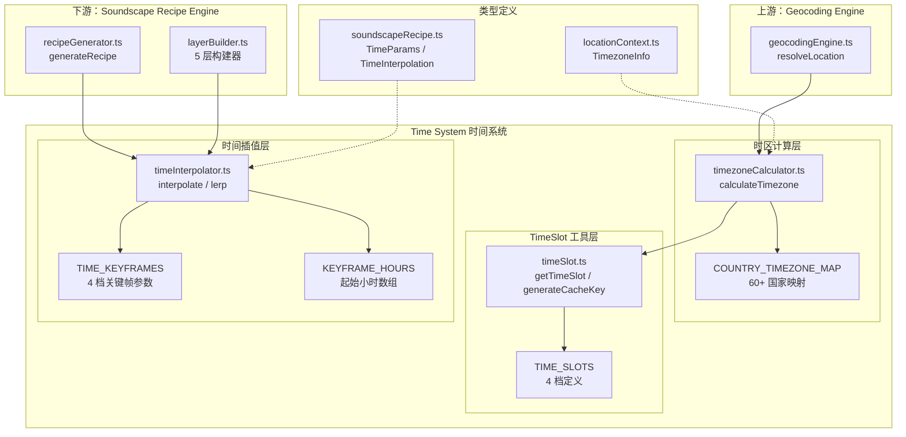
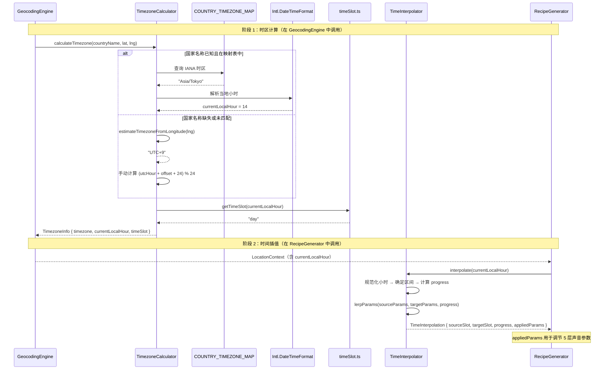
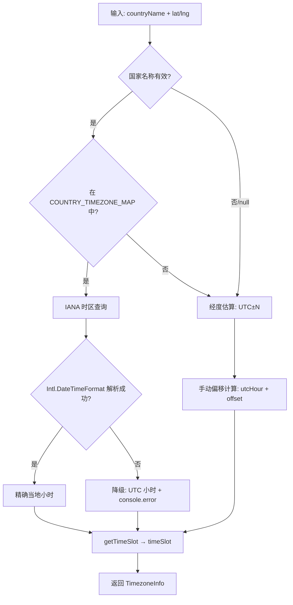

# 设计文档：Time System（时间系统）

## 概述

Time System 是 PinDrop 声景生成管道的时间维度核心模块，负责将目标地点的真实当地时间映射为连续变化的声景参数。该系统位于 Geocoding Engine（上游）和 Soundscape Recipe Engine（下游）之间，为声景配方生成提供精确的时间上下文。

系统由三个紧密协作的子模块构成：

1. **TimeSlot 工具层**（`src/utils/timeSlot.ts`）：定义 4 个时间档（dawn/day/dusk/night）及其小时范围映射，提供 `getTimeSlot()`、`generateCacheKey()`、`parseCacheKey()` 等基础工具函数
2. **Time Interpolator 插值层**（`src/utils/soundscape/timeInterpolator.ts`）：基于 4 档关键帧常量 `TIME_KEYFRAMES`，通过线性插值算法 `interpolate()` 在相邻关键帧之间平滑过渡 5 个声景参数（activity、traffic、nature、humanVoice、music），正确处理午夜跨越
3. **Timezone Calculator 时区层**（`src/utils/geocoding/timezoneCalculator.ts`）：从国家名称和坐标计算真实当地时间，支持 IANA 时区查询（60+ 国家）和经度估算降级

### 设计决策

| 决策 | 选择 | 理由 |
|------|------|------|
| 插值算法 | 线性插值（lerp） | 实现简单、可预测、易测试；声景参数不需要更复杂的曲线 |
| 关键帧数量 | 4 档 | 与 PRD 定义的 dawn/day/dusk/night 一致，覆盖一天的主要时段 |
| 时区查询策略 | IANA 优先 + 经度降级 | IANA 精确但需要国家名称；经度估算作为兜底保证任何坐标都能获得时间 |
| 参数 clamp | 所有插值结果 clamp 到 [0, 1] | 防止浮点精度问题导致参数越界 |
| 小时规范化 | 模运算 `((h % 24) + 24) % 24` | 统一处理负数、超范围输入，保证鲁棒性 |

## 架构

### 整体架构图



### 数据流序列图



## 组件与接口

### 模块结构

```
src/
├── types/
│   ├── locationContext.ts         # TimezoneInfo 接口、TimeSlot 重导出
│   └── soundscapeRecipe.ts        # TimeParams、TimeInterpolation 接口
├── utils/
│   ├── timeSlot.ts                # TimeSlot 类型、getTimeSlot()、generateCacheKey()、parseCacheKey()
│   ├── coordinates.ts             # roundCoordinates()（被 timeSlot.ts 依赖）
│   ├── soundscape/
│   │   └── timeInterpolator.ts    # TIME_KEYFRAMES、KEYFRAME_HOURS、lerp()、interpolate()
│   └── geocoding/
│       └── timezoneCalculator.ts  # calculateTimezone()、COUNTRY_TIMEZONE_MAP
└── utils/__tests__/
    ├── timeSlot.property.test.ts  # 已有：缓存键属性测试
    └── timezoneCalculator.test.ts # 已有：时区计算单元测试
```

### 核心接口定义

#### timeSlot.ts — TimeSlot 工具层

```typescript
/** 时间档类型 — 4 个离散值 */
export type TimeSlot = 'dawn' | 'day' | 'dusk' | 'night';

/** 时间档定义 — 包含小时范围和视觉属性 */
export interface TimeSlotDefinition {
  slot: TimeSlot;
  startHour: number;
  endHour: number;
  color: string;    // hex 颜色码
  emoji: string;
}

/** 4 档时间定义常量 */
export const TIME_SLOTS: TimeSlotDefinition[];

/**
 * 将小时映射到时间档
 * 规范化输入到 [0, 23]，处理午夜翻转
 * @param hour - 24 小时制小时值（支持任意整数）
 * @returns 对应的 TimeSlot
 */
export function getTimeSlot(hour: number): TimeSlot;

/**
 * 生成缓存键
 * 格式: "{lat},{lng}-{timeSlot}"，坐标精度 0.01°
 */
export function generateCacheKey(lat: number, lng: number, timeSlot: TimeSlot): string;

/**
 * 解析缓存键
 * @returns 解析结果或 null（无效输入）
 */
export function parseCacheKey(cacheKey: string): { coordinates: [number, number]; timeSlot: TimeSlot } | null;
```

#### timeInterpolator.ts — 时间插值层

```typescript
import type { TimeSlot } from '@/utils/timeSlot';
import type { TimeInterpolation, TimeParams } from '@/types/soundscapeRecipe';

/** 4 档时间关键帧 — 每个 TimeSlot 对应 5 个声景参数锚点 */
export const TIME_KEYFRAMES: Record<TimeSlot, TimeParams>;

/** 关键帧起始小时 — dawn=5, day=9, dusk=17, night=20 */
export const KEYFRAME_HOURS: Array<{ start: number; slot: TimeSlot }>;

/**
 * 线性插值辅助函数
 * 公式: a + (b - a) * t
 */
export function lerp(a: number, b: number, t: number): number;

/**
 * 根据当前本地小时计算时间插值参数
 *
 * 区间划分:
 * - hours 0-4:   night → dawn（午夜跨越，9 小时）
 * - hours 5-8:   dawn → day（4 小时）
 * - hours 9-16:  day → dusk（8 小时）
 * - hours 17-19: dusk → night（3 小时）
 * - hours 20-23: night → dawn（午夜跨越，9 小时）
 *
 * @param currentLocalHour - 当地小时（自动规范化到 0-23）
 * @returns TimeInterpolation 对象
 */
export function interpolate(currentLocalHour: number): TimeInterpolation;
```

#### timezoneCalculator.ts — 时区计算层

```typescript
import type { TimezoneInfo } from '@/types/locationContext';

/**
 * 计算时区信息
 *
 * 优先级:
 * 1. 国家名称 → COUNTRY_TIMEZONE_MAP → IANA 时区 → Intl.DateTimeFormat 解析
 * 2. 经度估算 → UTC±N → 手动偏移计算
 * 3. IANA 解析失败 → 降级到 UTC 小时
 *
 * @param countryName - 国家名称，可为 null
 * @param lat - 纬度
 * @param lng - 经度
 * @returns TimezoneInfo { timezone, currentLocalHour, timeSlot }
 */
export function calculateTimezone(
  countryName: string | null,
  lat: number,
  lng: number
): TimezoneInfo;
```

#### 类型接口（已定义在 types/ 目录）

```typescript
// locationContext.ts
export interface TimezoneInfo {
  timezone: string;           // IANA 格式或 "UTC±N"
  currentLocalHour: number;   // 0-23 整数
  timeSlot: TimeSlot;         // 由 getTimeSlot(currentLocalHour) 派生
}

// soundscapeRecipe.ts
export interface TimeParams {
  activity: number;           // 环境活动度 [0, 1]
  traffic: number;            // 交通密度 [0, 1]
  nature: number;             // 自然声强度 [0, 1]
  humanVoice: number;         // 人声密度 [0, 1]
  music: number;              // 音乐强度 [0, 1]
}

export interface TimeInterpolation {
  sourceSlot: TimeSlot;       // 前一个关键帧
  targetSlot: TimeSlot;       // 后一个关键帧
  progress: number;           // 插值进度 [0, 1]
  appliedParams: TimeParams;  // 插值后的参数
}
```


## 数据模型

### 时间档定义

| TimeSlot | 小时范围 | 起始小时 | 颜色 | Emoji | 声景特征 |
|----------|----------|----------|------|-------|----------|
| dawn | 05:00 - 08:59 | 5 | #FFA500 | 🌅 | 鸟鸣渐起、市集开张、通勤声浪上升 |
| day | 09:00 - 16:59 | 9 | #22C55E | ☀️ | 交通高峰、人声鼎沸、施工声 |
| dusk | 17:00 - 19:59 | 17 | #FBBF24 | 🌇 | 交通渐弱、归家脚步、晚祷 |
| night | 20:00 - 04:59 | 20 | #3B82F6 | 🌙 | 稀疏人声、虫鸣、远处车声 |

### 4 档关键帧参数

| TimeSlot | activity | traffic | nature | humanVoice | music |
|----------|----------|---------|--------|------------|-------|
| dawn | 0.3 | 0.4 | 0.7 | 0.3 | 0.15 |
| day | 0.9 | 0.8 | 0.2 | 0.8 | 0.25 |
| dusk | 0.5 | 0.5 | 0.4 | 0.4 | 0.3 |
| night | 0.1 | 0.15 | 0.6 | 0.1 | 0.2 |

### 插值区间定义

| 区间 | sourceSlot | targetSlot | 起始小时 | 结束小时 | 跨度 |
|------|-----------|-----------|----------|----------|------|
| 午夜跨越 | night | dawn | 20 | 5 (次日) | 9 小时 |
| 清晨 | dawn | day | 5 | 9 | 4 小时 |
| 白天 | day | dusk | 9 | 17 | 8 小时 |
| 傍晚 | dusk | night | 17 | 20 | 3 小时 |

### 插值示例

| 小时 | sourceSlot | targetSlot | progress | activity | traffic | nature | humanVoice | music |
|------|-----------|-----------|----------|----------|---------|--------|------------|-------|
| 5 | dawn | day | 0.000 | 0.300 | 0.400 | 0.700 | 0.300 | 0.150 |
| 7 | dawn | day | 0.500 | 0.600 | 0.600 | 0.450 | 0.550 | 0.200 |
| 9 | day | dusk | 0.000 | 0.900 | 0.800 | 0.200 | 0.800 | 0.250 |
| 13 | day | dusk | 0.500 | 0.700 | 0.650 | 0.300 | 0.600 | 0.275 |
| 17 | dusk | night | 0.000 | 0.500 | 0.500 | 0.400 | 0.400 | 0.300 |
| 18.5 | dusk | night | 0.500 | 0.300 | 0.325 | 0.500 | 0.250 | 0.250 |
| 20 | night | dawn | 0.000 | 0.100 | 0.150 | 0.600 | 0.100 | 0.200 |
| 0 | night | dawn | 0.444 | 0.189 | 0.261 | 0.644 | 0.189 | 0.178 |
| 3 | night | dawn | 0.778 | 0.256 | 0.344 | 0.678 | 0.256 | 0.161 |

### 参数对声景层的影响映射

| 参数 | 影响的声景层 | 影响方式 |
|------|-------------|----------|
| activity | ambient 层音量、signature 层触发间隔 | 高 activity → 高音量、短间隔 |
| traffic | ambient/signature 层中交通相关 SFX 音量 | 直接比例 |
| nature | ambient 层中自然声（鸟/虫/风）音量 | 直接比例 |
| humanVoice | dialogue 层音量、dialogue 重复间隔 | 高 humanVoice → 高音量、短间隔 |
| music | atmosphere（音乐）层音量 | 直接比例 |

### COUNTRY_TIMEZONE_MAP 覆盖范围

| 大洲 | 国家数量 | 示例 |
|------|----------|------|
| 欧洲 | 22 | France → Europe/Paris, Germany → Europe/Berlin, UK → Europe/London |
| 亚洲 | 22 | Japan → Asia/Tokyo, China → Asia/Shanghai, India → Asia/Kolkata |
| 美洲 | 12 | United States → America/New_York, Brazil → America/Sao_Paulo |
| 非洲 | 9 | Egypt → Africa/Cairo, South Africa → Africa/Johannesburg |
| 大洋洲 | 2 | Australia → Australia/Sydney, New Zealand → Pacific/Auckland |
| **合计** | **67** | |

### 经度估算公式

```
offset = Math.round(lng / 15)

示例:
  lng = 139.65 (东京) → offset = Math.round(9.31) = 9 → "UTC+9"
  lng = -74.01 (纽约) → offset = Math.round(-4.93) = -5 → "UTC-5"
  lng = 0 (格林威治) → offset = 0 → "UTC+0"
```

### 关键算法

#### 1. 时间插值算法（伪代码）

```
interpolate(currentLocalHour):
  // 步骤 1: 规范化小时到 [0, 23]
  hour = ((currentLocalHour % 24) + 24) % 24

  // 步骤 2: 确定所在区间和插值进度
  if hour >= 20 || hour < 5:
    // 午夜跨越：night(20) → dawn(5)，总长 9 小时
    sourceSlot = "night", targetSlot = "dawn"
    elapsed = hour >= 20 ? hour - 20 : hour + 4
    progress = elapsed / 9
  else if hour >= 5 && hour < 9:
    // dawn(5) → day(9)，总长 4 小时
    sourceSlot = "dawn", targetSlot = "day"
    progress = (hour - 5) / 4
  else if hour >= 9 && hour < 17:
    // day(9) → dusk(17)，总长 8 小时
    sourceSlot = "day", targetSlot = "dusk"
    progress = (hour - 9) / 8
  else:
    // dusk(17) → night(20)，总长 3 小时
    sourceSlot = "dusk", targetSlot = "night"
    progress = (hour - 17) / 3

  // 步骤 3: 对 5 个参数执行线性插值并 clamp
  for each param in [activity, traffic, nature, humanVoice, music]:
    result[param] = clamp(lerp(source[param], target[param], progress), 0, 1)

  return { sourceSlot, targetSlot, progress, appliedParams: result }
```

#### 2. lerp 函数

```
lerp(a, b, t) = a + (b - a) * t

性质:
  lerp(a, b, 0) = a          // t=0 返回起始值
  lerp(a, b, 1) = b          // t=1 返回目标值
  lerp(a, b, 0.5) = (a+b)/2  // t=0.5 返回中点
```

#### 3. 时区计算降级链

```
calculateTimezone(countryName, lat, lng):
  // 优先级 1: 国家名称 → IANA 时区
  if countryName && COUNTRY_TIMEZONE_MAP[countryName]:
    timezone = COUNTRY_TIMEZONE_MAP[countryName]
    hour = Intl.DateTimeFormat 解析当地小时
  // 优先级 2: 经度估算
  else:
    offset = Math.round(lng / 15)
    timezone = "UTC+{offset}" 或 "UTC{offset}"
    hour = (utcHour + offset + 24) % 24
  // 优先级 3: IANA 解析失败降级
  // (在 getCurrentHourInTimezone 内部处理)
  // catch → console.error + 返回 UTC 小时

  timeSlot = getTimeSlot(hour)
  return { timezone, currentLocalHour: hour, timeSlot }
```


## 正确性属性

*属性（Property）是指在系统所有有效执行中都应成立的特征或行为——本质上是对系统应做什么的形式化陈述。属性是连接人类可读规格与机器可验证正确性保证的桥梁。*

### Property 1: getTimeSlot 小时映射完备性

*For any* 整数小时值（包括负数和超出 [0, 23] 范围的值），`getTimeSlot(hour)` SHALL 返回恰好一个有效的 TimeSlot 值，且规范化后的小时与返回的 TimeSlot 满足以下映射关系：
- 规范化小时 ∈ [5, 8] → "dawn"
- 规范化小时 ∈ [9, 16] → "day"
- 规范化小时 ∈ [17, 19] → "dusk"
- 规范化小时 ∈ [20, 23] ∪ [0, 4] → "night"

其中规范化公式为 `((hour % 24) + 24) % 24`。

**Validates: Requirements 1.2, 1.3, 1.4, 1.5, 1.6, 1.7**

### Property 2: interpolate() 输出有效性与范围不变量

*For any* 数值型小时输入（整数或浮点数），`interpolate(hour)` SHALL 返回一个 TimeInterpolation 对象，满足：
- `sourceSlot` 和 `targetSlot` 均为有效的 TimeSlot 值且互不相同
- `sourceSlot` 和 `targetSlot` 在循环序列 dawn → day → dusk → night → dawn 中相邻
- `progress` ∈ [0, 1]
- `appliedParams` 的 5 个参数（activity、traffic、nature、humanVoice、music）均 ∈ [0, 1]

**Validates: Requirements 3.1, 3.5, 3.6, 3.7, 9.2**

### Property 3: interpolate() 代数正确性

*For any* 数值型小时输入，`interpolate(hour)` 返回的 `appliedParams` 中每个参数值 SHALL 等于（在浮点精度范围内）`clamp(lerp(TIME_KEYFRAMES[sourceSlot][param], TIME_KEYFRAMES[targetSlot][param], progress), 0, 1)`。即插值结果严格遵循线性插值公式加 clamp。

**Validates: Requirements 3.2**

### Property 4: lerp 数学正确性与有界性

*For any* 数值 a、b ∈ [0, 1] 和 t ∈ [0, 1]，`lerp(a, b, t)` SHALL 满足：
- 返回值等于 `a + (b - a) * t`（在浮点精度范围内）
- 返回值 ∈ [min(a, b), max(a, b)]

**Validates: Requirements 8.1, 8.5**

### Property 5: calculateTimezone 输出完整性与一致性

*For any* 输入组合（countryName 为任意字符串或 null，lat ∈ [-90, 90]，lng ∈ [-180, 180]），`calculateTimezone(countryName, lat, lng)` SHALL 返回一个 TimezoneInfo 对象，满足：
- `timezone` 为非空字符串，格式为 IANA 时区（如 "Asia/Tokyo"）或 UTC±N（如 "UTC+9"）
- `currentLocalHour` 为 [0, 23] 范围内的整数
- `timeSlot` 为 4 个有效 TimeSlot 值之一
- `timeSlot` === `getTimeSlot(currentLocalHour)`（一致性不变量）

**Validates: Requirements 5.1, 5.2, 5.3, 6.1, 6.2, 6.3, 6.4, 7.1, 7.2, 7.3, 7.4, 7.5**

### Property 6: 端到端管道有效性

*For any* 坐标（lat ∈ [-90, 90]，lng ∈ [-180, 180]）和可选国家名称，将 `calculateTimezone()` 的 `currentLocalHour` 输出传入 `interpolate()` SHALL 产出有效的 TimeInterpolation 结果，其中所有 5 个 `appliedParams` 值均 ∈ [0, 1]。

**Validates: Requirements 9.1, 9.3**

### Property 7: 管道确定性

*For any* 相同的输入（coordinates、countryName）在相同的系统时间下，连续两次调用完整管道（calculateTimezone → interpolate）SHALL 产出完全相同的 TimeInterpolation 结果。

**Validates: Requirements 9.4**

## 错误处理

### 错误分类与响应策略

| 错误类型 | 严重级别 | 组件 | 响应策略 | 日志格式 |
|----------|----------|------|----------|----------|
| 小时值超出 [0, 23] | 低 | getTimeSlot / interpolate | 模运算规范化 `((h % 24) + 24) % 24` | 无日志（静默处理） |
| 国家名称未在映射表中 | 低 | calculateTimezone | 降级到经度估算 | 无日志（正常降级路径） |
| 国家名称为 null | 低 | calculateTimezone | 直接使用经度估算 | 无日志（正常降级路径） |
| IANA 时区解析失败 | 中 | getCurrentHourInTimezone | 降级到 UTC 小时 | `[PinDrop Error] TimezoneCalculator: Failed to parse timezone {timezone}` |
| Intl.DateTimeFormat 不可用 | 中 | getCurrentHourInTimezone | 降级到 UTC 小时 | 同上 |
| 插值参数超出 [0, 1] | 低 | interpolate (lerpParams) | clamp 到 [0, 1] | 无日志（静默 clamp） |

### 降级链



### 设计原则

1. **永不失败**：`calculateTimezone()` 对任何输入都返回有效的 TimezoneInfo，不抛出异常
2. **静默降级**：降级路径不中断用户体验，仅在 IANA 解析失败时记录错误日志
3. **精度优先**：优先使用 IANA 时区（精确到分钟级），仅在不可用时降级到经度估算（精确到小时级）
4. **范围保证**：所有输出值通过 clamp 和模运算保证在有效范围内

## 测试策略

### 测试框架与工具

- **单元测试框架**：Vitest
- **属性测试库**：fast-check（项目已使用）
- **运行命令**：`npm run test`
- **覆盖率目标**：时间插值模块 100%（Critical 优先级）

### 双轨测试方法

#### 属性测试（Property-Based Tests）

属性测试验证系统在所有有效输入上的通用正确性。每个属性测试对应设计文档中的一个 Correctness Property。

| 属性 | 测试文件 | 最小迭代次数 | 状态 |
|------|----------|-------------|------|
| P1: getTimeSlot 映射完备性 | `timeSlot.property.test.ts` | 100 | 已有（部分覆盖） |
| P2: interpolate 输出有效性 | `timeInterpolator.property.test.ts` | 100 | 待新增 |
| P3: interpolate 代数正确性 | `timeInterpolator.property.test.ts` | 100 | 待新增 |
| P4: lerp 数学正确性 | `timeInterpolator.property.test.ts` | 100 | 待新增 |
| P5: calculateTimezone 完整性 | `timezoneCalculator.property.test.ts` | 100 | 待新增 |
| P6: 端到端管道有效性 | `timezoneCalculator.property.test.ts` | 100 | 待新增 |
| P7: 管道确定性 | `timezoneCalculator.property.test.ts` | 100 | 待新增 |

**属性测试标签格式**：`Feature: 04-time-system, Property {number}: {property_text}`

**配置要求**：
- 每个属性测试最少 100 次迭代（`{ numRuns: 100 }`）
- 使用 fast-check 的 `fc.assert` + `fc.property` 模式
- 每个属性测试必须引用设计文档中的 Property 编号

#### 单元测试（Example-Based Tests）

单元测试验证具体示例、边界条件和常量值。

| 测试内容 | 测试文件 | 状态 |
|----------|----------|------|
| TIME_KEYFRAMES 常量值验证 | `timeInterpolator.test.ts` | 待新增 |
| KEYFRAME_HOURS 常量值验证 | `timeInterpolator.test.ts` | 待新增 |
| 关键帧起始小时 progress=0 | `timeInterpolator.test.ts` | 待新增 |
| 插值示例值验证 | `timeInterpolator.test.ts` | 待新增 |
| COUNTRY_TIMEZONE_MAP 覆盖验证 | `timezoneCalculator.test.ts` | 已有（部分覆盖） |
| 经度估算边界值 | `timezoneCalculator.test.ts` | 已有 |
| IANA 解析失败降级 | `timezoneCalculator.test.ts` | 待新增 |
| 时间档边界值（4, 5, 8, 9, 16, 17, 19, 20） | `timeSlot.property.test.ts` | 已有 |

### 测试数据

**小时生成器**：
- 整数小时：`fc.integer({ min: 0, max: 23 })`
- 浮点小时：`fc.float({ min: 0, max: 23.99, noNaN: true })`
- 超范围小时：`fc.integer({ min: -100, max: 100 })`

**坐标生成器**：
- 纬度：`fc.float({ min: -90, max: 90, noNaN: true })`
- 经度：`fc.float({ min: -180, max: 180, noNaN: true })`

**国家名称生成器**：
- 已知国家：`fc.constantFrom(...Object.keys(COUNTRY_TIMEZONE_MAP))`
- 未知国家：`fc.string()`
- null：`fc.constant(null)`
- 混合：`fc.oneof(已知国家, 未知国家, null)`

**lerp 参数生成器**：
- a, b：`fc.float({ min: 0, max: 1, noNaN: true })`
- t：`fc.float({ min: 0, max: 1, noNaN: true })`

### 已有测试分析

| 文件 | 覆盖内容 | 缺口 |
|------|----------|------|
| `timeSlot.property.test.ts` | 缓存键格式、幂等性、往返一致性、颜色映射、小时映射 | 已较完整，需补充 P1 的超范围输入测试 |
| `timezoneCalculator.test.ts` | 国家→IANA、经度估算、时间档映射、边界值 | 缺少属性测试（P5-P7）、缺少 IANA 解析失败测试 |
| （不存在）`timeInterpolator.property.test.ts` | — | 需新建，覆盖 P2、P3、P4 |
| （不存在）`timeInterpolator.test.ts` | — | 需新建，覆盖常量验证和示例值 |

### 测试优先级

1. **P2 + P3**（interpolate 有效性 + 代数正确性）— 最高优先级，100% 覆盖率目标
2. **P4**（lerp 正确性）— 高优先级，interpolate 的基础
3. **P5**（calculateTimezone 完整性）— 高优先级，端到端正确性的前提
4. **P1**（getTimeSlot 映射）— 中优先级，已有部分覆盖
5. **P6 + P7**（端到端 + 确定性）— 中优先级，集成验证
