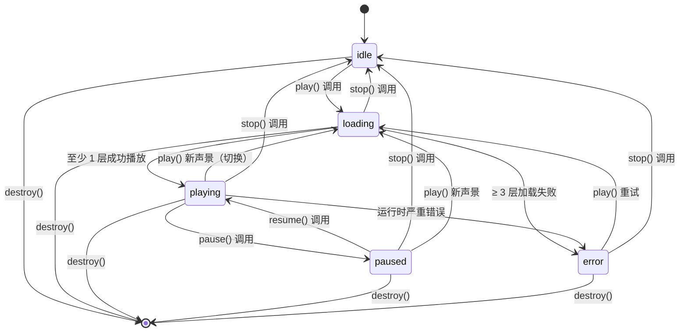
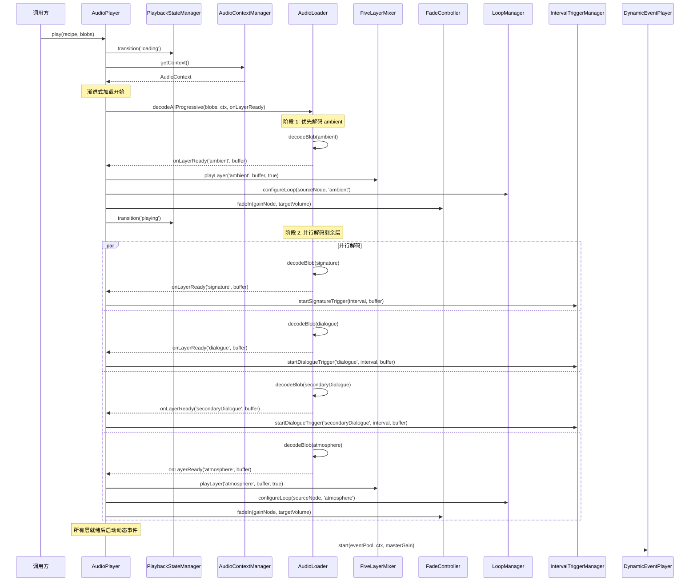
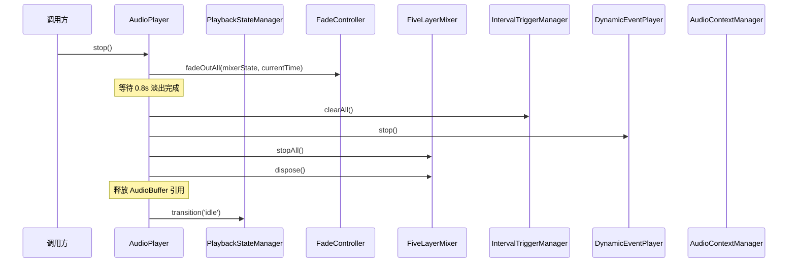
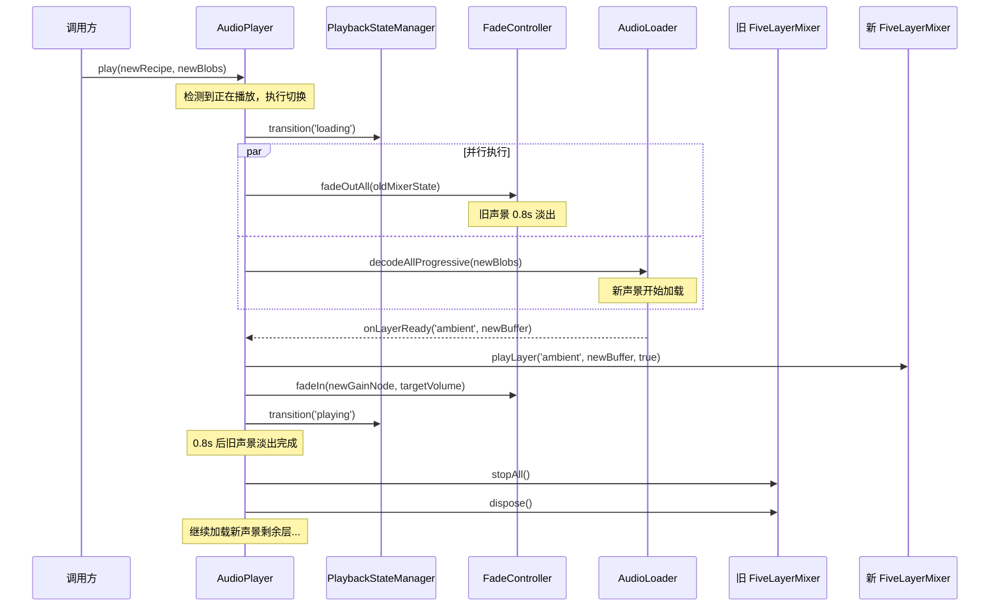
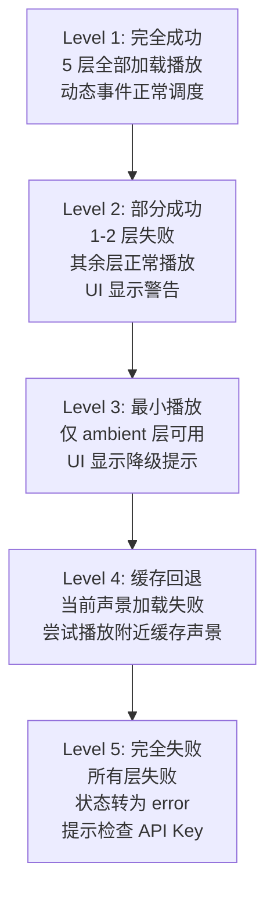

# 设计文档：Audio Player（音频播放器）

## 概述

Audio Player 是 PinDrop 声景播放系统的核心模块，负责将上游 Soundscape Engine 生成的 5 层音频数据（ambient、signature、dialogue、secondaryDialogue、atmosphere）通过 Web Audio API 进行混音、空间定位、音量控制和动态事件调度，最终输出到用户的音频设备。该模块是连接"声景配方"与"用户听觉体验"的桥梁——上游接收 ElevenLabs API 返回的音频 Blob 数据和 SoundscapeRecipe 配方，下游输出实时混音的声景音频流。

系统由以下核心组件构成：

- **AudioContextManager**：Web Audio API 的 AudioContext 生命周期管理器，负责初始化、恢复和清理音频上下文
- **FiveLayerMixer**：5 层音频混音器，为每层创建独立的 AudioBufferSourceNode 和 GainNode，支持独立音量控制
- **SpatialAudioController**：空间音频控制器，为对话层（dialogue 和 secondaryDialogue）提供 PanNode 实现左右声道定位
- **FadeController**：淡入淡出控制器，实现声景切换时的平滑过渡（淡入 1.5s，淡出 0.8s）
- **LoopManager**：循环播放管理器，处理 ambient 和 atmosphere 层的无缝循环
- **IntervalTriggerManager**：间隔触发管理器，按配方中的 intervalSeconds 和 repeatIntervalSeconds 定时触发 signature 和 dialogue 层
- **DynamicEventScheduler**：动态事件调度器，每 30-90 秒随机从区域事件池中选择并播放动态音效
- **MasterVolumeController**：总音量控制器，提供全局音量调节（0-1 范围）
- **AudioLoader**：音频加载器，将 Blob 数据解码为 AudioBuffer 供 Web Audio API 使用
- **PlaybackStateManager**：播放状态管理器，跟踪当前播放状态（idle/loading/playing/paused/error）

### 设计目标

1. **渐进式加载**：ambient 层优先播放（< 3s），其他层陆续加入（全部 < 5s）
2. **平滑过渡**：声景切换时旧声景淡出 0.8s，新声景淡入 1.5s，无突兀感
3. **独立控制**：5 层音频各自独立音量控制 + 1 个总音量控制
4. **空间定位**：对话层支持 -1（左）到 1（右）的声像定位
5. **动态性**：通过随机事件系统（30-90s 间隔）增加声景的真实感和不可预测性
6. **容错性**：部分层加载失败时其他层继续播放，不阻塞整体体验
7. **性能优化**：使用 Web Audio API 的原生节点，避免 JavaScript 音频处理的性能开销

## 架构

### 整体架构图

```mermaid
graph TB
    subgraph 调用方
        MAP[地图模块<br/>MapView]
        ORCH[声景协调器<br/>Orchestrator]
    end

    subgraph AudioPlayer["Audio Player"]
        PSM[PlaybackStateManager<br/>播放状态管理]
        AL[AudioLoader<br/>音频加载器]
    end

    subgraph 音频处理层
        ACM[AudioContextManager<br/>AudioContext 管理]
        FLM[FiveLayerMixer<br/>5 层混音器]
        SAC[SpatialAudioController<br/>空间定位]
        FC[FadeController<br/>淡入淡出]
        LM[LoopManager<br/>循环管理]
        ITM[IntervalTriggerManager<br/>间隔触发]
        DES[DynamicEventScheduler<br/>动态事件]
        MVC[MasterVolumeController<br/>总音量]
    end

    subgraph WebAudioAPI["Web Audio API"]
        CTX[AudioContext]
        SRC[AudioBufferSourceNode × 5]
        GAIN[GainNode × 5]
        PAN[StereoPannerNode × 2]
        MASTER[Master GainNode]
        DEST[AudioDestination<br/>🎧 音频输出]
    end

    subgraph 存储层
        LS[localStorage<br/>音量设置]
        IDB[IndexedDB<br/>音频缓存]
    end

    MAP --> ORCH
    ORCH --> PSM
    PSM --> AL
    AL --> ACM
    AL --> FLM
    FLM --> SAC
    FLM --> FC
    FLM --> LM
    FLM --> ITM
    FLM --> DES
    FLM --> MVC

    ACM --> CTX
    FLM --> SRC
    FLM --> GAIN
    SAC --> PAN
    MVC --> MASTER
    SRC --> GAIN
    GAIN --> PAN
    PAN --> MASTER
    MASTER --> DEST

    MVC -.读写.-> LS
    AL -.读取.-> IDB


### Web Audio API 节点图

```mermaid
graph LR
    subgraph Ambient层
        A_SRC[AudioBufferSourceNode<br/>loop=true] --> A_GAIN[GainNode<br/>ambient volume]
    end

    subgraph Signature层
        S_SRC[AudioBufferSourceNode<br/>loop=false] --> S_GAIN[GainNode<br/>signature volume]
    end

    subgraph Dialogue层
        D_SRC[AudioBufferSourceNode<br/>loop=false] --> D_PAN[StereoPannerNode<br/>pan: -1~1] --> D_GAIN[GainNode<br/>dialogue volume]
    end

    subgraph SecondaryDialogue层
        SD_SRC[AudioBufferSourceNode<br/>loop=false] --> SD_PAN[StereoPannerNode<br/>pan: -1~1] --> SD_GAIN[GainNode<br/>secondary volume]
    end

    subgraph Atmosphere层
        AT_SRC[AudioBufferSourceNode<br/>loop=true] --> AT_GAIN[GainNode<br/>atmosphere volume]
    end

    A_GAIN --> MASTER[Master GainNode<br/>masterVolume: 0~1]
    S_GAIN --> MASTER
    D_GAIN --> MASTER
    SD_GAIN --> MASTER
    AT_GAIN --> MASTER
    MASTER --> DEST[AudioContext.destination<br/>🎧 音频输出]
```

**节点连接规则：**

| 层类型 | 节点链 | 说明 |
|--------|--------|------|
| ambient | `SourceNode → GainNode → MasterGain → destination` | 无 PanNode，循环播放 |
| signature | `SourceNode → GainNode → MasterGain → destination` | 无 PanNode，间隔触发 |
| dialogue | `SourceNode → PanNode → GainNode → MasterGain → destination` | 有 PanNode，间隔触发 |
| secondaryDialogue | `SourceNode → PanNode → GainNode → MasterGain → destination` | 有 PanNode，间隔触发 |
| atmosphere | `SourceNode → GainNode → MasterGain → destination` | 无 PanNode，循环播放 |

## 组件与接口

### 模块结构

```
src/
├── utils/
│   └── audio/
│       ├── audioContextManager.ts     # AudioContext 生命周期管理
│       ├── fiveLayerMixer.ts          # 5 层混音器
│       ├── spatialAudioController.ts  # 空间音频控制
│       ├── fadeController.ts          # 淡入淡出控制
│       ├── loopManager.ts            # 循环播放管理
│       ├── intervalTriggerManager.ts  # 间隔触发管理
│       ├── dynamicEventPlayer.ts     # 动态事件播放（运行时调度）
│       ├── masterVolumeController.ts # 总音量控制
│       ├── audioLoader.ts            # 音频加载与解码
│       ├── playbackStateManager.ts   # 播放状态管理
│       ├── audioPlayer.ts            # 顶层 API 门面
│       ├── types.ts                  # 音频播放器类型定义
│       └── index.ts                  # 模块导出
├── hooks/
│   ├── useAudioPlayer.ts            # 音频播放器 React hook
│   └── usePlaybackPreferences.ts    # 播放偏好 hook（已有）
└── utils/__tests__/
    ├── audioContextManager.test.ts
    ├── fiveLayerMixer.test.ts
    ├── fadeController.test.ts
    ├── fadeController.property.test.ts
    ├── intervalTriggerManager.test.ts
    ├── intervalTriggerManager.property.test.ts
    ├── dynamicEventPlayer.test.ts
    ├── masterVolumeController.test.ts
    ├── masterVolumeController.property.test.ts
    ├── audioLoader.test.ts
    ├── playbackStateManager.test.ts
    ├── playbackStateManager.property.test.ts
    └── audioPlayer.test.ts
```


### 核心 TypeScript 类型定义

#### types.ts — 音频播放器类型

```typescript
import type { SoundscapeRecipe } from '@/types/soundscapeRecipe';

// === 层类型 ===

/** 音频层类型 */
export type LayerType = 'ambient' | 'signature' | 'dialogue' | 'secondaryDialogue' | 'atmosphere';

/** 所有有效的层类型值 */
export const ALL_LAYER_TYPES: readonly LayerType[] = [
  'ambient', 'signature', 'dialogue', 'secondaryDialogue', 'atmosphere',
] as const;

/** 需要循环播放的层 */
export const LOOPING_LAYERS: readonly LayerType[] = ['ambient', 'atmosphere'] as const;

/** 需要 PanNode 的层 */
export const PANNED_LAYERS: readonly LayerType[] = ['dialogue', 'secondaryDialogue'] as const;

/** 需要间隔触发的层 */
export const INTERVAL_LAYERS: readonly LayerType[] = ['signature', 'dialogue', 'secondaryDialogue'] as const;

// === 播放状态 ===

/** 播放状态枚举 */
export type PlaybackState = 'idle' | 'loading' | 'playing' | 'paused' | 'error';

/** 淡入淡出类型 */
export type FadeType = 'fadeIn' | 'fadeOut';

// === 单层音频状态 ===

/** 单层音频状态 — 跟踪每层的 Web Audio 节点和播放信息 */
export interface AudioLayerState {
  /** 当前的 AudioBufferSourceNode，未播放时为 null */
  sourceNode: AudioBufferSourceNode | null;
  /** 该层的 GainNode，始终存在 */
  gainNode: GainNode;
  /** 该层的 StereoPannerNode，仅 dialogue/secondaryDialogue 层有 */
  panNode: StereoPannerNode | null;
  /** 解码后的 AudioBuffer，未加载时为 null */
  buffer: AudioBuffer | null;
  /** 该层是否正在播放 */
  isPlaying: boolean;
  /** 该层的目标音量 (0-1) */
  volume: number;
  /** 该层是否加载失败 */
  failed: boolean;
}

// === 混音器状态 ===

/** 混音器状态 — 包含 5 层状态和总音量节点 */
export interface MixerState {
  /** 5 层音频状态 */
  layers: Record<LayerType, AudioLayerState>;
  /** 总音量 GainNode */
  masterGainNode: GainNode;
}

// === 播放状态元数据 ===

/** 播放状态详情 — 包含当前播放的完整信息 */
export interface PlaybackStateInfo {
  /** 当前播放状态 */
  state: PlaybackState;
  /** 当前声景配方 ID */
  soundscapeId: string | null;
  /** 已成功加载的层 */
  loadedLayers: LayerType[];
  /** 加载失败的层 */
  failedLayers: LayerType[];
  /** 错误信息（state 为 error 时） */
  errorMessage: string | null;
}

// === 音频加载结果 ===

/** 单层解码结果 */
export interface LayerDecodeResult {
  /** 层类型 */
  layerType: LayerType;
  /** 解码是否成功 */
  success: boolean;
  /** 解码后的 AudioBuffer，失败时为 null */
  buffer: AudioBuffer | null;
  /** 解码耗时（毫秒） */
  decodeTimeMs: number;
  /** 错误信息，成功时为 null */
  error: string | null;
}

/** 全部层解码结果 */
export interface DecodeAllResult {
  /** 各层解码结果 */
  results: LayerDecodeResult[];
  /** 成功解码的层数 */
  successCount: number;
  /** 失败的层数 */
  failureCount: number;
}

// === 音频 Blob 输入 ===

/** 音频 Blob 映射 — 从上游传入的 5 层音频数据 */
export type AudioBlobMap = Partial<Record<LayerType, Blob>>;

// === 状态变更回调 ===

/** 状态变更监听器 */
export type StateChangeListener = (state: PlaybackStateInfo) => void;

// === 淡入淡出配置 ===

/** 淡入淡出时间常量 */
export const FADE_IN_DURATION_S = 1.5;
export const FADE_OUT_DURATION_S = 0.8;

// === 性能常量 ===

/** 并发 AudioBufferSourceNode 最大数量 */
export const MAX_CONCURRENT_SOURCE_NODES = 10;

/** ambient 层最大加载时间（毫秒） */
export const AMBIENT_LOAD_DEADLINE_MS = 3000;

/** 全部层最大加载时间（毫秒） */
export const ALL_LAYERS_LOAD_DEADLINE_MS = 5000;

/** 动态事件最小间隔（毫秒） */
export const DYNAMIC_EVENT_MIN_INTERVAL_MS = 30000;

/** 动态事件最大间隔（毫秒） */
export const DYNAMIC_EVENT_MAX_INTERVAL_MS = 90000;

// === 默认音量 ===

/** 默认总音量 */
export const DEFAULT_MASTER_VOLUME = 0.7;

/** 默认各层音量 */
export const DEFAULT_LAYER_VOLUMES: Record<LayerType, number> = {
  ambient: 0.5,
  signature: 0.5,
  dialogue: 0.5,
  secondaryDialogue: 0.5,
  atmosphere: 0.5,
};
```


### 组件详细设计

#### AudioContextManager — AudioContext 生命周期管理

```typescript
/**
 * AudioContext 生命周期管理器
 *
 * 负责创建、恢复和关闭 AudioContext。
 * 全局单例，所有音频组件共享同一个 AudioContext。
 */
class AudioContextManager {
  private context: AudioContext | null;
  private isSupported: boolean;

  /** 获取或创建 AudioContext 实例 */
  getContext(): AudioContext;

  /** 恢复被浏览器 autoplay 策略挂起的 AudioContext */
  async resume(): Promise<void>;

  /** 关闭 AudioContext 并释放资源 */
  async close(): Promise<void>;

  /** 检查浏览器是否支持 Web Audio API */
  checkSupport(): boolean;

  /** 获取当前 AudioContext 状态 */
  getState(): AudioContextState | 'unsupported';
}
```

**内部状态：**
- `context`: 当前 AudioContext 实例，未初始化时为 null
- `isSupported`: 浏览器是否支持 Web Audio API

**状态转换：**
- `null → suspended`: 首次调用 `getContext()` 时创建
- `suspended → running`: 调用 `resume()` 后（需用户交互）
- `running → closed`: 调用 `close()` 后
- 任何状态 → 日志输出: `[PinDrop Audio] AudioContext state: {state}`

#### FiveLayerMixer — 5 层混音器

```typescript
/**
 * 5 层音频混音器
 *
 * 为每层创建独立的音频处理链（SourceNode → [PanNode] → GainNode → MasterGain）。
 * 维护 MixerState 对象，提供独立音量控制。
 */
class FiveLayerMixer {
  private mixerState: MixerState;
  private activeSourceNodes: Set<AudioBufferSourceNode>;

  /** 初始化 5 层音频处理链 */
  initialize(context: AudioContext, masterGainNode: GainNode): void;

  /** 为指定层播放 AudioBuffer */
  playLayer(layerType: LayerType, buffer: AudioBuffer, loop: boolean): void;

  /** 停止指定层的播放 */
  stopLayer(layerType: LayerType): void;

  /** 停止所有层的播放 */
  stopAll(): void;

  /** 设置指定层的音量 (0-1) */
  setLayerVolume(layerType: LayerType, volume: number): void;

  /** 获取指定层的当前状态 */
  getLayerState(layerType: LayerType): AudioLayerState;

  /** 获取完整的混音器状态 */
  getMixerState(): MixerState;

  /** 获取当前活跃的 SourceNode 数量 */
  getActiveSourceCount(): number;

  /** 断开所有节点并释放资源 */
  dispose(): void;
}
```

**关键约束：**
- 并发 AudioBufferSourceNode 数量 ≤ `MAX_CONCURRENT_SOURCE_NODES` (10)
- 所有音量值 clamp 到 [0, 1]
- 设置某层音量不影响其他层

#### SpatialAudioController — 空间音频控制

```typescript
/**
 * 空间音频控制器
 *
 * 为 dialogue 和 secondaryDialogue 层提供 StereoPannerNode，
 * 实现左右声道定位。
 */
class SpatialAudioController {
  /** 设置指定对话层的声像位置 (-1 到 1) */
  setPan(layerType: 'dialogue' | 'secondaryDialogue', pan: number): void;

  /** 获取指定对话层的当前声像位置 */
  getPan(layerType: 'dialogue' | 'secondaryDialogue'): number;

  /** 创建声像移动动画（用于动态事件的 panFromTo 效果） */
  animatePan(
    panNode: StereoPannerNode,
    fromPan: number,
    toPan: number,
    durationMs: number,
    currentTime: number
  ): void;
}
```

**约束：** 所有 pan 值 clamp 到 [-1, 1]

#### FadeController — 淡入淡出控制

```typescript
/**
 * 淡入淡出控制器
 *
 * 使用 GainNode.gain.linearRampToValueAtTime 实现平滑音量过渡。
 * 淡入 1.5s，淡出 0.8s。
 */
class FadeController {
  /** 对指定层执行淡入（0 → targetVolume，1.5s） */
  fadeIn(gainNode: GainNode, targetVolume: number, currentTime: number): void;

  /** 对指定层执行淡出（currentVolume → 0，0.8s） */
  fadeOut(gainNode: GainNode, currentTime: number): void;

  /** 对所有层同时执行淡入 */
  fadeInAll(mixerState: MixerState, currentTime: number): void;

  /** 对所有层同时执行淡出 */
  fadeOutAll(mixerState: MixerState, currentTime: number): void;

  /** 取消指定 GainNode 上的所有已调度的音量变化 */
  cancelFade(gainNode: GainNode, currentTime: number): void;
}
```

**淡入实现伪代码：**
```
fadeIn(gainNode, targetVolume, currentTime):
  gainNode.gain.cancelScheduledValues(currentTime)
  gainNode.gain.setValueAtTime(0, currentTime)
  gainNode.gain.linearRampToValueAtTime(targetVolume, currentTime + 1.5)
```

**淡出实现伪代码：**
```
fadeOut(gainNode, currentTime):
  gainNode.gain.cancelScheduledValues(currentTime)
  gainNode.gain.setValueAtTime(gainNode.gain.value, currentTime)
  gainNode.gain.linearRampToValueAtTime(0, currentTime + 0.8)
```

#### LoopManager — 循环播放管理

```typescript
/**
 * 循环播放管理器
 *
 * 为 ambient 和 atmosphere 层设置 loop=true，
 * 确保无缝循环播放。
 */
class LoopManager {
  /** 配置指定层的循环属性 */
  configureLoop(sourceNode: AudioBufferSourceNode, layerType: LayerType): void;

  /** 停止循环播放（先设 loop=false 再 stop） */
  stopLoop(sourceNode: AudioBufferSourceNode): void;
}
```

**规则：**
- `ambient` 和 `atmosphere` 层: `sourceNode.loop = true`
- `signature`、`dialogue`、`secondaryDialogue` 层: `sourceNode.loop = false`

#### IntervalTriggerManager — 间隔触发管理

```typescript
/**
 * 间隔触发管理器
 *
 * 使用 setTimeout 按配方中的间隔定时触发 signature 和 dialogue 层。
 * 每次触发创建新的 AudioBufferSourceNode。
 */
class IntervalTriggerManager {
  private pendingTimeouts: Map<string, ReturnType<typeof setTimeout>>;

  /** 启动 signature 层的间隔触发 */
  startSignatureTrigger(
    intervalSeconds: number,
    buffer: AudioBuffer,
    mixer: FiveLayerMixer,
    fadeController: FadeController,
    context: AudioContext
  ): void;

  /** 启动 dialogue 层的间隔触发 */
  startDialogueTrigger(
    layerType: 'dialogue' | 'secondaryDialogue',
    repeatIntervalSeconds: number,
    buffer: AudioBuffer,
    mixer: FiveLayerMixer,
    fadeController: FadeController,
    context: AudioContext
  ): void;

  /** 清除所有待执行的 timeout */
  clearAll(): void;

  /** 清除指定层的 timeout */
  clearLayer(layerType: LayerType): void;
}
```

**约束：**
- `intervalSeconds` clamp 到 [30, 90]
- `repeatIntervalSeconds` clamp 到 [30, 120]
- 每次触发创建新的 AudioBufferSourceNode（复用 AudioBuffer）
- 声景停止时清除所有 pending timeout

#### DynamicEventPlayer — 动态事件播放

```typescript
/**
 * 动态事件运行时播放器
 *
 * 在运行时调度和播放动态事件。
 * 使用上游 DynamicEventScheduler（已在 soundscape 模块中实现）的
 * scheduleNextEvent 纯函数来选择事件和计算间隔。
 */
class DynamicEventPlayer {
  private pendingTimeout: ReturnType<typeof setTimeout> | null;
  private isRunning: boolean;

  /** 启动动态事件调度循环 */
  start(
    eventPool: DynamicEvent[],
    context: AudioContext,
    masterGainNode: GainNode,
    spatialController: SpatialAudioController
  ): void;

  /** 停止动态事件调度 */
  stop(): void;

  /** 播放单个动态事件 */
  private async playEvent(
    scheduledEvent: ScheduledEvent,
    context: AudioContext,
    masterGainNode: GainNode,
    spatialController: SpatialAudioController
  ): Promise<void>;
}
```

**调度流程：**
1. 调用 `scheduleNextEvent(eventPool)` 获取事件和间隔
2. 使用 `setTimeout(nextIntervalMs)` 调度下一次触发
3. 触发时：生成音频 → 解码 → 创建 SourceNode → 应用音量和 pan 动画 → 播放
4. 播放完成后回到步骤 1

#### MasterVolumeController — 总音量控制

```typescript
/**
 * 总音量控制器
 *
 * 管理 Master GainNode，提供全局音量调节。
 * 音量设置持久化到 localStorage。
 */
class MasterVolumeController {
  private masterGainNode: GainNode | null;

  /** 初始化 Master GainNode 并连接到 destination */
  initialize(context: AudioContext): GainNode;

  /** 设置总音量 (0-1)，立即生效并持久化 */
  setVolume(volume: number): void;

  /** 获取当前总音量 */
  getVolume(): number;

  /** 从 localStorage 加载保存的音量 */
  loadSavedVolume(): number;

  /** 重置为默认音量 */
  resetToDefault(): void;
}
```

**持久化：** 通过 `preferencesStore` 读写 `pindrop_preferences.masterVolume`

#### AudioLoader — 音频加载与解码

```typescript
/**
 * 音频加载器
 *
 * 将 Blob 数据解码为 AudioBuffer。
 * 支持渐进式加载：ambient 层优先。
 */
class AudioLoader {
  /** 解码单个 Blob 为 AudioBuffer */
  async decodeBlob(
    blob: Blob,
    layerType: LayerType,
    context: AudioContext
  ): Promise<LayerDecodeResult>;

  /** 渐进式解码所有层（ambient 优先） */
  async decodeAllProgressive(
    blobs: AudioBlobMap,
    context: AudioContext,
    onLayerReady: (layerType: LayerType, buffer: AudioBuffer) => void
  ): Promise<DecodeAllResult>;

  /** 并行解码多个 Blob */
  async decodeParallel(
    blobs: AudioBlobMap,
    context: AudioContext
  ): Promise<DecodeAllResult>;
}
```

**渐进式加载策略：**
1. 优先解码 `ambient` 层
2. `ambient` 就绪后立即通过 `onLayerReady` 回调开始播放
3. 并行解码剩余 4 层（signature、dialogue、secondaryDialogue、atmosphere）
4. 每层就绪后立即通过 `onLayerReady` 回调加入混音

#### PlaybackStateManager — 播放状态管理

```typescript
/**
 * 播放状态管理器
 *
 * 维护当前播放状态，支持订阅状态变更。
 */
class PlaybackStateManager {
  private currentState: PlaybackStateInfo;
  private listeners: Set<StateChangeListener>;

  /** 获取当前状态 */
  getState(): PlaybackStateInfo;

  /** 转换到新状态 */
  transition(newState: PlaybackState, metadata?: Partial<PlaybackStateInfo>): void;

  /** 订阅状态变更 */
  subscribe(listener: StateChangeListener): () => void;

  /** 取消所有订阅 */
  unsubscribeAll(): void;

  /** 重置为初始状态 */
  reset(): void;
}
```

#### AudioPlayer — 顶层 API 门面

```typescript
/**
 * 音频播放器顶层 API
 *
 * 对外暴露简洁的播放控制接口，内部协调所有子组件。
 */
class AudioPlayer {
  /** 播放声景 */
  async play(recipe: SoundscapeRecipe, blobs: AudioBlobMap): Promise<void>;

  /** 暂停播放 */
  pause(): void;

  /** 恢复播放 */
  resume(): void;

  /** 停止播放并重置 */
  stop(): void;

  /** 设置总音量 (0-1) */
  setMasterVolume(volume: number): void;

  /** 设置指定层音量 (0-1) */
  setLayerVolume(layerType: LayerType, volume: number): void;

  /** 设置对话层声像位置 (-1 到 1) */
  setLayerPan(layerType: 'dialogue' | 'secondaryDialogue', pan: number): void;

  /** 获取当前播放状态 */
  getState(): PlaybackStateInfo;

  /** 订阅状态变更 */
  subscribe(callback: StateChangeListener): () => void;

  /** 销毁播放器，释放所有资源 */
  destroy(): void;
}
```


## 数据模型

### AudioLayerState 字段说明

| 字段 | 类型 | 初始值 | 说明 |
|------|------|--------|------|
| `sourceNode` | `AudioBufferSourceNode \| null` | `null` | 当前播放的源节点，每次触发创建新实例 |
| `gainNode` | `GainNode` | 初始化时创建 | 该层的音量控制节点，生命周期与 Mixer 一致 |
| `panNode` | `StereoPannerNode \| null` | dialogue 层创建，其他为 null | 声像定位节点 |
| `buffer` | `AudioBuffer \| null` | `null` | 解码后的音频数据，可被多个 SourceNode 复用 |
| `isPlaying` | `boolean` | `false` | 该层是否正在播放 |
| `volume` | `number` | 从 preferences 加载 | 该层的目标音量 (0-1) |
| `failed` | `boolean` | `false` | 该层是否加载/解码失败 |

### MixerState 结构

```typescript
{
  layers: {
    ambient:            AudioLayerState,
    signature:          AudioLayerState,
    dialogue:           AudioLayerState,
    secondaryDialogue:  AudioLayerState,
    atmosphere:         AudioLayerState,
  },
  masterGainNode: GainNode,
}
```

### PlaybackStateInfo 结构

```typescript
{
  state: 'idle' | 'loading' | 'playing' | 'paused' | 'error',
  soundscapeId: string | null,       // 当前声景配方 ID
  loadedLayers: LayerType[],         // 已成功加载的层列表
  failedLayers: LayerType[],         // 加载失败的层列表
  errorMessage: string | null,       // 错误信息
}
```

### 音量持久化数据结构

音量设置通过已有的 `preferencesStore` 持久化到 localStorage：

```typescript
// localStorage key: "pindrop_preferences"
{
  masterVolume: number,              // 0-1，默认 0.8
  layerVolumes: {
    ambient: number,                 // 0-1，默认 0.7
    signature: number,               // 0-1，默认 0.6
    dialogue: number,                // 0-1，默认 0.8
    secondaryDialogue: number,       // 0-1，默认 0.5
    atmosphere: number,              // 0-1，默认 0.4
  },
  // ... 其他偏好字段
}
```

## 关键算法

### 1. 淡入算法（Fade In）

```
fadeIn(gainNode, targetVolume, currentTime):
  // 步骤 1: 取消所有已调度的音量变化
  gainNode.gain.cancelScheduledValues(currentTime)

  // 步骤 2: 设置当前音量为 0
  gainNode.gain.setValueAtTime(0, currentTime)

  // 步骤 3: 线性渐变到目标音量，持续 1.5 秒
  gainNode.gain.linearRampToValueAtTime(targetVolume, currentTime + 1.5)
```

**时间线：**
```
T=0.0s  gain=0.00  ──────────────────────────────────────
T=0.3s  gain=0.20  ████████
T=0.6s  gain=0.40  ████████████████
T=0.9s  gain=0.60  ████████████████████████
T=1.2s  gain=0.80  ████████████████████████████████
T=1.5s  gain=1.00  ████████████████████████████████████████
```

### 2. 淡出算法（Fade Out）

```
fadeOut(gainNode, currentTime):
  // 步骤 1: 取消所有已调度的音量变化
  gainNode.gain.cancelScheduledValues(currentTime)

  // 步骤 2: 锚定当前音量值
  currentVolume = gainNode.gain.value
  gainNode.gain.setValueAtTime(currentVolume, currentTime)

  // 步骤 3: 线性渐变到 0，持续 0.8 秒
  gainNode.gain.linearRampToValueAtTime(0, currentTime + 0.8)
```

### 3. 声景切换交叉淡入淡出算法

```
switchSoundscape(newRecipe, newBlobs):
  currentTime = audioContext.currentTime

  // 步骤 1: 旧声景淡出（0.8s）
  fadeController.fadeOutAll(oldMixerState, currentTime)

  // 步骤 2: 立即开始加载新声景（不等淡出完成）
  newDecodePromise = audioLoader.decodeAllProgressive(newBlobs, context, onLayerReady)

  // 步骤 3: 新声景 ambient 层就绪后立即淡入（1.5s）
  // onLayerReady 回调中：
  onLayerReady(layerType, buffer):
    mixer.playLayer(layerType, buffer, isLooping)
    fadeController.fadeIn(gainNode, targetVolume, context.currentTime)

  // 步骤 4: 淡出完成后（0.8s 后）清理旧声景
  setTimeout(() => {
    oldMixer.stopAll()
    oldMixer.dispose()
    // 释放旧 AudioBuffer 引用
  }, 800)
```

**交叉淡入淡出时间线：**
```
旧声景:  ████████████████████▓▓▓▓▓▓▓▓░░░░░░░░
新声景:              ░░░░░░░░▓▓▓▓▓▓▓▓████████████████████
         |           |       |       |
         T=0       T=0.3   T=0.8   T=1.5
         开始淡出   新ambient  旧声景   新声景
         +加载新    就绪淡入   完全静音  完全音量
```

### 4. 间隔触发调度算法

```
startIntervalTrigger(layerType, intervalSeconds, buffer, mixer, fadeController, context):
  // 步骤 1: 立即播放第一次
  playOnce(layerType, buffer, mixer, fadeController, context)

  // 步骤 2: 调度下一次触发
  scheduleNext():
    timeout = setTimeout(() => {
      // 创建新的 SourceNode（复用 AudioBuffer）
      playOnce(layerType, buffer, mixer, fadeController, context)
      // 递归调度
      scheduleNext()
    }, intervalSeconds * 1000)
    pendingTimeouts.set(layerType, timeout)

  scheduleNext()

playOnce(layerType, buffer, mixer, fadeController, context):
  // 检查并发限制
  if mixer.getActiveSourceCount() >= MAX_CONCURRENT_SOURCE_NODES:
    log("[PinDrop Audio] Skipping trigger: concurrent limit reached")
    return

  mixer.playLayer(layerType, buffer, false)  // loop=false
  fadeController.fadeIn(gainNode, targetVolume, context.currentTime)
```

### 5. 动态事件随机选择与播放算法

```
dynamicEventLoop(eventPool, context, masterGainNode):
  // 步骤 1: 使用纯函数计算下一个事件
  scheduled = scheduleNextEvent(eventPool)  // 来自 soundscape 模块

  // 步骤 2: 等待随机间隔（30-90s）
  timeout = setTimeout(async () => {
    try {
      // 步骤 3: 生成事件音频（调用 ElevenLabs API）
      audioBlob = await generateEventAudio(scheduled.event.prompt)

      // 步骤 4: 解码音频
      buffer = await context.decodeAudioData(await audioBlob.arrayBuffer())

      // 步骤 5: 创建临时音频链
      sourceNode = context.createBufferSource()
      gainNode = context.createGain()
      panNode = context.createStereoPanner()

      sourceNode.buffer = buffer
      gainNode.gain.value = scheduled.volume

      // 步骤 6: 应用 pan 动画（从 panFromTo[0] 到 panFromTo[1]）
      panNode.pan.setValueAtTime(scheduled.event.panFromTo[0], context.currentTime)
      panNode.pan.linearRampToValueAtTime(
        scheduled.event.panFromTo[1],
        context.currentTime + scheduled.event.durationMs / 1000
      )

      // 步骤 7: 连接节点并播放
      sourceNode → panNode → gainNode → masterGainNode
      sourceNode.start()

      // 步骤 8: 播放完成后清理
      sourceNode.onended = () => {
        sourceNode.disconnect()
        gainNode.disconnect()
        panNode.disconnect()
      }
    } catch (error) {
      log("[PinDrop Audio] DynamicEvent failed: " + error)
    }

    // 步骤 9: 无论成功失败，继续调度下一个事件
    dynamicEventLoop(eventPool, context, masterGainNode)
  }, scheduled.nextIntervalMs)
```

### 6. 渐进式加载算法

```
decodeAllProgressive(blobs, context, onLayerReady):
  results = []

  // 阶段 1: 优先解码 ambient 层
  if blobs.ambient:
    ambientResult = await decodeBlob(blobs.ambient, 'ambient', context)
    results.push(ambientResult)
    if ambientResult.success:
      onLayerReady('ambient', ambientResult.buffer)

  // 阶段 2: 并行解码剩余 4 层
  remainingLayers = ['signature', 'dialogue', 'secondaryDialogue', 'atmosphere']
  remainingPromises = remainingLayers
    .filter(layer => blobs[layer] != null)
    .map(async (layer) => {
      result = await decodeBlob(blobs[layer], layer, context)
      results.push(result)
      if result.success:
        onLayerReady(layer, result.buffer)
      return result
    })

  await Promise.allSettled(remainingPromises)

  return {
    results,
    successCount: results.filter(r => r.success).length,
    failureCount: results.filter(r => !r.success).length,
  }
```

## 状态机设计

### 播放状态转换图



### 状态转换规则

| 当前状态 | 触发事件 | 目标状态 | 附加动作 |
|----------|----------|----------|----------|
| `idle` | `play()` | `loading` | 开始解码音频 |
| `loading` | ambient 层就绪 | `playing` | 开始淡入播放 |
| `loading` | ≥ 3 层失败 | `error` | 设置错误信息 |
| `loading` | `stop()` | `idle` | 取消加载 |
| `playing` | `pause()` | `paused` | 挂起 AudioContext |
| `playing` | `stop()` | `idle` | 淡出 → 停止 → 清理 |
| `playing` | `play()` 新声景 | `loading` | 旧声景淡出 + 加载新声景 |
| `paused` | `resume()` | `playing` | 恢复 AudioContext |
| `paused` | `stop()` | `idle` | 停止 → 清理 |
| `error` | `play()` | `loading` | 重新加载 |
| `error` | `stop()` | `idle` | 清理错误状态 |
| 任何状态 | `destroy()` | 终止 | 释放所有资源 |

## 数据流序列图

### play() 操作完整流程



### stop() 操作流程



### 声景切换（switch）操作流程




## 错误处理

### 错误分类与响应策略

| 错误类型 | 严重级别 | 组件 | 响应策略 | 日志格式 |
|----------|----------|------|----------|----------|
| 浏览器不支持 Web Audio API | 致命 | AudioContextManager | 显示错误提示，禁用播放 | `[PinDrop Audio] AudioContextManager: Web Audio API not supported` |
| AudioContext 创建失败 | 致命 | AudioContextManager | 显示错误提示，禁用播放 | `[PinDrop Audio] AudioContextManager: Failed to create AudioContext: {error}` |
| AudioContext 被 autoplay 策略挂起 | 低 | AudioContextManager | 显示"点击启用音频"提示 | `[PinDrop Audio] AudioContext state: suspended` |
| 单层 Blob 解码失败 | 中 | AudioLoader | 该层标记为 failed，继续播放其他层 | `[PinDrop Audio] Failed to decode {layerType} audio: {error}` |
| 3+ 层解码失败 | 高 | AudioLoader | 状态转为 error，显示错误信息 | `[PinDrop Audio] AudioLoader: {failureCount} layers failed, entering error state` |
| 间隔触发时并发限制 | 低 | IntervalTriggerManager | 跳过本次触发，等待下一次 | `[PinDrop Audio] IntervalTrigger: Skipping {layerType}, concurrent limit reached` |
| 动态事件音频生成失败 | 低 | DynamicEventPlayer | 记录错误，继续调度下一个事件 | `[PinDrop Audio] DynamicEvent: Failed to generate {eventId}: {error}` |
| 动态事件解码失败 | 低 | DynamicEventPlayer | 记录错误，继续调度下一个事件 | `[PinDrop Audio] DynamicEvent: Failed to decode {eventId}: {error}` |
| localStorage 不可用 | 低 | MasterVolumeController | 使用默认音量，不持久化 | `[PinDrop Audio] MasterVolume: localStorage unavailable, using defaults` |
| 音量值超出范围 | 低 | FiveLayerMixer / MasterVolumeController | 静默 clamp 到 [0, 1] | 无日志 |
| pan 值超出范围 | 低 | SpatialAudioController | 静默 clamp 到 [-1, 1] | 无日志 |
| 快速连续切换声景 | 中 | AudioPlayer | 取消前一次加载，只处理最新请求 | `[PinDrop Audio] AudioPlayer: Canceling pending load, switching to latest request` |

### 5 级降级策略



### 部分层失败处理流程

```typescript
// 伪代码
async function handleDecodeResults(results: DecodeAllResult): Promise<void> {
  const { successCount, failureCount } = results;

  if (failureCount === 0) {
    // Level 1: 完全成功
    stateManager.transition('playing');
  } else if (failureCount <= 2) {
    // Level 2: 部分成功 — 继续播放成功的层
    stateManager.transition('playing', {
      failedLayers: results.results
        .filter(r => !r.success)
        .map(r => r.layerType),
    });
    // 日志记录每个失败的层
    for (const result of results.results) {
      if (!result.success) {
        console.error(
          `[PinDrop Audio] Layer ${result.layerType} failed: ${result.error}`
        );
      }
    }
  } else {
    // Level 5: 3+ 层失败 — 进入错误状态
    stateManager.transition('error', {
      errorMessage: 'Multiple layers failed to load',
    });
  }
}
```

### 快速切换防抖

当用户在 2 秒内多次点击不同位置时：

```typescript
// 伪代码
class AudioPlayer {
  private currentLoadId: number = 0;

  async play(recipe: SoundscapeRecipe, blobs: AudioBlobMap): Promise<void> {
    // 递增 loadId，使之前的加载失效
    const loadId = ++this.currentLoadId;

    // 开始淡出旧声景
    if (this.isPlaying) {
      this.fadeController.fadeOutAll(this.mixerState, this.context.currentTime);
    }

    // 开始加载新声景
    const results = await this.audioLoader.decodeAllProgressive(
      blobs,
      this.context,
      (layerType, buffer) => {
        // 检查 loadId 是否仍然是最新的
        if (loadId !== this.currentLoadId) {
          return; // 已被更新的请求取代，忽略
        }
        this.onLayerReady(layerType, buffer, recipe);
      }
    );
  }
}
```

## 性能优化方案

### 1. AudioBuffer 复用

对于间隔触发的层（signature、dialogue、secondaryDialogue），每次触发创建新的 `AudioBufferSourceNode`，但复用同一个 `AudioBuffer`：

```typescript
// AudioBufferSourceNode 是一次性的（播放后不可重用）
// 但 AudioBuffer 可以被多个 SourceNode 共享
function triggerLayer(buffer: AudioBuffer, context: AudioContext): AudioBufferSourceNode {
  const source = context.createBufferSource();
  source.buffer = buffer;  // 复用已解码的 AudioBuffer
  // ... 连接节点并播放
  return source;
}
```

### 2. 并发 SourceNode 限制

维护活跃 SourceNode 计数器，超过 `MAX_CONCURRENT_SOURCE_NODES` (10) 时跳过新的触发：

```typescript
class FiveLayerMixer {
  private activeSourceNodes: Set<AudioBufferSourceNode> = new Set();

  playLayer(layerType: LayerType, buffer: AudioBuffer, loop: boolean): void {
    if (this.activeSourceNodes.size >= MAX_CONCURRENT_SOURCE_NODES) {
      console.warn('[PinDrop Audio] Concurrent source node limit reached, skipping');
      return;
    }

    const source = this.context.createBufferSource();
    this.activeSourceNodes.add(source);

    source.onended = () => {
      this.activeSourceNodes.delete(source);
      source.disconnect();
    };

    // ... 连接并播放
  }
}
```

### 3. 渐进式加载优先级

| 优先级 | 层 | 策略 | 目标时间 |
|--------|-----|------|----------|
| P0 | ambient | 最先解码，就绪即播放 | < 3s |
| P1 | signature, dialogue | 并行解码，就绪即加入 | < 5s |
| P2 | secondaryDialogue, atmosphere | 并行解码，就绪即加入 | < 5s |

### 4. 内存管理

- 声景切换时，旧声景的 `AudioBuffer` 引用在淡出完成后立即释放
- 动态事件的临时 `AudioBuffer` 在播放完成后立即释放
- 通过 `dispose()` 方法断开所有节点连接，帮助 GC 回收

### 5. 音频内存监控

```typescript
function calculateAudioMemoryMB(mixerState: MixerState): number {
  let totalBytes = 0;
  for (const layer of Object.values(mixerState.layers)) {
    if (layer.buffer) {
      // AudioBuffer 内存 = 通道数 × 采样数 × 4 字节(Float32)
      totalBytes += layer.buffer.numberOfChannels
        * layer.buffer.length
        * 4;
    }
  }
  return totalBytes / (1024 * 1024);
}
// 日志: [PinDrop Audio] Total audio memory: {MB}MB
```

### 6. 原生节点优先

所有音频处理均使用 Web Audio API 原生节点，不在 JavaScript 主线程进行音频数据操作：

| 操作 | 使用的原生节点 | 避免的 JS 操作 |
|------|---------------|---------------|
| 音量控制 | `GainNode.gain.value` | 手动修改 PCM 样本 |
| 淡入淡出 | `GainNode.gain.linearRampToValueAtTime` | setInterval 逐帧修改音量 |
| 声像定位 | `StereoPannerNode.pan.value` | 手动计算左右声道增益 |
| 循环播放 | `AudioBufferSourceNode.loop = true` | 监听 ended 事件重新播放 |
| 音频解码 | `AudioContext.decodeAudioData` | 手动解析音频格式 |


## 正确性属性

*属性（Property）是指在系统所有有效执行中都应成立的特征或行为——本质上是对系统应做什么的形式化陈述。属性是连接人类可读规格与机器可验证正确性保证的桥梁。*

### Property 1: 音量值始终在有效范围内

*For any* 层类型（5 种 LayerType 中的任意一种）和 *for any* 数值输入（包括负数、大于 1 的数、NaN、Infinity），调用 `setLayerVolume(layerType, value)` 后，该层的 `GainNode.gain.value` SHALL 始终在 [0, 1] 范围内。同样，*for any* 数值输入，调用 `setMasterVolume(value)` 后，Master GainNode 的 `gain.value` SHALL 始终在 [0, 1] 范围内。

**Validates: Requirements 2.5, 2.7, 10.3**

### Property 2: 音量设置层间隔离

*For any* 层类型和 *for any* 音量值，调用 `setLayerVolume(layerType, volume)` 后，其他 4 层的 `GainNode.gain.value` SHALL 保持不变。同样，*for any* 总音量值，调用 `setMasterVolume(volume)` 后，所有 5 层的 `GainNode.gain.value` SHALL 保持不变（仅 Master GainNode 的值改变）。

**Validates: Requirements 2.6, 10.4**

### Property 3: 声像值始终在有效范围内

*For any* 对话层类型（`'dialogue'` 或 `'secondaryDialogue'`）和 *for any* 数值输入（包括超出 [-1, 1] 范围的值），调用 `setPan(layerType, value)` 后，该层的 `StereoPannerNode.pan.value` SHALL 始终在 [-1, 1] 范围内。

**Validates: Requirements 3.5**

### Property 4: 淡入目标音量正确性

*For any* 目标音量值 `v ∈ [0, 1]`，调用 `fadeIn(gainNode, v, currentTime)` SHALL 使 `GainNode.gain.linearRampToValueAtTime` 被调用，参数为 `(v, currentTime + 1.5)`。即淡入的目标音量始终等于传入的目标音量，持续时间始终为 1.5 秒。

**Validates: Requirements 4.2, 4.4, 4.5**

### Property 5: 淡出终止音量为零

*For any* 当前音量值（GainNode 当前的 gain.value），调用 `fadeOut(gainNode, currentTime)` SHALL 使 `GainNode.gain.linearRampToValueAtTime` 被调用，参数为 `(0, currentTime + 0.8)`。即淡出的终止音量始终为 0，持续时间始终为 0.8 秒。

**Validates: Requirements 5.1, 5.3**

### Property 6: 间隔触发值始终在有效范围内

*For any* 数值输入作为 `intervalSeconds`，IntervalTriggerManager 使用的有效间隔 SHALL 被 clamp 到 [30, 90] 范围内。同样，*for any* 数值输入作为 `repeatIntervalSeconds`，有效间隔 SHALL 被 clamp 到 [30, 120] 范围内。

**Validates: Requirements 7.7, 8.7**

### Property 7: 播放状态机转换有效性

*For any* 合法的操作序列（由 `play()`、`pause()`、`resume()`、`stop()` 组成），PlaybackStateManager 的状态 SHALL 始终是 `PlaybackState` 枚举中的有效值（`'idle'`、`'loading'`、`'playing'`、`'paused'`、`'error'`），且每次转换 SHALL 遵循状态转换规则表中定义的合法路径。特别地：
- 从 `'idle'` 只能转换到 `'loading'`
- 从 `'loading'` 只能转换到 `'playing'`、`'error'` 或 `'idle'`
- 从 `'playing'` 只能转换到 `'paused'`、`'loading'`、`'idle'` 或 `'error'`
- 从 `'paused'` 只能转换到 `'playing'`、`'idle'` 或 `'loading'`
- 从 `'error'` 只能转换到 `'loading'` 或 `'idle'`

**Validates: Requirements 14.1, 14.2, 14.3, 14.4, 14.5, 14.6, 14.7**

### Property 8: 音量持久化往返一致性

*For any* 总音量值 `v ∈ [0, 1]` 和 *for any* 5 层音量值（各 ∈ [0, 1]），将这些值通过 `preferencesStore.savePreferences()` 保存到 localStorage 后，再通过 `preferencesStore.loadPreferences()` 加载回来，所得的 `masterVolume` 和 `layerVolumes` SHALL 与保存前的值相等。

**Validates: Requirements 16.1, 16.2, 16.3, 16.4, 16.6**

### Property 9: 部分层失败状态判定

*For any* 5 层解码结果的组合（每层独立地成功或失败），PlaybackStateManager SHALL 按以下规则确定状态：
- 失败层数 = 0：状态为 `'playing'`，`failedLayers` 为空数组
- 失败层数 ∈ [1, 2]：状态为 `'playing'`，`failedLayers` 包含所有失败的层类型
- 失败层数 ≥ 3：状态为 `'error'`

**Validates: Requirements 13.1, 13.3, 13.4, 13.5, 13.6**

## 测试策略

### 测试框架与工具

- **单元测试框架**: Vitest（项目已配置）
- **Property-Based Testing 库**: fast-check（通过 Vitest 集成）
- **Mock 工具**: Vitest 内置 mock（`vi.fn()`、`vi.spyOn()`）
- **Web Audio API Mock**: 自定义 mock 类模拟 AudioContext、GainNode、StereoPannerNode、AudioBufferSourceNode

### Web Audio API Mock 策略

由于 Web Audio API 在 Node.js/Vitest 环境中不可用，需要创建 mock：

```typescript
// __mocks__/webAudioApi.ts
class MockAudioContext {
  state: AudioContextState = 'suspended';
  currentTime: number = 0;
  destination: MockAudioDestinationNode;

  createGain(): MockGainNode { /* ... */ }
  createBufferSource(): MockAudioBufferSourceNode { /* ... */ }
  createStereoPanner(): MockStereoPannerNode { /* ... */ }
  async decodeAudioData(buffer: ArrayBuffer): Promise<MockAudioBuffer> { /* ... */ }
  async resume(): Promise<void> { this.state = 'running'; }
  async close(): Promise<void> { this.state = 'closed'; }
}

class MockGainNode {
  gain: MockAudioParam = new MockAudioParam(1);
  connect = vi.fn();
  disconnect = vi.fn();
}

class MockAudioParam {
  value: number;
  setValueAtTime = vi.fn();
  linearRampToValueAtTime = vi.fn();
  cancelScheduledValues = vi.fn();
}
```

### 双重测试方法

**单元测试（Example-Based）：**
- 验证具体场景和边界条件
- 覆盖 AudioContext 生命周期、节点连接、循环配置、清理逻辑
- 覆盖错误处理路径（解码失败、浏览器不支持等）
- 覆盖日志输出格式

**属性测试（Property-Based）：**
- 使用 fast-check 生成随机输入
- 每个属性测试最少 100 次迭代
- 每个测试标注对应的设计文档属性编号
- 标签格式: `Feature: audio-player, Property {number}: {property_text}`

### 属性测试配置

```typescript
import { fc } from '@fast-check/vitest';

// 每个属性测试至少 100 次迭代
const PBT_CONFIG = { numRuns: 100 };

// 自定义 Arbitrary 生成器
const volumeArb = fc.double({ min: 0, max: 1, noNaN: true });
const panArb = fc.double({ min: -1, max: 1, noNaN: true });
const outOfRangeVolumeArb = fc.double({ min: -10, max: 10, noNaN: true });
const layerTypeArb = fc.constantFrom(
  'ambient', 'signature', 'dialogue', 'secondaryDialogue', 'atmosphere'
);
const intervalSecondsArb = fc.double({ min: 0, max: 200, noNaN: true });
const playbackStateArb = fc.constantFrom(
  'idle', 'loading', 'playing', 'paused', 'error'
);
```

### 测试文件与属性映射

| 测试文件 | 覆盖属性 | 测试类型 |
|----------|----------|----------|
| `fiveLayerMixer.test.ts` | — | 单元测试：节点创建、连接、播放/停止 |
| `masterVolumeController.property.test.ts` | P1, P2 | 属性测试：音量 clamp、层间隔离 |
| `fadeController.property.test.ts` | P4, P5 | 属性测试：淡入目标、淡出终止 |
| `intervalTriggerManager.property.test.ts` | P6 | 属性测试：间隔 clamp |
| `playbackStateManager.property.test.ts` | P7, P9 | 属性测试：状态机转换、失败判定 |
| `audioLoader.test.ts` | — | 单元测试：解码、渐进式加载、错误处理 |
| `audioContextManager.test.ts` | — | 单元测试：生命周期、浏览器兼容 |
| `audioPlayer.test.ts` | — | 单元测试：API 门面、声景切换、清理 |

### 覆盖率目标

| 模块 | 目标覆盖率 | 优先级 |
|------|-----------|--------|
| fadeController | 100% | 关键 |
| masterVolumeController | 100% | 关键 |
| playbackStateManager | 100% | 关键 |
| fiveLayerMixer | 90% | 高 |
| intervalTriggerManager | 90% | 高 |
| audioLoader | 85% | 高 |
| audioContextManager | 80% | 高 |
| audioPlayer (门面) | 80% | 中 |
| spatialAudioController | 80% | 中 |
| dynamicEventPlayer | 70% | 中 |
