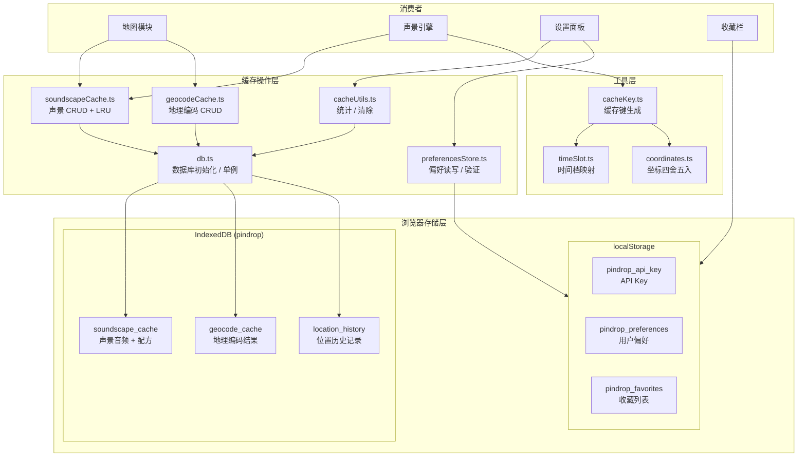
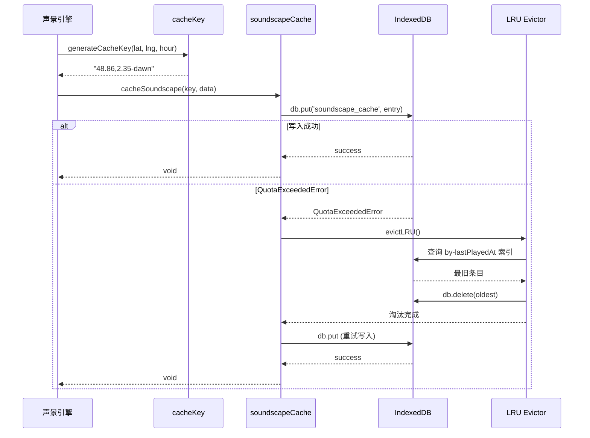
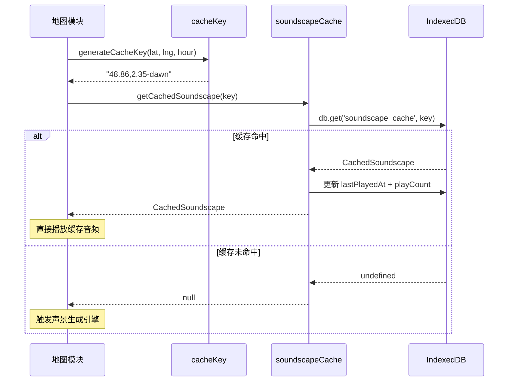
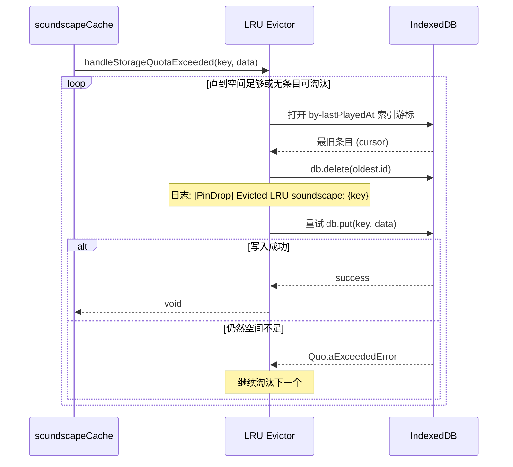
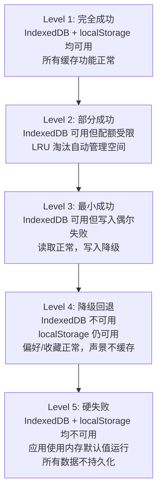

# 设计文档：缓存与存储系统

## 概述

缓存与存储系统是 PinDrop 应用的客户端数据持久化层，遵循"零后端"架构原则，所有用户数据仅存储在浏览器本地。系统由两大存储引擎组成：

- **IndexedDB**（数据库名：`pindrop`）：存储大体积二进制数据，包括声景音频缓存（5 层 audioBlobs + SoundscapeRecipe）、地理编码缓存和位置历史记录
- **localStorage**：存储轻量级键值数据，包括用户偏好设置、ElevenLabs API Key 和收藏列表

系统通过坐标精度 0.01°（约 1.1km）+ 时间档（dawn/day/dusk/night）的缓存键生成规则实现高效缓存命中，并采用 LRU（最近最少使用）淘汰策略管理存储配额。当存储引擎不可用时，系统遵循 5 级降级策略确保应用核心功能不受影响。

### 设计目标

1. **缓存命中率最大化**：通过坐标四舍五入和时间档分组，使相近位置和相同时段的请求共享缓存
2. **存储空间自动管理**：LRU 淘汰策略在配额不足时自动清理最久未使用的条目
3. **优雅降级**：IndexedDB 或 localStorage 不可用时，应用仍可正常运行
4. **数据安全**：API Key 不记录到日志，敏感数据不泄露

## 架构

### 整体架构图



### 数据流序列图

#### 缓存写入流程



#### 缓存读取流程



#### LRU 淘汰流程



## 组件与接口

### 模块结构

```
src/
├── utils/
│   ├── db.ts                  # IndexedDB 初始化、单例管理、可用性检测
│   ├── soundscapeCache.ts     # 声景缓存 CRUD + LRU 淘汰
│   ├── geocodeCache.ts        # 地理编码缓存 CRUD
│   ├── cacheKey.ts            # 缓存键生成（坐标 + 小时 → 键）
│   ├── timeSlot.ts            # 时间档映射 + 缓存键生成（坐标 + 时间档 → 键）
│   ├── coordinates.ts         # 坐标验证与四舍五入
│   └── __tests__/
│       ├── coordinates.property.test.ts
│       ├── timeSlot.property.test.ts
│       └── distance.property.test.ts
├── components/settings/
│   ├── cacheUtils.ts          # 缓存统计计算、格式化、清除
│   ├── preferencesStore.ts    # 偏好设置读写、验证、API Key 存储
│   ├── types.ts               # 类型定义
│   └── __tests__/
│       ├── cacheUtils.test.ts
│       └── preferencesStore.test.ts
```

### 核心接口

#### db.ts — 数据库初始化模块

```typescript
// 数据库初始化，返回单例实例
function initDB(): Promise<IDBPDatabase<PinDropDB>>;

// 获取数据库实例（懒初始化）
function getDB(): Promise<IDBPDatabase<PinDropDB>>;

// 检测 IndexedDB 是否可用
function isIndexedDBAvailable(): boolean;
```

#### soundscapeCache.ts — 声景缓存模块

```typescript
// 按缓存键读取声景
function getCachedSoundscape(cacheKey: string): Promise<CachedSoundscape | null>;

// 写入声景缓存
function cacheSoundscape(cacheKey: string, data: Omit<CachedSoundscape, 'id'>): Promise<void>;

// 检查缓存是否存在
function checkCacheExists(cacheKey: string): Promise<boolean>;

// 获取所有缓存标记（用于地图显示）
function getCachedMarkers(): Promise<CachedSoundscape[]>;

// 更新播放统计（lastPlayedAt + playCount）
function updatePlayStats(cacheKey: string): Promise<void>;

// LRU 淘汰最旧条目
function evictLRU(): Promise<void>;

// 处理配额超出：淘汰 + 重试写入
function handleStorageQuotaExceeded(cacheKey: string, data: Omit<CachedSoundscape, 'id'>): Promise<void>;
```

#### geocodeCache.ts — 地理编码缓存模块

```typescript
// 按坐标读取缓存的地理编码结果
function getCachedGeocode(lat: number, lng: number): Promise<GeocodingResult | null>;

// 写入地理编码缓存
function cacheGeocode(lat: number, lng: number, result: GeocodingResult): Promise<void>;
```

#### cacheKey.ts — 缓存键生成模块

```typescript
// 根据坐标和小时生成缓存键
function generateCacheKey(lat: number, lng: number, hour: number): string;

// 使用当前时间生成缓存键
function generateCacheKeyNow(lat: number, lng: number): string;
```

#### timeSlot.ts — 时间档模块

```typescript
// 小时 → 时间档映射
function getTimeSlot(hour: number): TimeSlot;

// 坐标 + 时间档 → 缓存键
function generateCacheKey(lat: number, lng: number, timeSlot: TimeSlot): string;

// 缓存键 → 坐标 + 时间档（解析）
function parseCacheKey(cacheKey: string): { coordinates: Coordinates; timeSlot: TimeSlot } | null;
```

#### preferencesStore.ts — 偏好设置模块

```typescript
// 验证偏好设置，无效字段替换为默认值
function validatePreferences(preferences: unknown): UserPreferences;

// API Key 存储/检索/清除
function storeApiKey(apiKey: string): void;
function retrieveApiKey(): string | null;
function clearApiKey(): void;

// PreferencesStore 类
class PreferencesStore {
  isLocalStorageAvailable(): boolean;
  loadPreferences(): UserPreferences;
  savePreferences(preferences: UserPreferences): void;
  getDefaultPreferences(): UserPreferences;
}
```

#### cacheUtils.ts — 缓存管理工具

```typescript
// 计算 blob 大小数组的总 MB
function calculateTotalSizeMB(blobSizes: number[]): number;

// 格式化缓存统计为可读字符串
function formatCacheStats(stats: CacheStatistics | null | undefined): string;

// 查询缓存统计信息
function calculateCacheStatistics(): Promise<CacheStatistics>;

// 清除所有缓存
function clearAllCaches(): Promise<void>;
```

### 关键算法

#### 1. 坐标四舍五入算法

将坐标四舍五入到 0.01° 精度（约 1.1km），确保相近位置共享缓存键：

```typescript
function roundCoordinate(value: number): number {
  return Math.round(value * 100) / 100;
}
```

**特性**：
- 幂等性：`round(round(x)) === round(x)`
- 精度：结果始终为 2 位小数
- 误差范围：最大偏差 ±0.005°

#### 2. 缓存键生成算法

格式：`"{lat},{lng}-{timeSlot}"`

```
输入: lat=48.8566, lng=2.3522, hour=7
  ↓ 坐标四舍五入
  lat=48.86, lng=2.35
  ↓ 小时 → 时间档
  hour=7 → "dawn"
  ↓ 拼接
输出: "48.86,2.35-dawn"
```

**关键约束**：
- 坐标始终输出 2 位小数（`toFixed(2)`），包括 `"0.00"`
- 负数坐标保留负号：`"-33.87,151.21-night"`
- 往返一致性：`parse(generate(x)) → generate(parse(generate(x))) === generate(x)`

#### 3. LRU 淘汰算法

利用 IndexedDB 的 `by-lastPlayedAt` 索引定位最旧条目：

```
1. 打开 by-lastPlayedAt 索引的游标（升序）
2. 游标指向 lastPlayedAt 最小的条目
3. 删除该条目
4. 重试原始写入操作
5. 若仍失败，重复步骤 1-4
```

#### 4. 偏好设置验证算法

对每个字段进行类型和范围校验，无效值替换为默认值：

| 字段 | 有效值 | 默认值 |
|------|--------|--------|
| mapStyle | `'light'` \| `'dark'` | `'light'` |
| autoPlay | `boolean` | `true` |
| fadeInDuration | `0.5 \| 1.0 \| 1.5 \| 2.0 \| 3.0` | `1.5` |
| dynamicEvents | `boolean` | `true` |
| masterVolume | `number` ∈ [0, 1] | `0.8` |
| layerVolumes.* | `number` ∈ [0, 1] | 各层独立默认值 |

## 数据模型

### IndexedDB Schema（PinDropDB）

#### soundscape_cache Object Store

| 字段 | 类型 | 说明 |
|------|------|------|
| `id` (keyPath) | `string` | 缓存键，格式 `"{lat},{lng}-{timeSlot}"` |
| `coordinates` | `[number, number]` | 原始坐标元组 `[lat, lng]` |
| `timeSlot` | `'dawn' \| 'day' \| 'dusk' \| 'night'` | 时间档 |
| `cityName` | `string` | 城市名称 |
| `countryName` | `string` | 国家名称 |
| `generatedAt` | `number` | 生成时间戳（Unix ms） |
| `playCount` | `number` | 播放次数，初始为 0 |
| `lastPlayedAt` | `number` | 最后播放时间戳（Unix ms） |
| `sizeBytes` | `number` | 数据总大小（字节） |
| `audioBlobs` | `object` | 5 层音频 Blob（可选） |
| `audioBlobs.ambient` | `Blob?` | 环境音层 |
| `audioBlobs.signature` | `Blob?` | 标志性声音层 |
| `audioBlobs.dialogue` | `Blob?` | 对话层 |
| `audioBlobs.secondaryDialogue` | `Blob?` | 副对话层 |
| `audioBlobs.atmosphere` | `Blob?` | 氛围音乐层 |
| `recipe` | `unknown` | SoundscapeRecipe 配方数据 |

**索引**：
- `by-lastPlayedAt`：基于 `lastPlayedAt`，用于 LRU 淘汰
- `by-coordinates`：基于 `coordinates`，用于空间查询

#### geocode_cache Object Store

| 字段 | 类型 | 说明 |
|------|------|------|
| `key` (keyPath) | `string` | 缓存键，格式 `"{lat},{lng}"`（0.01° 精度） |
| `result` | `GeocodingResult` | 地理编码结果对象 |
| `result.cityName` | `string` | 城市名称 |
| `result.countryName` | `string` | 国家名称 |
| `result.administrativeRegion` | `string` | 行政区划 |
| `result.timezone` | `string` | 时区标识符 |
| `result.language` | `string` | 主要语言代码 |
| `result.isInferred` | `boolean` | 是否为推断结果 |
| `cachedAt` | `number` | 缓存时间戳（Unix ms） |

**索引**：
- `by-cachedAt`：基于 `cachedAt`

#### location_history Object Store

| 字段 | 类型 | 说明 |
|------|------|------|
| `id` (keyPath, autoIncrement) | `number` | 自增主键 |
| `coordinates` | `[number, number]` | 坐标元组 `[lat, lng]` |
| `visitedAt` | `number` | 访问时间戳（Unix ms） |
| `soundscapeId` | `string` | 关联的声景缓存键 |

**索引**：
- `by-visitedAt`：基于 `visitedAt`，用于按时间排序查询
- `by-soundscapeId`：基于 `soundscapeId`，用于关联查询

### localStorage 数据结构

#### pindrop_preferences

```typescript
interface UserPreferences {
  mapStyle: 'light' | 'dark';
  autoPlay: boolean;
  fadeInDuration: 0.5 | 1.0 | 1.5 | 2.0 | 3.0;
  dynamicEvents: boolean;
  masterVolume: number;       // 0-1
  layerVolumes: {
    ambient: number;          // 0-1, 默认 0.7
    signature: number;        // 0-1, 默认 0.6
    dialogue: number;         // 0-1, 默认 0.8
    secondaryDialogue: number; // 0-1, 默认 0.5
    atmosphere: number;       // 0-1, 默认 0.4
  };
}
```

#### pindrop_api_key

```typescript
// 存储格式：纯字符串，以 "xi-" 开头
// 安全约束：不记录到控制台日志
type ApiKey = string; // 格式: "xi-{32位字母数字}"
```

#### pindrop_favorites

```typescript
// 存储格式：JSON 序列化的字符串数组
type Favorites = string[]; // 声景缓存键数组，如 ["48.86,2.35-dawn", "35.68,139.65-night"]
```

### TypeScript 类型定义

```typescript
// 缓存统计信息
interface CacheStatistics {
  soundscapeCount: number;
  totalSizeMB: number;
  geocodeCount: number;
  historyCount: number;
}

// 缓存清除结果
interface CacheClearResult {
  success: boolean;
  error?: string;
  clearedStores: string[];
}

// 时间档类型
type TimeSlot = 'dawn' | 'day' | 'dusk' | 'night';

// 坐标类型
type Coordinates = [number, number]; // [latitude, longitude]
```


## 正确性属性

*属性（Property）是指在系统所有有效执行中都应成立的特征或行为——本质上是对系统应做什么的形式化陈述。属性是连接人类可读规格说明与机器可验证正确性保证之间的桥梁。*

> **注意**：属性 1-3（坐标四舍五入幂等性、缓存键格式一致性、缓存键往返一致性）已在 `src/utils/__tests__/coordinates.property.test.ts` 和 `src/utils/__tests__/timeSlot.property.test.ts` 中实现。以下属性为本模块新增。

### Property 1: 声景缓存写入/读取往返一致性

*For any* 有效的声景数据（包含 coordinates、timeSlot、cityName、countryName、audioBlobs、recipe 等字段），将其写入 IndexedDB 后再读取，返回的数据 SHALL 与写入的数据在所有非时间戳字段上等价。

**Validates: Requirements 3.2, 3.3, 3.4, 4.1, 4.3**

### Property 2: 声景缓存覆盖写入

*For any* 缓存键和两组不同的声景数据，先写入第一组数据再写入第二组数据后，读取该缓存键 SHALL 返回第二组数据而非第一组。

**Validates: Requirements 3.5**

### Property 3: 播放统计单调递增

*For any* 已缓存的声景条目，每次调用 `updatePlayStats` 后，`playCount` SHALL 严格递增 1，且 `lastPlayedAt` SHALL 不小于调用前的值。

**Validates: Requirements 4.5**

### Property 4: LRU 淘汰最旧条目

*For any* 包含多个缓存条目的 soundscape_cache，当触发 LRU 淘汰时，被删除的条目 SHALL 是 `lastPlayedAt` 值最小的那个条目。

**Validates: Requirements 5.1**

### Property 5: 地理编码缓存往返一致性

*For any* 有效的坐标对和地理编码结果，将其写入 geocode_cache 后，使用相同坐标（0.01° 精度内）查询 SHALL 返回等价的地理编码结果。

**Validates: Requirements 6.1, 6.2, 6.3**

### Property 6: calculateTotalSizeMB 计算正确性

*For any* 非负整数数组 `blobSizes`，`calculateTotalSizeMB(blobSizes)` SHALL 等于 `Math.round(sum(blobSizes) / (1024 * 1024) * 100) / 100`，且结果始终非负。

**Validates: Requirements 8.2**

### Property 7: formatCacheStats 格式一致性

*For any* 有效的 `CacheStatistics` 对象，`formatCacheStats(stats)` SHALL 返回格式为 `"{soundscapeCount} soundscapes · {totalSizeMB} MB"` 的字符串；对于 `null` 或 `undefined` 输入，SHALL 返回 `"Cache unavailable"`。

**Validates: Requirements 8.3, 8.6**

### Property 8: 偏好设置验证总是返回有效值

*For any* 任意 `unknown` 类型的输入，`validatePreferences(input)` SHALL 返回一个完全有效的 `UserPreferences` 对象，其中 `mapStyle` 为 `'light'` 或 `'dark'`，`masterVolume` 在 [0, 1] 范围内，`fadeInDuration` 为允许值之一，所有 `layerVolumes` 在 [0, 1] 范围内。

**Validates: Requirements 9.3**

### Property 9: 偏好设置往返一致性

*For any* 有效的 `UserPreferences` 对象，通过 `savePreferences` 保存后再通过 `loadPreferences` 加载，返回的偏好设置 SHALL 与原始值等价。

**Validates: Requirements 9.2, 9.5**

### Property 10: 收藏列表添加/移除往返

*For any* 声景缓存键，添加到收藏列表后查询该键 SHALL 返回 `true`；移除后查询 SHALL 返回 `false`。

**Validates: Requirements 11.2, 11.3, 11.5**

### Property 11: 收藏列表去重幂等性

*For any* 声景缓存键，将同一键添加到收藏列表 N 次（N ≥ 1），收藏列表中该键的出现次数 SHALL 始终为 1。

**Validates: Requirements 11.4**

## 错误处理

### 错误分类与响应策略

| 错误类型 | 严重级别 | 响应策略 | 日志格式 |
|----------|----------|----------|----------|
| IndexedDB 初始化失败 | 严重 | 抛出异常，禁用缓存功能 | `[PinDrop Error] IndexedDB initialization failed: {error}` |
| 声景缓存写入失败（非配额） | 中等 | 记录日志，继续播放（不缓存） | `[PinDrop Error] Failed to cache soundscape: {error}` |
| 声景缓存写入配额超出 | 中等 | 触发 LRU 淘汰后重试 | `[PinDrop] Evicted LRU soundscape: {cacheKey}` |
| 声景缓存读取失败 | 低 | 记录日志，返回 null（触发重新生成） | `[PinDrop Error] Failed to get cached soundscape: {error}` |
| 地理编码缓存操作失败 | 低 | 记录日志，继续执行（非关键路径） | `[PinDrop Error] Failed to get/cache geocode: {error}` |
| 缓存统计查询失败 | 中等 | 记录日志，抛出异常（UI 显示错误） | `[PinDrop Error] CACHE_STATS_LOAD_FAILED: {error}` |
| 缓存清除失败 | 中等 | 记录日志，抛出异常（UI 显示错误） | `[PinDrop Error] CACHE_CLEAR_FAILED: {error}` |
| localStorage 不可用 | 低 | 记录警告，使用内存默认值 | `[PinDrop] localStorage unavailable, using defaults` |
| localStorage 写入失败 | 低 | 记录错误，不阻塞应用 | `[PinDrop Error] Failed to save preferences: {error}` |
| API Key 存储失败 | 低 | 记录错误（不含 Key 值） | `[PinDrop Error] Failed to store API key` |

### 5 级降级策略



### 安全约束

1. **API Key 保护**：
   - `storeApiKey` / `retrieveApiKey` / `clearApiKey` 操作中不将 Key 值记录到任何日志
   - 错误日志使用 `[PinDrop Error] Failed to store API key` 而非包含 Key 值
   - Key 格式验证：必须以 `xi-` 开头

2. **日志安全**：
   - 所有错误日志遵循 `[PinDrop Error] {type}: {message}` 格式
   - 日志中不包含 API Key、用户坐标等敏感数据
   - 仅记录缓存键（公开格式）用于调试

## 测试策略

### 测试框架与工具

- **单元测试框架**：Vitest
- **属性测试库**：fast-check（已安装，版本 ^4.6.0）
- **测试环境**：jsdom（通过 vitest.config.ts 配置）
- **Mock 工具**：Vitest 内置 `vi.mock` / `vi.fn` / `vi.spyOn`

### 双重测试方法

#### 属性测试（Property-Based Tests）

验证跨所有输入的通用属性，每个属性测试最少运行 **100 次迭代**。

| 属性 | 测试文件 | 标签 |
|------|----------|------|
| Property 1: 声景缓存往返 | `soundscapeCache.property.test.ts` | Feature: 06-caching-storage, Property 1: 声景缓存写入/读取往返一致性 |
| Property 2: 覆盖写入 | `soundscapeCache.property.test.ts` | Feature: 06-caching-storage, Property 2: 声景缓存覆盖写入 |
| Property 3: 播放统计递增 | `soundscapeCache.property.test.ts` | Feature: 06-caching-storage, Property 3: 播放统计单调递增 |
| Property 4: LRU 淘汰最旧 | `soundscapeCache.property.test.ts` | Feature: 06-caching-storage, Property 4: LRU 淘汰最旧条目 |
| Property 5: 地理编码往返 | `geocodeCache.property.test.ts` | Feature: 06-caching-storage, Property 5: 地理编码缓存往返一致性 |
| Property 6: 大小计算 | `cacheUtils.property.test.ts` | Feature: 06-caching-storage, Property 6: calculateTotalSizeMB 计算正确性 |
| Property 7: 格式化一致性 | `cacheUtils.property.test.ts` | Feature: 06-caching-storage, Property 7: formatCacheStats 格式一致性 |
| Property 8: 验证返回有效值 | `preferencesStore.property.test.ts` | Feature: 06-caching-storage, Property 8: 偏好设置验证总是返回有效值 |
| Property 9: 偏好往返 | `preferencesStore.property.test.ts` | Feature: 06-caching-storage, Property 9: 偏好设置往返一致性 |
| Property 10: 收藏往返 | `favoritesStore.property.test.ts` | Feature: 06-caching-storage, Property 10: 收藏列表添加/移除往返 |
| Property 11: 收藏去重 | `favoritesStore.property.test.ts` | Feature: 06-caching-storage, Property 11: 收藏列表去重幂等性 |

#### 单元测试（Example-Based Tests）

验证具体示例、边界条件和错误处理。

| 测试范围 | 测试文件 | 覆盖需求 |
|----------|----------|----------|
| 数据库初始化与单例 | `db.test.ts` | 1.1-1.10 |
| 缓存键具体示例 | `cacheKey.test.ts` | 2.3 |
| 缓存未命中返回 null | `soundscapeCache.test.ts` | 4.4 |
| 读取失败返回 null | `soundscapeCache.test.ts` | 4.6, 14.3 |
| QuotaExceededError 触发 LRU | `soundscapeCache.test.ts` | 3.6, 5.3-5.6 |
| 地理编码未命中/错误处理 | `geocodeCache.test.ts` | 6.4-6.6 |
| IndexedDB 不可用降级 | `db.test.ts` | 12.1-12.5 |
| localStorage 不可用降级 | `preferencesStore.test.ts` | 13.1-13.5, 9.6 |
| API Key 安全约束 | `preferencesStore.test.ts` | 10.1-10.6 |
| 缓存统计/清除错误处理 | `cacheUtils.test.ts` | 14.5, 14.6 |
| 收藏降级 | `favoritesStore.test.ts` | 11.6 |

### Mock 策略

- **IndexedDB**：使用 `vi.mock('@/utils/db')` mock `getDB` 和 `isIndexedDBAvailable`，返回带有 `get`/`put`/`delete`/`getAll`/`count`/`clear` 方法的 mock 对象
- **localStorage**：使用 `vi.spyOn(Storage.prototype, ...)` mock `setItem`/`getItem`/`removeItem`
- **console**：使用 `vi.spyOn(console, 'error/warn/log')` 验证日志输出

### 覆盖率目标

| 模块 | 目标覆盖率 | 优先级 |
|------|-----------|--------|
| cacheKey.ts | 100% | 关键 |
| timeSlot.ts | 100% | 关键 |
| coordinates.ts | 100% | 关键 |
| soundscapeCache.ts | 90% | 高 |
| geocodeCache.ts | 90% | 高 |
| cacheUtils.ts | 90% | 高 |
| preferencesStore.ts | 90% | 高 |
| db.ts | 80% | 高 |
