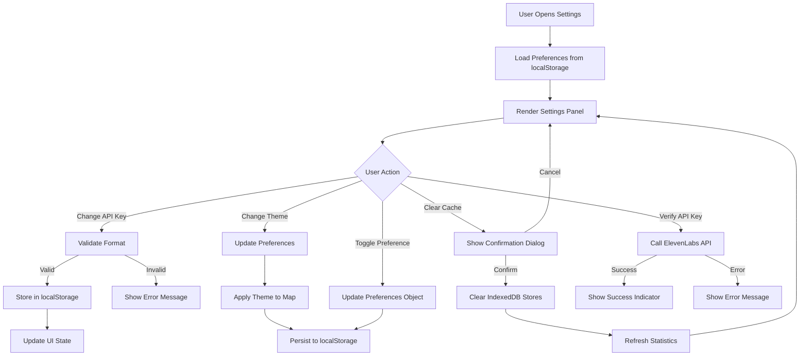

# Design Document: Settings UI

## Overview

The Settings UI provides a comprehensive configuration panel for managing ElevenLabs API credentials, customizing map appearance, configuring playback preferences, and managing local cache storage. This module implements a zero-backend architecture where all settings are persisted client-side using localStorage, with cache management operations performed directly against IndexedDB.

The Settings UI serves as the central control panel for user preferences and system configuration, providing immediate visual feedback for all changes and maintaining consistency with the application's design system. It operates entirely within the browser with no server-side dependencies.

### Key Responsibilities

- Manage ElevenLabs API Key input, validation, and secure storage
- Provide map theme switching (light/dark mode)
- Configure playback preferences (auto-play, fade-in duration, dynamic events)
- Display cache statistics (soundscape count and storage size)
- Enable cache clearing with confirmation
- Persist all preferences to localStorage
- Validate user inputs with immediate feedback
- Maintain responsive layout across screen sizes
- Integrate with existing application state management

## Architecture

### Component Structure

```
SettingsModule
├── SettingsPanel (React Component)
│   ├── SettingsPanelHeader
│   ├── ApiKeySection
│   │   ├── ApiKeyInput
│   │   ├── ApiKeyValidator
│   │   └── ApiKeyMasking
│   ├── MapSection
│   │   └── ThemeSelector
│   ├── PlaybackSection
│   │   ├── AutoPlayToggle
│   │   ├── FadeInSelector
│   │   └── DynamicEventsToggle
│   ├── CacheSection
│   │   ├── CacheStatistics
│   │   └── ClearCacheButton
│   └── AboutSection
├── PreferencesStore
│   ├── LocalStorageManager
│   ├── PreferencesValidator
│   └── DefaultPreferences
├── ApiKeyManager
│   ├── FormatValidator
│   ├── ApiKeyVerifier
│   └── SecureStorage
└── CacheManager
    ├── StatisticsCalculator
    ├── CacheClearer
    └── IndexedDBWrapper
```

### Data Flow



### State Management

The module maintains the following state:

```typescript
interface SettingsState {
  // Panel state
  isOpen: boolean;
  activeSection: SettingsSection | null;
  
  // API Key state
  apiKey: string;
  apiKeyMasked: string;
  isApiKeyValid: boolean | null;
  apiKeyError: string | null;
  isVerifying: boolean;
  
  // Preferences state
  preferences: UserPreferences;
  hasUnsavedChanges: boolean;
  
  // Cache state
  cacheStats: CacheStatistics | null;
  isLoadingStats: boolean;
  isClearingCache: boolean;
  showClearConfirmation: boolean;
  
  // UI state
  error: string | null;
  successMessage: string | null;
}

interface UserPreferences {
  mapStyle: 'light' | 'dark';
  autoPlay: boolean;
  fadeInDuration: number; // seconds
  dynamicEvents: boolean;
  masterVolume: number; // 0-1
  layerVolumes: {
    ambient: number;
    signature: number;
    dialogue: number;
    secondaryDialogue: number;
    atmosphere: number;
  };
}

interface CacheStatistics {
  soundscapeCount: number;
  totalSizeMB: number;
  geocodeCount: number;
  historyCount: number;
}

type SettingsSection = 'api-key' | 'map' | 'playback' | 'cache' | 'about';
```

## Components and Interfaces

### SettingsPanel Component

**Purpose**: Main container component that renders the settings overlay and manages overall state.

**Props**:
```typescript
interface SettingsPanelProps {
  isOpen: boolean;
  onClose: () => void;
  onThemeChange: (theme: 'light' | 'dark') => void;
  currentTheme: 'light' | 'dark';
}
```

**Key Methods**:
- `loadPreferences()`: Load all preferences from localStorage on mount
- `savePreferences(preferences: UserPreferences)`: Persist preferences to localStorage
- `handleApiKeyChange(apiKey: string)`: Validate and store API key
- `handleThemeChange(theme: 'light' | 'dark')`: Update theme and notify parent
- `handleClearCache()`: Clear all IndexedDB stores with confirmation
- `refreshCacheStats()`: Query IndexedDB for current statistics

**Layout Structure**:
```tsx
<div className="settings-overlay" onClick={handleOverlayClick}>
  <div className="settings-panel" onClick={stopPropagation}>
    <SettingsPanelHeader onClose={onClose} />
    
    <div className="settings-content">
      <ApiKeySection
        apiKey={apiKey}
        onApiKeyChange={handleApiKeyChange}
        onVerify={handleVerifyApiKey}
        isVerifying={isVerifying}
        error={apiKeyError}
      />
      
      <MapSection
        theme={preferences.mapStyle}
        onThemeChange={handleThemeChange}
      />
      
      <PlaybackSection
        autoPlay={preferences.autoPlay}
        fadeInDuration={preferences.fadeInDuration}
        dynamicEvents={preferences.dynamicEvents}
        onAutoPlayChange={handleAutoPlayChange}
        onFadeInChange={handleFadeInChange}
        onDynamicEventsChange={handleDynamicEventsChange}
      />
      
      <CacheSection
        stats={cacheStats}
        isLoading={isLoadingStats}
        onClearCache={handleClearCache}
        isClearingCache={isClearingCache}
      />
      
      <AboutSection />
    </div>
  </div>
</div>
```

### ApiKeySection Component

**Purpose**: Manage API key input, validation, masking, and verification.

**Props**:
```typescript
interface ApiKeySectionProps {
  apiKey: string;
  onApiKeyChange: (apiKey: string) => void;
  onVerify: () => Promise<void>;
  isVerifying: boolean;
  error: string | null;
}
```

**Interface**:
```typescript
interface ApiKeyManager {
  validateFormat(apiKey: string): ValidationResult;
  maskApiKey(apiKey: string): string;
  verifyApiKey(apiKey: string): Promise<VerificationResult>;
  storeApiKey(apiKey: string): void;
  retrieveApiKey(): string | null;
  clearApiKey(): void;
}

interface ValidationResult {
  isValid: boolean;
  error?: string;
}

interface VerificationResult {
  isValid: boolean;
  error?: string;
}
```

**Validation Rules**:
- Format: `xi-[a-zA-Z0-9]{32}` (ElevenLabs API key format)
- Length: Exactly 35 characters (3 prefix + 32 alphanumeric)
- Prefix: Must start with `xi-`
- Characters: Only alphanumeric after prefix

**Masking Implementation**:
```typescript
function maskApiKey(apiKey: string): string {
  if (!apiKey || apiKey.length < 3) {
    return '';
  }
  
  // Show first 3 characters (sk-) followed by dots
  // User feedback: mask as sk-•••••••••••••••••••• (not xi-)
  return 'sk-' + '•'.repeat(22);
}
```

**Verification Flow**:
```typescript
async function verifyApiKey(apiKey: string): Promise<VerificationResult> {
  try {
    const response = await fetch('/api/elevenlabs/user/subscription', {
      method: 'GET',
      headers: {
        'x-elevenlabs-api-key': apiKey,
      },
    });
    
    if (!response.ok) {
      return {
        isValid: false,
        error: 'Key invalid or expired',
      };
    }
    
    // User feedback: Do NOT display balance
    return {
      isValid: true,
    };
  } catch (error) {
    return {
      isValid: false,
      error: 'Verification failed. Check connection.',
    };
  }
}
```

### MapSection Component

**Purpose**: Provide theme selection for map appearance.

**Props**:
```typescript
interface MapSectionProps {
  theme: 'light' | 'dark';
  onThemeChange: (theme: 'light' | 'dark') => void;
}
```

**Interface**:
```typescript
interface ThemeSelector {
  currentTheme: 'light' | 'dark';
  availableThemes: ThemeOption[];
  selectTheme: (theme: 'light' | 'dark') => void;
}

interface ThemeOption {
  value: 'light' | 'dark';
  label: string;
  icon: string;
}

const THEME_OPTIONS: ThemeOption[] = [
  { value: 'light', label: 'Light', icon: '☀️' },
  { value: 'dark', label: 'Dark', icon: '🌙' },
];
```

**Implementation**:
```tsx
function MapSection({ theme, onThemeChange }: MapSectionProps) {
  return (
    <section className="settings-section">
      <h3 className="section-header">Map</h3>
      
      <div className="setting-item">
        <label htmlFor="theme-selector">Theme</label>
        <div className="theme-selector">
          {THEME_OPTIONS.map((option) => (
            <button
              key={option.value}
              className={`theme-option ${theme === option.value ? 'active' : ''}`}
              onClick={() => onThemeChange(option.value)}
              aria-pressed={theme === option.value}
            >
              <span className="theme-icon">{option.icon}</span>
              <span className="theme-label">{option.label}</span>
            </button>
          ))}
        </div>
      </div>
    </section>
  );
}
```

### PlaybackSection Component

**Purpose**: Configure audio playback preferences.

**Props**:
```typescript
interface PlaybackSectionProps {
  autoPlay: boolean;
  fadeInDuration: number;
  dynamicEvents: boolean;
  onAutoPlayChange: (enabled: boolean) => void;
  onFadeInChange: (duration: number) => void;
  onDynamicEventsChange: (enabled: boolean) => void;
}
```

**Interface**:
```typescript
interface PlaybackPreferences {
  autoPlay: boolean;
  fadeInDuration: number; // 0.5, 1.0, 1.5, 2.0, 3.0
  dynamicEvents: boolean;
}

const FADE_IN_OPTIONS = [
  { value: 0.5, label: '0.5s' },
  { value: 1.0, label: '1.0s' },
  { value: 1.5, label: '1.5s' },
  { value: 2.0, label: '2.0s' },
  { value: 3.0, label: '3.0s' },
];
```

**Implementation**:
```tsx
function PlaybackSection({
  autoPlay,
  fadeInDuration,
  dynamicEvents,
  onAutoPlayChange,
  onFadeInChange,
  onDynamicEventsChange,
}: PlaybackSectionProps) {
  return (
    <section className="settings-section">
      <h3 className="section-header">Playback</h3>
      
      <div className="setting-item">
        <label htmlFor="auto-play-toggle">
          Auto-play
          <span className="setting-description">
            Play immediately after click
          </span>
        </label>
        <Toggle
          id="auto-play-toggle"
          checked={autoPlay}
          onChange={onAutoPlayChange}
        />
      </div>
      
      <div className="setting-item">
        <label htmlFor="fade-in-selector">Fade-in duration</label>
        <select
          id="fade-in-selector"
          value={fadeInDuration}
          onChange={(e) => onFadeInChange(Number(e.target.value))}
        >
          {FADE_IN_OPTIONS.map((option) => (
            <option key={option.value} value={option.value}>
              {option.label}
            </option>
          ))}
        </select>
      </div>
      
      <div className="setting-item">
        <label htmlFor="dynamic-events-toggle">
          Dynamic events
          <span className="setting-description">
            Random ambient sound effects
          </span>
        </label>
        <Toggle
          id="dynamic-events-toggle"
          checked={dynamicEvents}
          onChange={onDynamicEventsChange}
        />
      </div>
    </section>
  );
}
```

### CacheSection Component

**Purpose**: Display cache statistics and provide cache clearing functionality.

**Props**:
```typescript
interface CacheSectionProps {
  stats: CacheStatistics | null;
  isLoading: boolean;
  onClearCache: () => void;
  isClearingCache: boolean;
}
```

**Interface**:
```typescript
interface CacheManager {
  getStatistics(): Promise<CacheStatistics>;
  clearAllCaches(): Promise<void>;
  clearSoundscapeCache(): Promise<void>;
  clearGeocodeCache(): Promise<void>;
  clearLocationHistory(): Promise<void>;
}

interface CacheStatistics {
  soundscapeCount: number;
  totalSizeMB: number;
  geocodeCount: number;
  historyCount: number;
}
```

**Statistics Calculation**:
```typescript
async function calculateCacheStatistics(): Promise<CacheStatistics> {
  const db = await getDB();
  
  // Count soundscapes
  const soundscapes = await db.getAll('soundscape_cache');
  const soundscapeCount = soundscapes.length;
  
  // Calculate total size
  let totalSizeBytes = 0;
  for (const soundscape of soundscapes) {
    totalSizeBytes += soundscape.sizeBytes || 0;
  }
  const totalSizeMB = Math.round((totalSizeBytes / (1024 * 1024)) * 100) / 100;
  
  // Count geocode entries
  const geocodes = await db.getAll('geocode_cache');
  const geocodeCount = geocodes.length;
  
  // Count history entries
  const history = await db.getAll('location_history');
  const historyCount = history.length;
  
  return {
    soundscapeCount,
    totalSizeMB,
    geocodeCount,
    historyCount,
  };
}
```

**Cache Clearing Implementation**:
```typescript
async function clearAllCaches(): Promise<void> {
  const db = await getDB();
  
  // Clear soundscape cache
  await db.clear('soundscape_cache');
  
  // Clear geocode cache
  await db.clear('geocode_cache');
  
  // Clear location history
  await db.clear('location_history');
}
```

**Confirmation Dialog**:
```tsx
function CacheSection({
  stats,
  isLoading,
  onClearCache,
  isClearingCache,
}: CacheSectionProps) {
  const [showConfirmation, setShowConfirmation] = useState(false);
  
  const handleClearClick = () => {
    setShowConfirmation(true);
  };
  
  const handleConfirm = () => {
    setShowConfirmation(false);
    onClearCache();
  };
  
  const handleCancel = () => {
    setShowConfirmation(false);
  };
  
  return (
    <section className="settings-section">
      <h3 className="section-header">Cache</h3>
      
      <div className="setting-item">
        <div className="cache-stats">
          {isLoading ? (
            <span className="loading">Loading statistics...</span>
          ) : stats ? (
            <span className="stats-text">
              {stats.soundscapeCount} soundscapes · {stats.totalSizeMB} MB
            </span>
          ) : (
            <span className="error">Cache unavailable</span>
          )}
        </div>
      </div>
      
      <div className="setting-item">
        <button
          className="clear-cache-button"
          onClick={handleClearClick}
          disabled={isClearingCache || !stats || stats.soundscapeCount === 0}
        >
          {isClearingCache ? 'Clearing...' : 'Clear All Cache'}
        </button>
      </div>
      
      {showConfirmation && (
        <ConfirmationDialog
          title="Clear Cache"
          message="Clear all cached soundscapes? This cannot be undone."
          onConfirm={handleConfirm}
          onCancel={handleCancel}
        />
      )}
    </section>
  );
}
```

### PreferencesStore

**Purpose**: Manage persistence and validation of user preferences in localStorage.

**Interface**:
```typescript
interface PreferencesStore {
  loadPreferences(): UserPreferences;
  savePreferences(preferences: UserPreferences): void;
  validatePreferences(preferences: unknown): UserPreferences;
  getDefaultPreferences(): UserPreferences;
  isLocalStorageAvailable(): boolean;
}

const PREFERENCES_KEY = 'pindrop_preferences';
const API_KEY_KEY = 'pindrop_api_key';

const DEFAULT_PREFERENCES: UserPreferences = {
  mapStyle: 'light',
  autoPlay: true,
  fadeInDuration: 1.5,
  dynamicEvents: true,
  masterVolume: 0.8,
  layerVolumes: {
    ambient: 0.7,
    signature: 0.6,
    dialogue: 0.8,
    secondaryDialogue: 0.5,
    atmosphere: 0.4,
  },
};
```

**Implementation**:
```typescript
class PreferencesStoreImpl implements PreferencesStore {
  loadPreferences(): UserPreferences {
    if (!this.isLocalStorageAvailable()) {
      console.warn('[PinDrop] localStorage unavailable, using defaults');
      return DEFAULT_PREFERENCES;
    }
    
    try {
      const stored = localStorage.getItem(PREFERENCES_KEY);
      if (!stored) {
        return DEFAULT_PREFERENCES;
      }
      
      const parsed = JSON.parse(stored);
      return this.validatePreferences(parsed);
    } catch (error) {
      console.error('[PinDrop Error] Failed to load preferences:', error);
      return DEFAULT_PREFERENCES;
    }
  }
  
  savePreferences(preferences: UserPreferences): void {
    if (!this.isLocalStorageAvailable()) {
      console.warn('[PinDrop] localStorage unavailable, cannot save preferences');
      return;
    }
    
    try {
      const validated = this.validatePreferences(preferences);
      localStorage.setItem(PREFERENCES_KEY, JSON.stringify(validated));
    } catch (error) {
      console.error('[PinDrop Error] Failed to save preferences:', error);
    }
  }
  
  validatePreferences(preferences: unknown): UserPreferences {
    const prefs = preferences as Partial<UserPreferences>;
    
    return {
      mapStyle: prefs.mapStyle === 'dark' ? 'dark' : 'light',
      autoPlay: typeof prefs.autoPlay === 'boolean' ? prefs.autoPlay : true,
      fadeInDuration: this.validateFadeInDuration(prefs.fadeInDuration),
      dynamicEvents: typeof prefs.dynamicEvents === 'boolean' ? prefs.dynamicEvents : true,
      masterVolume: this.validateVolume(prefs.masterVolume, 0.8),
      layerVolumes: {
        ambient: this.validateVolume(prefs.layerVolumes?.ambient, 0.7),
        signature: this.validateVolume(prefs.layerVolumes?.signature, 0.6),
        dialogue: this.validateVolume(prefs.layerVolumes?.dialogue, 0.8),
        secondaryDialogue: this.validateVolume(prefs.layerVolumes?.secondaryDialogue, 0.5),
        atmosphere: this.validateVolume(prefs.layerVolumes?.atmosphere, 0.4),
      },
    };
  }
  
  private validateFadeInDuration(duration: unknown): number {
    const validDurations = [0.5, 1.0, 1.5, 2.0, 3.0];
    if (typeof duration === 'number' && validDurations.includes(duration)) {
      return duration;
    }
    return 1.5; // default
  }
  
  private validateVolume(volume: unknown, defaultValue: number): number {
    if (typeof volume === 'number' && volume >= 0 && volume <= 1) {
      return volume;
    }
    return defaultValue;
  }
  
  getDefaultPreferences(): UserPreferences {
    return { ...DEFAULT_PREFERENCES };
  }
  
  isLocalStorageAvailable(): boolean {
    try {
      const test = '__localStorage_test__';
      localStorage.setItem(test, test);
      localStorage.removeItem(test);
      return true;
    } catch {
      return false;
    }
  }
}
```

## Data Models

### Preferences Types

```typescript
interface UserPreferences {
  mapStyle: 'light' | 'dark';
  autoPlay: boolean;
  fadeInDuration: number; // 0.5 | 1.0 | 1.5 | 2.0 | 3.0
  dynamicEvents: boolean;
  masterVolume: number; // 0-1
  layerVolumes: LayerVolumes;
}

interface LayerVolumes {
  ambient: number; // 0-1
  signature: number; // 0-1
  dialogue: number; // 0-1
  secondaryDialogue: number; // 0-1
  atmosphere: number; // 0-1
}

type FadeInDuration = 0.5 | 1.0 | 1.5 | 2.0 | 3.0;
type MapTheme = 'light' | 'dark';
```

### API Key Types

```typescript
interface ApiKeyState {
  value: string;
  masked: string;
  isValid: boolean | null;
  error: string | null;
  isVerifying: boolean;
}

interface ApiKeyValidation {
  isValid: boolean;
  error?: string;
}

interface ApiKeyVerification {
  isValid: boolean;
  error?: string;
}
```

### Cache Types

```typescript
interface CacheStatistics {
  soundscapeCount: number;
  totalSizeMB: number;
  geocodeCount: number;
  historyCount: number;
}

interface CacheClearResult {
  success: boolean;
  error?: string;
  clearedStores: string[];
}
```

### Settings Panel Types

```typescript
interface SettingsPanelState {
  isOpen: boolean;
  activeSection: SettingsSection | null;
  apiKey: ApiKeyState;
  preferences: UserPreferences;
  cacheStats: CacheStatistics | null;
  isLoadingStats: boolean;
  isClearingCache: boolean;
  showClearConfirmation: boolean;
  error: string | null;
  successMessage: string | null;
}

type SettingsSection = 'api-key' | 'map' | 'playback' | 'cache' | 'about';

interface SettingsAction {
  type: SettingsActionType;
  payload?: unknown;
}

type SettingsActionType =
  | 'OPEN_PANEL'
  | 'CLOSE_PANEL'
  | 'SET_API_KEY'
  | 'VERIFY_API_KEY_START'
  | 'VERIFY_API_KEY_SUCCESS'
  | 'VERIFY_API_KEY_ERROR'
  | 'UPDATE_PREFERENCE'
  | 'LOAD_CACHE_STATS_START'
  | 'LOAD_CACHE_STATS_SUCCESS'
  | 'LOAD_CACHE_STATS_ERROR'
  | 'CLEAR_CACHE_START'
  | 'CLEAR_CACHE_SUCCESS'
  | 'CLEAR_CACHE_ERROR'
  | 'SHOW_ERROR'
  | 'SHOW_SUCCESS'
  | 'CLEAR_MESSAGES';
```

## Correctness Properties

*A property is a characteristic or behavior that should hold true across all valid executions of a system—essentially, a formal statement about what the system should do. Properties serve as the bridge between human-readable specifications and machine-verifiable correctness guarantees.*

### Property-Based Testing Applicability Assessment

The Settings UI feature involves:
- UI rendering and interaction (NOT suitable for PBT)
- localStorage operations (side effects, NOT suitable for PBT)
- IndexedDB operations (side effects, NOT suitable for PBT)
- Input validation (suitable for PBT)
- Data transformation (suitable for PBT)

**Decision**: Property-based testing IS applicable for the pure validation and transformation logic, but NOT for the UI components or storage operations.

### Prework Analysis

Using the prework tool to analyze acceptance criteria for testability:


### Property Reflection

After analyzing all acceptance criteria, I identified the following properties suitable for property-based testing:

**Identified Properties:**
1. API key masking format (1.2)
2. API key format validation (1.3)
3. API key not in error messages (3.2)
4. Cache size calculation (8.2)
5. Cache statistics format string (8.3)
6. Preferences validation (11.5)
7. Invalid preference fallback to default (11.6)

**Redundancy Analysis:**
- Property 1 (masking format) and Property 2 (format validation) test different aspects: one tests output format, the other tests input validation. They should remain separate.
- Property 4 (size calculation) and Property 5 (format string) test different aspects: one tests arithmetic, the other tests string formatting. They should remain separate.
- Property 6 (preferences validation) and Property 7 (fallback to default) are related but test different behaviors: one tests the validation logic, the other tests the fallback behavior. They should remain separate.

**Final Property Count**: 7 properties (no redundancy found)

### Property 1: API Key Masking Format Consistency

*For any* string representing an API key, the masking function SHALL produce a string in the format `sk-••••••••••••••••••••` (3 characters prefix + 22 dots), and applying the masking function twice SHALL produce the same result as applying it once (idempotence).

**Validates: Requirements 1.2, 1.6, 3.6**

### Property 2: API Key Format Validation Correctness

*For any* string input, the API key validation function SHALL correctly identify whether the string matches the pattern `xi-[a-zA-Z0-9]{32}` (exactly 35 characters: 3-character prefix + 32 alphanumeric characters).

**Validates: Requirements 1.3**

### Property 3: API Key Exclusion from Error Messages

*For any* error condition that occurs during API key operations, the error message SHALL NOT contain the actual API key value, and SHALL only contain the masked version if any key representation is needed.

**Validates: Requirements 3.2**

### Property 4: Cache Size Calculation Accuracy

*For any* array of blob size values (in bytes), the total size calculation function SHALL return the sum of all values divided by (1024 * 1024) rounded to 2 decimal places, and the result SHALL always be non-negative.

**Validates: Requirements 8.2**

### Property 5: Cache Statistics Format String Consistency

*For any* pair of non-negative integers representing soundscape count and size in MB, the statistics formatting function SHALL produce a string in the format "{count} soundscapes · {size} MB" where count and size are the provided values.

**Validates: Requirements 8.3**

### Property 6: Preferences Validation Type Safety

*For any* object loaded from localStorage, the preferences validation function SHALL return a valid UserPreferences object with all required fields present and all values within their valid ranges (mapStyle in {'light', 'dark'}, volumes in [0, 1], fadeInDuration in {0.5, 1.0, 1.5, 2.0, 3.0}).

**Validates: Requirements 11.5**

### Property 7: Invalid Preference Fallback Consistency

*For any* invalid preference value (wrong type, out of range, or missing), the preferences validation function SHALL replace it with the corresponding default value, and the resulting preferences object SHALL pass validation.

**Validates: Requirements 11.6**

## Error Handling

### Error Types

```typescript
enum SettingsErrorType {
  INVALID_API_KEY_FORMAT = 'INVALID_API_KEY_FORMAT',
  API_KEY_VERIFICATION_FAILED = 'API_KEY_VERIFICATION_FAILED',
  LOCALSTORAGE_UNAVAILABLE = 'LOCALSTORAGE_UNAVAILABLE',
  LOCALSTORAGE_WRITE_FAILED = 'LOCALSTORAGE_WRITE_FAILED',
  INDEXEDDB_UNAVAILABLE = 'INDEXEDDB_UNAVAILABLE',
  CACHE_STATS_LOAD_FAILED = 'CACHE_STATS_LOAD_FAILED',
  CACHE_CLEAR_FAILED = 'CACHE_CLEAR_FAILED',
  PREFERENCES_LOAD_FAILED = 'PREFERENCES_LOAD_FAILED',
  PREFERENCES_SAVE_FAILED = 'PREFERENCES_SAVE_FAILED',
}

interface SettingsError {
  type: SettingsErrorType;
  message: string;
  timestamp: number;
  recoverable: boolean;
}
```

### Error Handling Strategy

| Error Type | User Impact | Recovery Strategy |
|------------|-------------|-------------------|
| Invalid API Key Format | Cannot save key | Display inline error, allow correction |
| API Key Verification Failed | Cannot verify key | Display error message, suggest checking connection |
| localStorage Unavailable | Cannot save preferences | Display warning, use defaults, continue with session-only settings |
| localStorage Write Failed | Preferences not persisted | Display warning, retry once, continue with session-only settings |
| IndexedDB Unavailable | Cannot display cache stats | Display "Cache unavailable", disable clear button |
| Cache Stats Load Failed | Cannot show statistics | Display "Unable to load statistics", allow retry |
| Cache Clear Failed | Cache not cleared | Display error message, suggest manual browser cache clear |
| Preferences Load Failed | Cannot load saved settings | Use defaults, display warning |
| Preferences Save Failed | Settings not persisted | Display warning, retry once |

### Graceful Degradation

```typescript
class SettingsPanel {
  private handleLocalStorageUnavailable(): void {
    // Use in-memory preferences for session
    this.setState({
      error: 'Settings cannot be saved. Changes will be lost when you close the browser.',
      preferences: DEFAULT_PREFERENCES,
    });
  }
  
  private handleIndexedDBUnavailable(): void {
    // Disable cache-related features
    this.setState({
      cacheStats: null,
      isLoadingStats: false,
      error: 'Cache statistics unavailable.',
    });
  }
  
  private handleApiKeyVerificationFailure(error: string): void {
    // Allow user to continue with unverified key
    this.setState({
      apiKey: {
        ...this.state.apiKey,
        isValid: false,
        error: error,
        isVerifying: false,
      },
    });
  }
}
```

## Testing Strategy

### Dual Testing Approach

The Settings UI module will employ both unit tests and property-based tests for comprehensive coverage:

**Unit Tests** (Vitest):
- UI component rendering (buttons, inputs, toggles, selectors)
- User interaction flows (click, type, toggle, select)
- localStorage integration (save, load, error handling)
- IndexedDB integration (query, clear, error handling)
- Error conditions (invalid inputs, unavailable storage, API failures)
- Default value behavior (empty localStorage, missing preferences)
- Confirmation dialogs (show, confirm, cancel)
- Theme application (CSS variables, map tiles)

**Property-Based Tests** (fast-check):
- API key masking format consistency
- API key format validation correctness
- API key exclusion from error messages
- Cache size calculation accuracy
- Cache statistics format string consistency
- Preferences validation type safety
- Invalid preference fallback consistency

### Property Test Configuration

All property-based tests SHALL:
- Run minimum 100 iterations per test
- Use fast-check library for JavaScript/TypeScript
- Include a comment tag referencing the design property
- Tag format: `// Feature: 07-settings-ui, Property {number}: {property_text}`

Example:
```typescript
import fc from 'fast-check';

// Feature: 07-settings-ui, Property 1: API Key Masking Format Consistency
test('API key masking produces consistent format', () => {
  fc.assert(
    fc.property(
      fc.string({ minLength: 3 }),
      (apiKey) => {
        const masked = maskApiKey(apiKey);
        const expectedFormat = /^sk-•{22}$/;
        
        // Should match format
        expect(masked).toMatch(expectedFormat);
        
        // Should be idempotent
        const maskedTwice = maskApiKey(masked);
        expect(maskedTwice).toBe(masked);
      }
    ),
    { numRuns: 100 }
  );
});

// Feature: 07-settings-ui, Property 2: API Key Format Validation Correctness
test('API key validation correctly identifies valid format', () => {
  fc.assert(
    fc.property(
      fc.string(),
      (input) => {
        const result = validateApiKeyFormat(input);
        const isValidFormat = /^xi-[a-zA-Z0-9]{32}$/.test(input);
        expect(result.isValid).toBe(isValidFormat);
      }
    ),
    { numRuns: 100 }
  );
});

// Feature: 07-settings-ui, Property 4: Cache Size Calculation Accuracy
test('cache size calculation is accurate', () => {
  fc.assert(
    fc.property(
      fc.array(fc.nat({ max: 100000000 })), // Array of blob sizes in bytes
      (blobSizes) => {
        const totalSizeMB = calculateTotalSizeMB(blobSizes);
        
        // Should be non-negative
        expect(totalSizeMB).toBeGreaterThanOrEqual(0);
        
        // Should match manual calculation
        const expectedBytes = blobSizes.reduce((sum, size) => sum + size, 0);
        const expectedMB = Math.round((expectedBytes / (1024 * 1024)) * 100) / 100;
        expect(totalSizeMB).toBe(expectedMB);
      }
    ),
    { numRuns: 100 }
  );
});

// Feature: 07-settings-ui, Property 6: Preferences Validation Type Safety
test('preferences validation ensures type safety', () => {
  fc.assert(
    fc.property(
      fc.anything(), // Any possible input
      (input) => {
        const validated = validatePreferences(input);
        
        // Should always return valid structure
        expect(validated).toHaveProperty('mapStyle');
        expect(['light', 'dark']).toContain(validated.mapStyle);
        expect(validated.masterVolume).toBeGreaterThanOrEqual(0);
        expect(validated.masterVolume).toBeLessThanOrEqual(1);
        expect([0.5, 1.0, 1.5, 2.0, 3.0]).toContain(validated.fadeInDuration);
      }
    ),
    { numRuns: 100 }
  );
});
```

### Test Coverage Targets

| Module | Unit Test Coverage | Property Test Coverage | Priority |
|--------|-------------------|----------------------|----------|
| API key validation | 100% | 100% | Critical |
| API key masking | 100% | 100% | Critical |
| Preferences validation | 100% | 100% | Critical |
| Cache size calculation | 100% | 100% | High |
| Statistics formatting | 100% | 100% | High |
| localStorage operations | 90% | N/A | High |
| IndexedDB operations | 90% | N/A | High |
| UI components | 70% | N/A | Medium |
| Theme switching | 80% | N/A | Medium |
| Error handling | 85% | N/A | Medium |

### Integration Test Scenarios

Using Playwright for end-to-end testing:

1. **Complete Settings Flow**
   - Open settings panel → all sections visible
   - Enter API key → masked display shown
   - Verify key → success indicator shown
   - Change theme → map tiles update
   - Toggle preferences → saved to localStorage
   - Close panel → preferences persisted

2. **API Key Management Flow**
   - Enter invalid key → error message shown
   - Correct format → error clears
   - Verify valid key → success shown
   - Edit key → input becomes editable
   - Save new key → masked display updates

3. **Cache Management Flow**
   - Open settings → statistics loaded
   - Click clear cache → confirmation shown
   - Confirm → cache cleared
   - Statistics refresh → shows 0 soundscapes

4. **Error Recovery Flow**
   - localStorage unavailable → warning shown, defaults used
   - IndexedDB unavailable → cache section disabled
   - API verification fails → error shown, key still saved
   - Preferences load fails → defaults used

5. **Responsive Layout Flow**
   - Desktop view → 480px centered panel
   - Mobile view → full-screen panel
   - All controls remain accessible
   - Scrolling works when content overflows

### Manual Testing Checklist

- [ ] Open settings panel from navigation bar
- [ ] Enter valid API key, verify masking as `sk-••••••••••••••••••••`
- [ ] Enter invalid API key, verify error message
- [ ] Click "Verify Key" with valid key, verify success indicator
- [ ] Click "Verify Key" with invalid key, verify error message
- [ ] Switch theme to dark, verify map tiles update
- [ ] Switch theme to light, verify map tiles update
- [ ] Toggle auto-play off, verify saved to localStorage
- [ ] Change fade-in duration, verify saved to localStorage
- [ ] Toggle dynamic events off, verify saved to localStorage
- [ ] View cache statistics, verify count and size displayed
- [ ] Click "Clear All Cache", verify confirmation dialog
- [ ] Confirm cache clear, verify statistics show 0
- [ ] Close and reopen settings, verify preferences persisted
- [ ] Test with localStorage disabled, verify warning shown
- [ ] Test with IndexedDB disabled, verify cache section disabled
- [ ] Test responsive layout on mobile device
- [ ] Test keyboard navigation (Tab, Enter, Escape)
- [ ] Test screen reader announcements

## UI Specifications

### Layout and Spacing

**Settings Panel Dimensions**:
- Width: 480px (desktop), 100vw (mobile < 768px)
- Max height: 90vh
- Padding: 24px
- Border radius: 8px (desktop only)
- Background: var(--bg-primary)
- Box shadow: 0 4px 24px rgba(0, 0, 0, 0.15)

**Section Spacing**:
- Section margin-bottom: 24px
- Section header margin-bottom: 16px
- Setting item margin-bottom: 16px
- Label-control gap: 8px

**Typography**:
- Section headers: 18px, 600 weight, var(--text-primary)
- Labels: 14px, 400 weight, var(--text-primary)
- Descriptions: 12px, 400 weight, var(--text-secondary)
- Error messages: 12px, 400 weight, #EF4444 (red)
- Success messages: 12px, 400 weight, #22C55E (green)

### Component Styles

**API Key Input**:
```css
.api-key-input {
  width: 100%;
  padding: 12px;
  border: 1px solid var(--border);
  border-radius: 4px;
  font-family: 'JetBrains Mono', monospace;
  font-size: 14px;
  background: var(--bg-secondary);
  color: var(--text-primary);
}

.api-key-input:focus {
  outline: none;
  border-color: var(--accent);
  box-shadow: 0 0 0 3px rgba(59, 130, 246, 0.1);
}

.api-key-input.error {
  border-color: #EF4444;
}

.api-key-masked {
  font-family: 'JetBrains Mono', monospace;
  font-size: 14px;
  color: var(--text-secondary);
  letter-spacing: 0.05em;
}
```

**Toggle Switch**:
```css
.toggle {
  position: relative;
  width: 44px;
  height: 24px;
  background: var(--border);
  border-radius: 12px;
  cursor: pointer;
  transition: background 0.2s;
}

.toggle.checked {
  background: var(--accent);
}

.toggle-thumb {
  position: absolute;
  top: 2px;
  left: 2px;
  width: 20px;
  height: 20px;
  background: white;
  border-radius: 50%;
  transition: transform 0.2s;
}

.toggle.checked .toggle-thumb {
  transform: translateX(20px);
}
```

**Theme Selector**:
```css
.theme-selector {
  display: flex;
  gap: 8px;
}

.theme-option {
  flex: 1;
  padding: 12px;
  border: 2px solid var(--border);
  border-radius: 4px;
  background: var(--bg-secondary);
  cursor: pointer;
  transition: all 0.2s;
  display: flex;
  align-items: center;
  justify-content: center;
  gap: 8px;
}

.theme-option:hover {
  border-color: var(--accent);
}

.theme-option.active {
  border-color: var(--accent);
  background: rgba(59, 130, 246, 0.1);
}

.theme-icon {
  font-size: 20px;
}

.theme-label {
  font-size: 14px;
  font-weight: 500;
}
```

**Clear Cache Button**:
```css
.clear-cache-button {
  width: 100%;
  padding: 12px;
  border: 1px solid #EF4444;
  border-radius: 4px;
  background: transparent;
  color: #EF4444;
  font-size: 14px;
  font-weight: 500;
  cursor: pointer;
  transition: all 0.2s;
}

.clear-cache-button:hover:not(:disabled) {
  background: #EF4444;
  color: white;
}

.clear-cache-button:disabled {
  opacity: 0.5;
  cursor: not-allowed;
}
```

**Confirmation Dialog**:
```css
.confirmation-dialog-overlay {
  position: fixed;
  top: 0;
  left: 0;
  right: 0;
  bottom: 0;
  background: rgba(0, 0, 0, 0.5);
  display: flex;
  align-items: center;
  justify-content: center;
  z-index: 10000;
}

.confirmation-dialog {
  width: 90%;
  max-width: 400px;
  padding: 24px;
  background: var(--bg-primary);
  border-radius: 8px;
  box-shadow: 0 8px 32px rgba(0, 0, 0, 0.2);
}

.confirmation-dialog-title {
  font-size: 18px;
  font-weight: 600;
  margin-bottom: 12px;
  color: var(--text-primary);
}

.confirmation-dialog-message {
  font-size: 14px;
  color: var(--text-secondary);
  margin-bottom: 24px;
}

.confirmation-dialog-actions {
  display: flex;
  gap: 12px;
  justify-content: flex-end;
}

.confirmation-dialog-button {
  padding: 8px 16px;
  border-radius: 4px;
  font-size: 14px;
  font-weight: 500;
  cursor: pointer;
  transition: all 0.2s;
}

.confirmation-dialog-button.cancel {
  border: 1px solid var(--border);
  background: transparent;
  color: var(--text-primary);
}

.confirmation-dialog-button.confirm {
  border: none;
  background: #EF4444;
  color: white;
}
```

### Accessibility

**ARIA Labels and Roles**:
```tsx
<div
  className="settings-panel"
  role="dialog"
  aria-labelledby="settings-title"
  aria-modal="true"
>
  <h2 id="settings-title" className="sr-only">
    Settings
  </h2>
  
  <section aria-labelledby="api-key-section-title">
    <h3 id="api-key-section-title">API Key</h3>
    
    <label htmlFor="api-key-input">
      ElevenLabs API Key
    </label>
    <input
      id="api-key-input"
      type="password"
      aria-describedby="api-key-description api-key-error"
      aria-invalid={!!apiKeyError}
    />
    <span id="api-key-description" className="sr-only">
      Enter your ElevenLabs API key in format xi- followed by 32 characters
    </span>
    {apiKeyError && (
      <span id="api-key-error" role="alert" className="error-message">
        {apiKeyError}
      </span>
    )}
  </section>
  
  <section aria-labelledby="cache-section-title">
    <h3 id="cache-section-title">Cache</h3>
    
    <div aria-live="polite" aria-atomic="true">
      {cacheStats && (
        <span>{cacheStats.soundscapeCount} soundscapes · {cacheStats.totalSizeMB} MB</span>
      )}
    </div>
    
    <button
      onClick={handleClearCache}
      aria-describedby="clear-cache-warning"
    >
      Clear All Cache
    </button>
    <span id="clear-cache-warning" className="sr-only">
      Warning: This action cannot be undone
    </span>
  </section>
</div>
```

**Keyboard Navigation**:
- Tab: Move focus between controls
- Shift+Tab: Move focus backward
- Enter/Space: Activate buttons and toggles
- Escape: Close settings panel
- Arrow keys: Navigate theme selector options

**Focus Management**:
```typescript
class SettingsPanel {
  private firstFocusableElement: HTMLElement | null = null;
  private lastFocusableElement: HTMLElement | null = null;
  
  componentDidMount(): void {
    // Trap focus within panel
    const focusableElements = this.panelRef.current?.querySelectorAll(
      'button, input, select, [tabindex]:not([tabindex="-1"])'
    );
    
    if (focusableElements && focusableElements.length > 0) {
      this.firstFocusableElement = focusableElements[0] as HTMLElement;
      this.lastFocusableElement = focusableElements[focusableElements.length - 1] as HTMLElement;
      
      // Focus first element
      this.firstFocusableElement.focus();
    }
    
    document.addEventListener('keydown', this.handleKeyDown);
  }
  
  componentWillUnmount(): void {
    document.removeEventListener('keydown', this.handleKeyDown);
  }
  
  private handleKeyDown = (event: KeyboardEvent): void {
    if (event.key === 'Escape') {
      this.props.onClose();
      return;
    }
    
    if (event.key === 'Tab') {
      if (event.shiftKey) {
        // Shift+Tab
        if (document.activeElement === this.firstFocusableElement) {
          event.preventDefault();
          this.lastFocusableElement?.focus();
        }
      } else {
        // Tab
        if (document.activeElement === this.lastFocusableElement) {
          event.preventDefault();
          this.firstFocusableElement?.focus();
        }
      }
    }
  };
}
```

## Animation Specifications

### Panel Open/Close Animation

```css
@keyframes slideIn {
  from {
    opacity: 0;
    transform: translateY(-20px);
  }
  to {
    opacity: 1;
    transform: translateY(0);
  }
}

@keyframes slideOut {
  from {
    opacity: 1;
    transform: translateY(0);
  }
  to {
    opacity: 0;
    transform: translateY(-20px);
  }
}

.settings-panel {
  animation: slideIn 0.2s ease-out;
}

.settings-panel.closing {
  animation: slideOut 0.2s ease-in;
}

.settings-overlay {
  animation: fadeIn 0.2s ease-out;
}

@keyframes fadeIn {
  from {
    opacity: 0;
  }
  to {
    opacity: 1;
  }
}
```

### Loading States

```css
@keyframes spin {
  from {
    transform: rotate(0deg);
  }
  to {
    transform: rotate(360deg);
  }
}

.loading-spinner {
  width: 16px;
  height: 16px;
  border: 2px solid var(--border);
  border-top-color: var(--accent);
  border-radius: 50%;
  animation: spin 0.6s linear infinite;
}
```

### Success/Error Feedback

```css
@keyframes checkmark {
  0% {
    transform: scale(0);
    opacity: 0;
  }
  50% {
    transform: scale(1.2);
  }
  100% {
    transform: scale(1);
    opacity: 1;
  }
}

.success-icon {
  animation: checkmark 0.3s ease-out;
}

@keyframes shake {
  0%, 100% {
    transform: translateX(0);
  }
  25% {
    transform: translateX(-4px);
  }
  75% {
    transform: translateX(4px);
  }
}

.error-message {
  animation: shake 0.3s ease-out;
}
```

## Performance Optimization

### Debouncing and Throttling

```typescript
// Debounce API key validation
const debouncedValidation = useMemo(
  () =>
    debounce((apiKey: string) => {
      const result = validateApiKeyFormat(apiKey);
      setApiKeyError(result.isValid ? null : result.error);
    }, 500),
  []
);

// Throttle preferences save
const throttledSave = useMemo(
  () =>
    throttle((preferences: UserPreferences) => {
      preferencesStore.savePreferences(preferences);
    }, 1000),
  []
);
```

### Lazy Loading

```typescript
// Lazy load cache statistics only when section is visible
const [cacheStatsLoaded, setCacheStatsLoaded] = useState(false);

useEffect(() => {
  if (isOpen && !cacheStatsLoaded) {
    loadCacheStatistics();
    setCacheStatsLoaded(true);
  }
}, [isOpen, cacheStatsLoaded]);
```

### Memoization

```typescript
// Memoize expensive calculations
const maskedApiKey = useMemo(() => maskApiKey(apiKey), [apiKey]);

const formattedCacheStats = useMemo(
  () =>
    cacheStats
      ? `${cacheStats.soundscapeCount} soundscapes · ${cacheStats.totalSizeMB} MB`
      : 'Cache unavailable',
  [cacheStats]
);
```

## Integration Points

### Map Theme Integration

```typescript
interface MapThemeIntegration {
  onThemeChange: (theme: 'light' | 'dark') => void;
  currentTheme: 'light' | 'dark';
}

// Settings panel notifies parent of theme change
function handleThemeChange(theme: 'light' | 'dark'): void {
  // Update preferences
  const updatedPreferences = {
    ...preferences,
    mapStyle: theme,
  };
  setPreferences(updatedPreferences);
  preferencesStore.savePreferences(updatedPreferences);
  
  // Notify parent to update map
  props.onThemeChange(theme);
}
```

### Audio Player Integration

```typescript
interface AudioPlayerIntegration {
  autoPlay: boolean;
  fadeInDuration: number;
  dynamicEvents: boolean;
  masterVolume: number;
  layerVolumes: LayerVolumes;
}

// Audio player reads preferences from store
function initializeAudioPlayer(): void {
  const preferences = preferencesStore.loadPreferences();
  
  audioPlayer.setAutoPlay(preferences.autoPlay);
  audioPlayer.setFadeInDuration(preferences.fadeInDuration);
  audioPlayer.setDynamicEvents(preferences.dynamicEvents);
  audioPlayer.setMasterVolume(preferences.masterVolume);
  audioPlayer.setLayerVolumes(preferences.layerVolumes);
}
```

### API Key Integration

```typescript
interface ApiKeyIntegration {
  getApiKey: () => string | null;
  setApiKey: (apiKey: string) => void;
  clearApiKey: () => void;
}

// Other modules retrieve API key from storage
function getStoredApiKey(): string | null {
  try {
    return localStorage.getItem('pindrop_api_key');
  } catch {
    return null;
  }
}

// ElevenLabs API calls use stored key
async function callElevenLabsAPI(endpoint: string, payload: unknown): Promise<Response> {
  const apiKey = getStoredApiKey();
  
  if (!apiKey) {
    throw new Error('API key not configured. Please add your key in Settings.');
  }
  
  return fetch(`/api/elevenlabs/${endpoint}`, {
    method: 'POST',
    headers: {
      'Content-Type': 'application/json',
      'x-elevenlabs-api-key': apiKey,
    },
    body: JSON.stringify(payload),
  });
}
```

## Summary

The Settings UI module provides a comprehensive configuration interface for the PinDrop application with the following key design decisions:

1. **Zero-Backend Architecture**: All settings stored client-side in localStorage, cache managed via IndexedDB
2. **Security-First API Key Handling**: Format validation, masked display (`sk-••••••••••••••••••••`), secure storage, no logging
3. **Graceful Degradation**: Continues functioning with localStorage or IndexedDB unavailable
4. **Immediate Persistence**: All preference changes saved immediately to localStorage
5. **Property-Based Testing**: 7 universal properties with 100+ iterations each for validation logic
6. **Responsive Design**: 480px centered panel on desktop, full-screen on mobile
7. **Accessibility**: Full keyboard navigation, ARIA labels, focus management, screen reader support
8. **Performance Optimization**: Debounced validation, throttled saves, lazy loading, memoization
9. **Clear Visual Feedback**: Loading states, success/error messages, confirmation dialogs
10. **Integration-Ready**: Clean interfaces for map theme, audio player, and API key access

The module handles edge cases (invalid inputs, unavailable storage, API failures) while maintaining a smooth user experience with immediate visual feedback and clear error messages.
