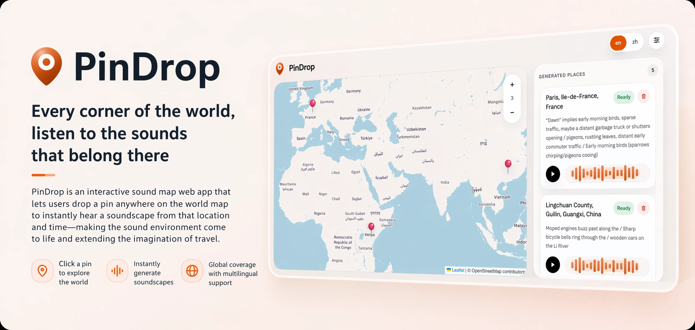

<div align="center">
  <h1>PinDrop</h1>
  
  <p><strong>在地图上落下一枚图钉，生成并聆听这个地点的环境音景。</strong></p>
  <p>
    <a href="./README.md">简体中文</a> ·
    <a href="./README.en.md">English</a>
  </p>
  <p>
    
    
    
    
    
  </p>
</div>

## ✨ 项目简介

PinDrop 是一个面向声音体验的交互式地图应用。用户可以直接点击世界地图中的任意位置，系统会结合地理位置、时间段、区域特征与语言语境，生成对应地点的声音场景，并在浏览器中完成播放与缓存。

当前项目已经具备从“地图选点”到“音景生成”再到“本地播放与复用”的完整闭环，整体更接近一个可体验的产品原型，而不只是静态展示页面。

## 🌍 项目特点

- 🗺️ 地图即入口：点击地图任意位置即可开始生成该地点的声音体验。
- 🧠 场景更具体：先结合 LLM 补充地点叙事，再生成更贴近当地语境的声音场景。
- 🎧 多层音景生成：支持环境层、标志层、对白层、次对白层、氛围层等多层组合。
- ⚡ 本地缓存复用：已生成的地点会缓存到浏览器本地，减少重复请求并提升再次播放速度。
- 🌐 双语界面：内置中文与英文界面切换，适合不同语言环境下使用。
- 🔊 可直接播放：生成完成后可立即播放、暂停、继续，并保留基础播放状态。
- 🧭 地理推断兜底：即使反向地理编码失败，也会基于坐标进行区域、地形、时区等推断。

## 🎼 体验流程

1. 在地图上选择一个地点。
2. 系统解析地点信息，并推断时间、地形、区域与语言环境。
3. 结合 LLM 生成更具体的场景描述，再调用 ElevenLabs 生成多层音频。
4. 音景结果会缓存到本地，之后可再次打开并快速播放。

## 🚀 本地部署

### 本地开发运行

```bash
npm install
npm run dev
```

启动后访问 [http://localhost:3000](http://localhost:3000)。

首次使用前，请在应用的 `Settings` 中完成以下配置：

- `ElevenLabs API Key`
- `LLM Base URL`
- `LLM Model`
- `LLM API Key`

### 本地生产启动

```bash
npm run build
npm run start
```

### 质量检查

```bash
npm run lint
npm run type-check
npm run test
```

## 🧩 技术栈

- `Next.js 16`
- `React 19`
- `TypeScript`
- `Leaflet`
- `IndexedDB / localStorage`
- `ElevenLabs API`

## 📄 开源许可

本项目采用 `MIT License` 开源，许可证全文见根目录的 `LICENSE` 文件。
